# RouteIQ — Canonical Architecture

> **As of v1.0.0rc1, 2026-06-15.** This is the single canonical architecture map for
> RouteIQ. It is derived from a read-only frame-by-frame trace of the live code under
> `src/litellm_llmrouter/` and `deploy/cdk/`. Every node and edge in every diagram below
> reflects a real module, class, or call path — there are no aspirational boxes.
>
> Diagrams are **inline GitHub-flavored Mermaid** (v10+). GitHub renders them natively;
> do not export PNGs.

---

## 1. The two-layer model (the inversion)

RouteIQ is a **host application that owns its own FastAPI app and treats LiteLLM as a
mounted routing plugin** — the inverse of the pre-v1.0 layout where RouteIQ mounted itself
on top of `litellm.proxy.proxy_server.app`. Two ownership facts define the whole system
(see `CLAUDE.md` "Non-Obvious Behaviors" and the `aws-rearchitecture/` set, especially
`10-aws-native-target-architecture.md`, `40-pluggable-routing-and-mlops.md`, and
`50-litellm-universal-surface.md`):

1. **App ownership.** `create_gateway_app()` (`gateway/app.py`, ADR-0012) constructs a fresh
   `FastAPI(lifespan=_routeiq_lifespan)`, controls the entire middleware stack and route
   table, and calls `app.mount("/v1", litellm_app)` — LiteLLM is a **sub-application**, not
   the host.

2. **Routing ownership.** RouteIQ does **not** monkey-patch LiteLLM's `Router`. It installs
   its routing brain via LiteLLM's official `CustomRoutingStrategyBase` plugin API
   (ADR-0002): `install_plugin_routing_strategy(app)` → `router.set_custom_routing_strategy(
   RouteIQRoutingStrategy(...))`, which swaps the Router's `get_available_deployment` /
   `async_get_available_deployment` methods. This is multi-worker safe (registers
   per-worker, no patch to preserve).

Above the request path sits a **control plane** (governance / usage-policies / quota / RBAC
/ OIDC / policy-engine / audit) that admits-or-rejects a request *before* it reaches the
router. Out of the dataplane runs the **only true cycle** in the system: a
COLLECT → EVALUATE → AGGREGATE → FEEDBACK loop (`eval_pipeline.py`) that pushes quality
signal back into the routing arms via a strategy-agnostic MLOps adapter ABI. The whole stack
runs on an **AWS substrate** of three independent CDK stacks (P0 EKS/ECR foundation, P1
Aurora/ElastiCache state, P2 AppConfig/observability/data-lake), with a single EKS Pod
Identity role threading the running app to the cloud.

**The reader should walk away understanding:** RouteIQ is the host; LiteLLM is a routing
plugin inside it; the ML routing intelligence is a hot-swappable arm registry fed by a closed
eval loop; governance gates the front door; and the whole thing runs on a 3-stack
EKS/Aurora/observability AWS substrate.

### Naming convention (used across all diagrams)

- **Solid bold `==>`** — the primary request hot path.
- **Solid `-->`** — a real synchronous call or registration edge.
- **Dashed `-.->`** — a secondary, failure, fallback, or observability/telemetry path.
- **Invisible `~~~`** — layout-only ordering between independent subgraphs.
- Subgraphs are the architectural lanes; cross-lane edges connect to **subgraph boundaries**
  wherever possible (not individual interior nodes) to keep the layout legible.

---

## 2. Eagle-eye view

This single diagram is the spine of the whole document: client → RouteIQ's **own** FastAPI
app (which mounts LiteLLM at `/v1`) → the RouteIQ routing plugin → strategy registry/pipeline
→ LiteLLM Router → the dynamic arm set of providers. The control plane gates the front door;
the eval loop is the curved feedback cycle; the AWS substrate sits beneath everything.

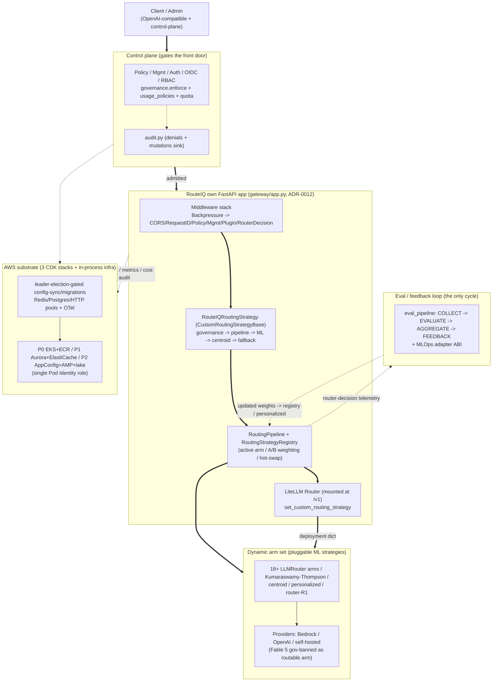

**Five cross-cutting signals** fan out of the hot path (drawn as dashed edges above and
detailed per-section below): routing-decision telemetry, audit events, OTel spans/metrics,
cost tracking, and guardrail verdicts.

---

## 3. Startup & boot order — own-FastAPI + LiteLLM-as-plugin

`cli.py` (`routeiq start`) hands off to `startup.main()`, which runs a sequence of
synchronous, pre-uvicorn `*_if_enabled()` helpers (env validation, observability init,
strategy registration, MLOps feedback wiring) and then branches on `_use_own_app()` (default
`True`) into `_run_gateway_app()`. `create_gateway_app()` is the **composition root**: it
loads `Settings`, loads plugins *before* routes (deterministic order), adds the
`BackpressureMiddleware` **first** (innermost, wrapping the raw ASGI app directly because
`BaseHTTPMiddleware` breaks streaming), configures the outer middleware LIFO, registers
routes, and mounts LiteLLM at `/v1`.

The heavy Router build is **deferred to the async `_routeiq_lifespan`** that runs inside
uvicorn: step 0 calls `_proxy_server.initialize()` to build the LiteLLM Router from config;
step 0b calls `install_plugin_routing_strategy(app)` to swap in `RouteIQRoutingStrategy`. The
**fragile contract**: that install call *must* receive `app` (it reads
`app.state.use_plugin_strategy`); if `app` is omitted the resulting `TypeError` is swallowed
and ML routing **silently falls back to the LiteLLM default** with no error surfaced
(historical fix `59f80e9` + `7844419`). `env_validation` and `service_discovery` are advisory
— neither blocks boot.

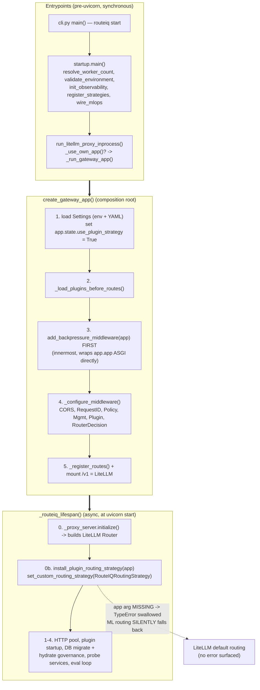

---

## 4. Routing dataplane — pipeline, registry & ML strategy arms

An inbound chat/completion request reaches LiteLLM's Router, which invokes RouteIQ's
`RouteIQRoutingStrategy` hook. That hook runs a strict **progressive-enhancement chain**:
`_enforce_governance` (budget/rate-limit, short-circuits with `HTTPException` on violation,
fail-open otherwise) → `_check_amplification_guard` (caps a `litellm_call_id` at 3 attempts)
→ `_route_via_pipeline` (the **primary** path) → and on `None`, falls back through direct
LLMRouter ML → personalized re-rank → centroid (~2ms) → first-healthy deployment.

`RoutingPipeline.route()` computes an A/B hash key (priority `tenant+user` > `user` >
`request_id` > random UUID for sticky variant assignment), asks the thread-safe
`RoutingStrategyRegistry` to `select_strategy` (active arm, or an A/B-weighted variant via
`sha256(hash_key) % total_weight`), runs `strategy.select_deployment(context)`, falls back to
`DefaultStrategy` on exception, and emits routing-decision telemetry out of the hot path. The
registry holds the strategy family as **pluggable arms** and supports hot-swap
(stage → validate → promote/rollback).

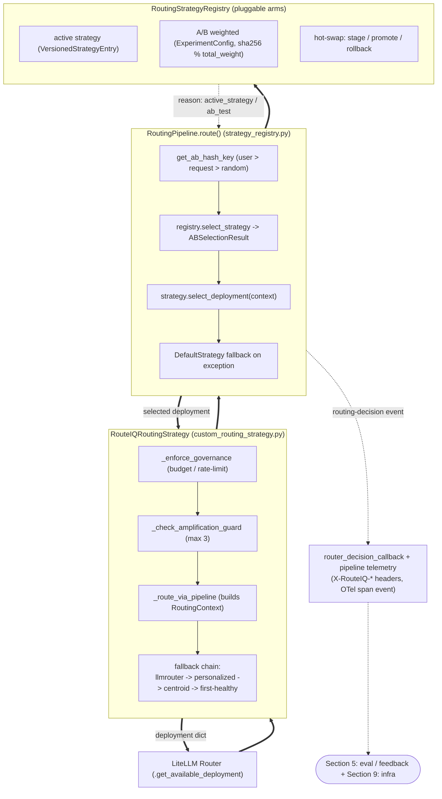

The arms themselves — all implementing `RoutingStrategy.select_deployment(context)` and
registered at startup by `register_strategies()` — form a fan feeding the registry:

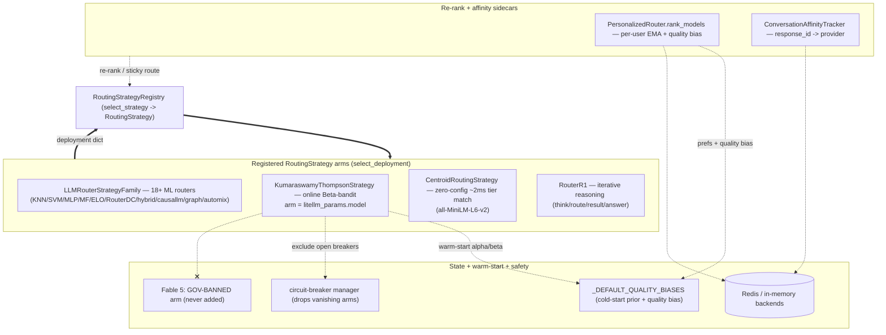

---

## 5. Adapter ABI + MLOps framework + eval/feedback loop

This is the **only true cycle** in the system, made of two halves bolted together. **(A) The
adapter ABI** (`adapters/contract.py`) defines a strategy-agnostic `RoutingAdapter` Protocol
that is a superset of the in-tree `RoutingStrategy` ABC; `attach_route_alias()` binds
`route = select_deployment` so every in-tree strategy satisfies the Protocol with zero edits.
`_abi_compatible` does SemVer negotiation; `loader.py` (`AdapterLoaderPlugin`) discovers
*out-of-tree* adapters via the `routeiq.routing_adapters` entry-point group through a
5-gate validate-then-promote pipeline that never raises.

**(B) The eval/feedback loop** (`eval_pipeline.py`) runs COLLECT → EVALUATE (LLM-as-judge via
`litellm.acompletion`) → AGGREGATE (per-model quality) → FEEDBACK. The FEEDBACK arm closes the
loop two ways: directly into `personalized_routing.update_quality_bias` (EMA), and via the
`MLOpsCoordinator.on_aggregate_feedback()` fan-out into every registered continuous-learning
adapter (the Kumaraswamy-Thompson bandit's posterior `update`). `model_artifacts.py` is the
**trust gate**: any artifact reloaded into an adapter (`apply_artifact`) is SHA256 + optional
Ed25519/HMAC verified first; pickle loading is signature-gated and off by default.

> **Honest gap (not aspirational):** the COLLECT producer is not yet auto-wired per request —
> `router_decision_callback.py` emits telemetry/metrics/spend but does not construct
> `EvalSample`s. The live driver today is the admin `POST .../eval/run-batch` endpoint over
> already-queued samples (drawn dashed). FEEDBACK fan-out is flag-gated
> (`adapter_framework.mlops_feedback_loop`) and off by default.

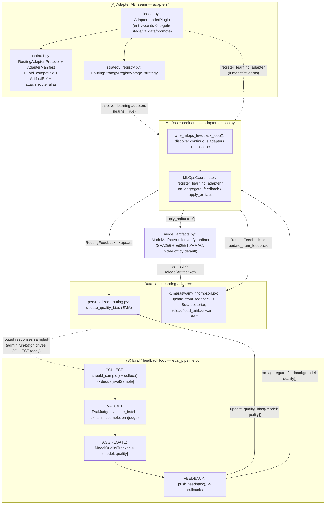

---

## 6. Control plane — multi-tenant governance, policy & identity

The control plane sits **beside** the dataplane and admits-or-rejects a request *before* it
reaches the router, through an ordered funnel layered at the ASGI/FastAPI seam (outermost
first, fixed in `_configure_middleware()`): `RequestIDMiddleware` (raw ASGI, stamps an
`X-Request-ID` ContextVar) → `PolicyMiddleware` (OPA-style, runs **before** routing AND
FastAPI auth; fail-open default, fail-closed optional; 403 short-circuits) →
`ManagementMiddleware` (classifies management ops, optional RBAC + audit) → two-tier auth
(admin `X-Admin-API-Key`, **fail-closed**; vs. LiteLLM `user_api_key_auth`) → OIDC SSO
(token-exchange of an IdP JWT for a RouteIQ key) → RBAC (`requires_permission`) → per-tenant
limits (`governance.enforce` + `usage_policies` + `quota`, most-restrictive-wins).

Two cross-cutting facts complete the picture: a **single shared state layer** — in-memory
engine singletons backed by either `*_STATE_PATH` JSON files *or* the Aurora `GovernanceStore`
— is read on every request and written after every CRUD mutation; and **`audit.py` is the
single sink** every denial and management mutation funnels into.

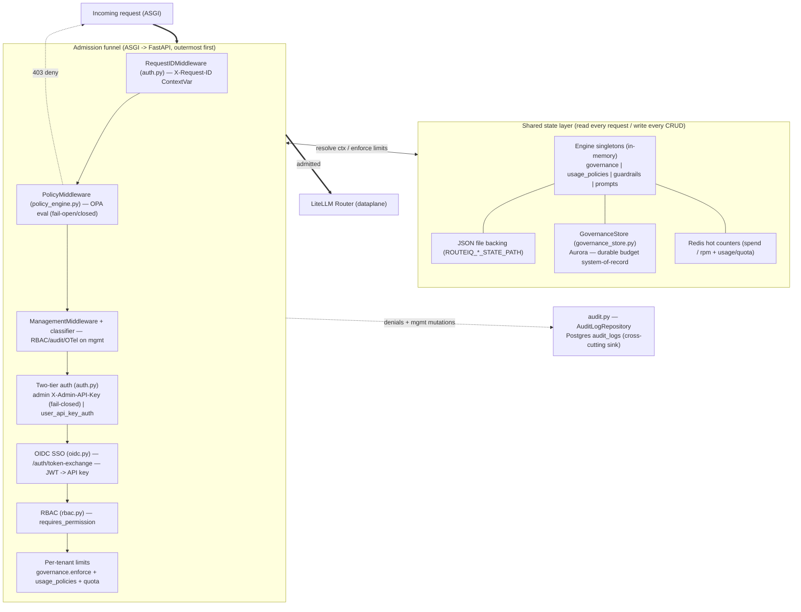

---

## 7. Plugin system & guardrails — GatewayPlugin lifecycle + 14 built-ins

Plugins are loaded **once at startup, ordered deterministically, then fan out into three
attach points** on the live request/response path. `PluginManager` reads `LLMROUTER_PLUGINS`,
validates against an allowlist + capability policy *before* import, topologically sorts by
`depends_on` + `priority` (Kahn's algorithm), caches the sorted order, and then partitions
that one list into three subsets: `get_middleware_plugins()` → `PluginMiddleware` (pure ASGI,
request path); `get_callback_plugins()` → `PluginCallbackBridge` (LiteLLM pre/post-call); and
all plugins carry a typed `PluginContext` whose subsystem accessors come from
`plugin_adapters.create_all_adapters()` typed by `plugin_protocols`.

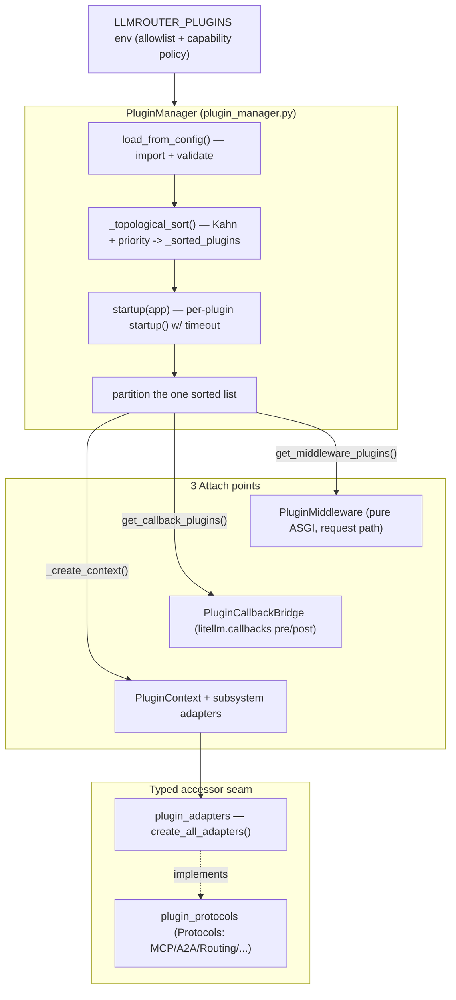

**Guardrails are not a separate subsystem** — they ride the `PluginCallbackBridge`
LLM-lifecycle seam. Pre-call (`async_log_pre_api_call`): `context_optimizer` (6 lossless
transforms, -30..70% tokens) → `semantic_cache` (L1→L2→embedding, hit short-circuits) →
guardrail plugins (`pii_guard` / `prompt_injection_guard` / `content_filter` / `llamaguard` /
`bedrock_guardrails`, raising `GuardrailBlockError`) → `GuardrailPolicyEngine.evaluate_input`
(14 check types, DENY → HTTP 446). Post-call (`async_log_success_event`): output guardrails
(log/alert only), `cost_tracker` (actual cost + OTel + quota reconcile), and cache store.

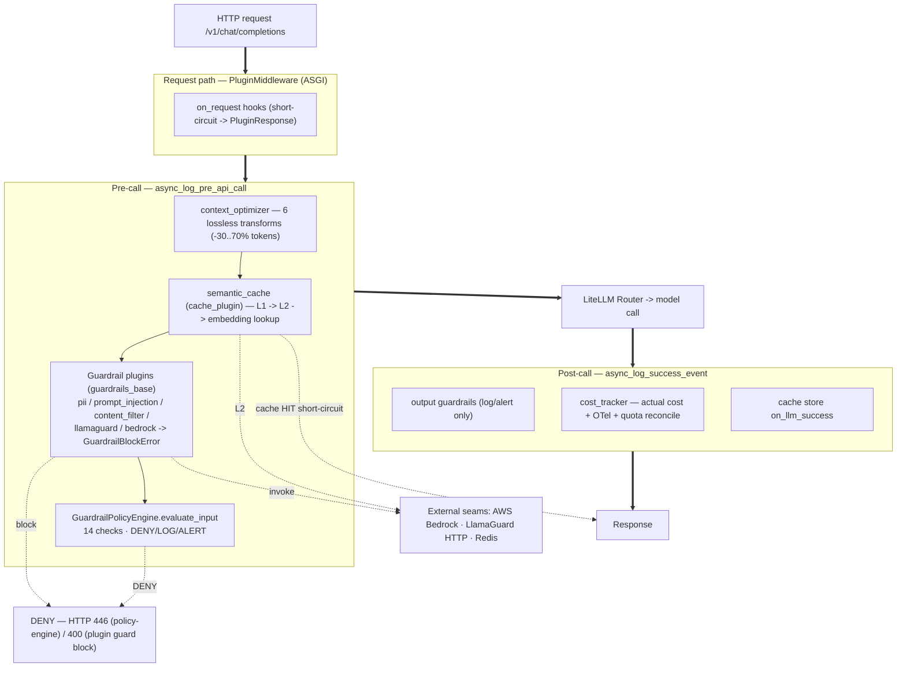

---

## 8. MCP / A2A / agentic tool surface

RouteIQ keeps a **thin REST control surface** for MCP/A2A and **delegates the heavy protocol
transports to upstream LiteLLM** (ADR-0003/0017, after `mcp_jsonrpc.py` /
`mcp_sse_transport.py` / `mcp_parity.py` were deleted). RouteIQ owns a REST MCP gateway
(`/llmrouter/mcp/*`, `/v1/llmrouter/mcp/*` — server registry + tool discovery) and an
in-memory `A2AGateway`, while JSON-RPC + SSE transports and the DB-backed
`global_agent_registry` are served by LiteLLM. Two gates a reader must see: tool invocation is
**off by default** even when the gateway is enabled (needs both `MCP_GATEWAY_ENABLED` and
`LLMROUTER_ENABLE_MCP_TOOL_INVOCATION`; otherwise 501), and every outbound URL passes through
`url_security` SSRF validation **twice** — once at registration (`resolve_dns=False`) and
again at invocation (DNS resolved, **fail-closed**) to defeat DNS rebinding.

> **AWS Agent Registry relationship** (see `agentcore-registry/registry-integration.md`):
> the registry is a *discovery/governance catalog*, not a runtime tool plane. It complements
> rather than duplicates this surface. The recommended integration is **R1 (publish)** —
> register RouteIQ's MCP endpoint as a `descriptorType: MCP` record with `fromUrl` sync;
> **R2 (consume)** is blocked on an auth gap (LiteLLM 1.82.3's MCP client has no SigV4
> auth_type, so an IAM-authorizer registry needs CUSTOM_JWT or the `mcp-proxy-for-aws` shim).

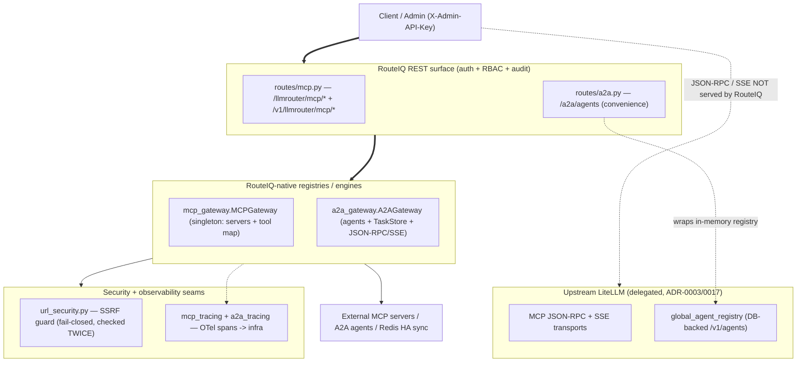

The agentic consumer plugins ride the same `GatewayPlugin` lifecycle but consume the surface
rather than serving it: `bedrock_agentcore_mcp` registers AgentCore agents as MCP servers
(producer into the registry, SSRF-validated); `agentic_pipeline` does
DETECT→DECOMPOSE→ROUTE→EXECUTE→AGGREGATE over the routing dataplane; `skills_discovery` serves
`/.well-known/skills/*` from the filesystem with path-traversal guards.

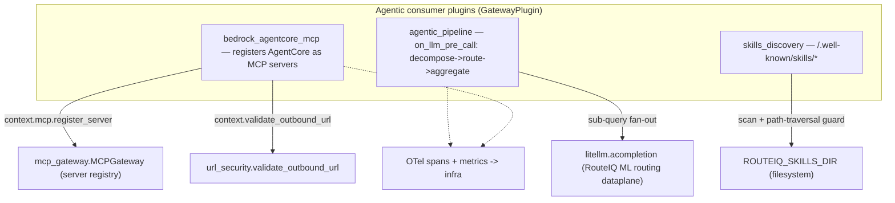

---

## 9. Infra, state, config & observability — HA substrate (in-process)

**Leader election emits a single `is-leader` signal that gates all singleton background
work.** `leader_election.py` auto-selects a backend (K8s Lease API → Redis SETNX → Postgres
lease → None) and exposes one boolean (`MultiBackendLeaderElection.is_leader`); a daemon
renewal thread auto-demotes after 2 consecutive failures. Three things hang off that gate:
**config_sync** (the S3 ETag + AppConfig poll loop runs only on the leader; non-leaders
no-op), **migrations** (`run_migrations_if_leader` lets the leader run `prisma db push` while
followers block on an `asyncio.Event`), and any other singleton job. Around the gate sit the
shared state pools (`database.py` asyncpg with optional RDS IAM auth, `redis_pool.py` with
optional ElastiCache IAM auth, `http_client_pool.py`) and the resilience primitives wrapping
them.

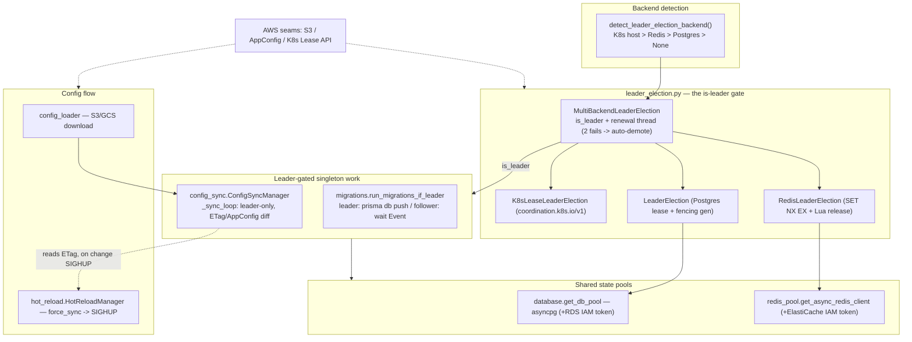

The observability column is the **telemetry sink**: `ObservabilityManager` reuses an existing
LiteLLM `TracerProvider`/`MeterProvider` if present, attaches an OTLP `BatchSpanProcessor`, and
emits structured `routing_decision` + error JSON lines (the dual/triple-key model field
satisfies both the CloudWatch per-model MetricFilter and the Glue/Athena lake column
contract). `/_health/ready` deliberately returns **200 even when circuit breakers are open**
(degraded ≠ unready).

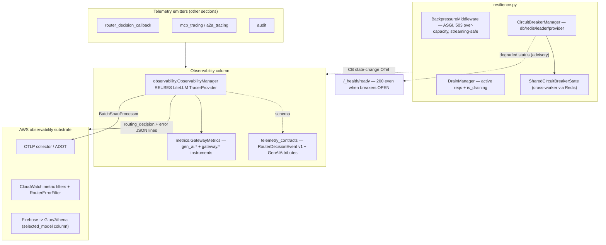

---

## 10. AWS substrate — 3 CDK stacks (P0 foundation / P1 state / P2 observability)

Three CDK `Stack`s deploy as three independent blast radii, **wired together by reference,
never by `from_lookup`.** `app.py:main()` builds them in dependency order and threads the
*Python object* of the P0 stack (`foundation=foundation`) into the other two; because all
three live in one `cdk.App`, CDK resolves those cross-stack reads at **synth** time into
auto-generated `Export`/`Fn::ImportValue` pairs — cred-free, enabling the offline cdk-nag
gate. Two things thread through all three stacks: the **single pod IAM role**
(`RouteIqStack.pod_role`, bound via `CfnPodIdentityAssociation` — Pod Identity, not IRSA) onto
which P1 and P2 each `attach_to_role` a stack-local `iam.Policy` (cycle-safe — they never
mutate the *imported* role via `add_to_principal_policy`; P0 populates its own role with
`add_to_policy`, which is correct in-stack); and the **KMS boundary** — two customer CMKs, one per state-bearing
stack so each rolls back with its own key.

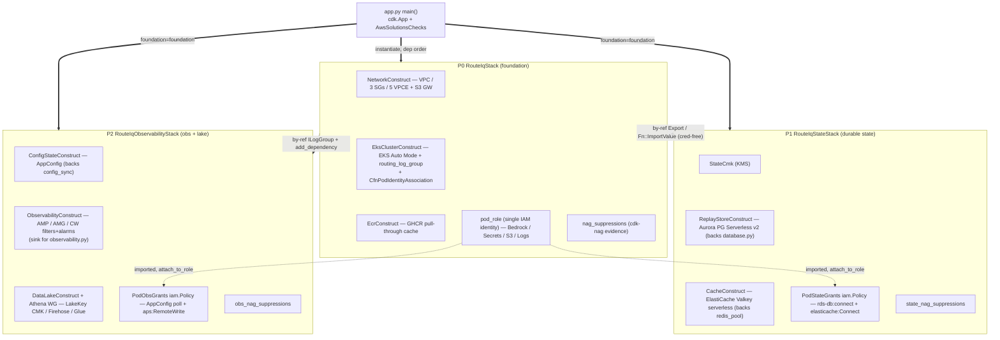

---

## 11. Where to read the code

| Section | Key modules (under `src/litellm_llmrouter/` unless noted) |
|---------|-----------------------------------------------------------|
| **Boot / composition root** | `cli.py`, `startup.py`, `gateway/app.py` (`create_gateway_app`, `_routeiq_lifespan`, `_configure_middleware`), `settings.py`, `service_discovery.py`, `env_validation.py` |
| **Routing dataplane** | `custom_routing_strategy.py` (`RouteIQRoutingStrategy`), `strategy_registry.py` (`RoutingPipeline`, `RoutingStrategyRegistry`), `strategies.py` (`LLMRouterStrategyFamily`), `kumaraswamy_thompson.py`, `centroid_routing.py`, `personalized_routing.py`, `router_r1.py`, `conversation_affinity.py`, `router_decision_callback.py` |
| **Adapter ABI + MLOps + eval loop** | `adapters/contract.py` (`RoutingAdapter`, `AdapterManifest`, `attach_route_alias`, `_abi_compatible`), `adapters/loader.py` (`AdapterLoaderPlugin`), `adapters/mlops.py` (`MLOpsCoordinator`, `wire_mlops_feedback_loop`), `eval_pipeline.py` (`EvalPipeline`, `EvalJudge`, `ModelQualityTracker`), `model_artifacts.py` (`ModelArtifactVerifier`) |
| **Control plane** | `policy_engine.py` (`PolicyMiddleware`), `management_middleware.py` / `management_classifier.py`, `auth.py` (`RequestIDMiddleware`, `admin_api_key_auth`), `oidc.py`, `rbac.py`, `governance.py` (`GovernanceEngine`), `governance_store.py`, `usage_policies.py`, `quota.py`, `prompt_management.py`, `audit.py` |
| **Plugin system & guardrails** | `gateway/plugin_manager.py` (`PluginManager`, `GatewayPlugin`), `gateway/plugin_middleware.py`, `gateway/plugin_callback_bridge.py`, `gateway/plugin_adapters.py`, `gateway/plugin_protocols.py`, `guardrail_policies.py` (`GuardrailPolicyEngine`), `semantic_cache.py`, `gateway/plugins/{guardrails_base,pii_guard,prompt_injection_guard,content_filter,llamaguard_plugin,bedrock_guardrails,context_optimizer,cache_plugin,cost_tracker}.py` |
| **MCP / A2A / agentic** | `mcp_gateway.py` (`MCPGateway`), `a2a_gateway.py` (`A2AGateway`), `routes/mcp.py`, `routes/a2a.py`, `url_security.py`, `mcp_tracing.py`, `a2a_tracing.py`, `gateway/plugins/{bedrock_agentcore_mcp,agentic_pipeline,skills_discovery}.py` |
| **Infra / state / config / observability** | `leader_election.py` (`MultiBackendLeaderElection`), `config_loader.py`, `config_sync.py` (`ConfigSyncManager`), `hot_reload.py`, `migrations.py`, `database.py`, `redis_pool.py`, `http_client_pool.py`, `resilience.py` (`BackpressureMiddleware`, `DrainManager`, `CircuitBreakerManager`), `observability.py`, `metrics.py`, `telemetry_contracts.py` |
| **AWS substrate** | `deploy/cdk/app.py`, `deploy/cdk/lib/{routeiq_stack,network_construct,eks_cluster_construct,ecr_construct}.py` (P0); `deploy/cdk/lib/{routeiq_state_stack,replay_store_construct,cache_construct}.py` (P1); `deploy/cdk/lib/{routeiq_observability_stack,config_state_construct,observability_construct,data_lake_construct}.py` (P2); `deploy/cdk/lib/{naming,nag_suppressions}.py` |

---

## Related docs

- **Project guide & non-obvious behaviors:** `CLAUDE.md` (repo root)
- **AWS re-architecture set:** `docs/architecture/aws-rearchitecture/` —
  `10-aws-native-target-architecture.md`, `20-kumaraswamy-thompson-router.md`,
  `40-pluggable-routing-and-mlops.md`, `50-litellm-universal-surface.md`,
  `31-p0-cdk-foundation-proposal.md`
- **AgentCore integration:** `docs/architecture/agentcore-integration-and-arch-2026-06-15.md`
  and `research/agentcore-registry/registry-integration.md`
- **ADRs:** `docs/adr/` (25 decisions; ADR-0002 plugin routing, ADR-0012 own-app,
  ADR-0017 MCP delegation, ADR-0028/0029 IAM auth)
