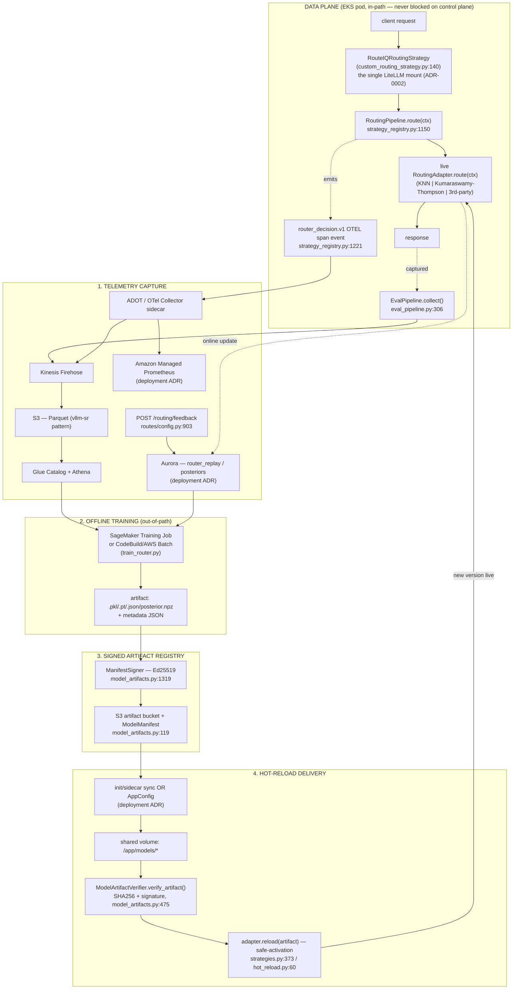

# 40 — Pluggable Routing-Strategy / Algorithm Adapters + the MLOps Loop

> **Status**: Design (offline). No code changes. Citations are `file:line` against
> `src/litellm_llmrouter/` at the time of writing.
>
> **Attribution**: RouteIQ builds on upstream [LiteLLM](https://github.com/BerriAI/litellm)
> (proxy/API + `CustomRoutingStrategyBase`) and [LLMRouter](https://github.com/ulab-uiuc/LLMRouter)
> (the UIUC ML routing algorithm family).

## 0. The Ask

> "One of the features we wanted from RouteIQ was the capability to plug in MLOps
> and use adapters/extensions for other routing strategies and/or algorithms to be
> included."

This doc designs two coupled things:

1. A **stable, versioned routing-strategy adapter contract** so third-party
   strategies *and* algorithms (the UIUC LLMRouter family, the new
   Kumaraswamy–Thompson router from `20-kumaraswamy-thompson-router.md`, and
   arbitrary future ones) plug in **without forking** — discovered via Python
   entry-points rather than hard-coded in-tree.
2. The **MLOps loop** that feeds those adapters: an AWS-native lifecycle of
   telemetry capture → offline training → signed-artifact registry → hot-reload
   back into a live adapter, closing the learning loop.

Sibling docs (referenced, not depended on): `20-kumaraswamy-thompson-router.md`
(a new online-bandit strategy) and the deployment ADRs (Aurora replay store,
AppConfig config delivery, AMP/managed-Prometheus telemetry).

---

## 1. Current Extension Points — Honest Inventory

RouteIQ already has **four** distinct, overlapping extension seams. They work, but
none of them is a *stable, declared, out-of-tree adapter ABI*. This section is the
honest map; §2 proposes the unifying contract.

### 1.1 The `RoutingStrategy` ABC + the registry/pipeline (the in-process seam)

The core abstraction is a one-method ABC:

- `class RoutingStrategy(ABC)` with `@abstractmethod select_deployment(context) -> Optional[Dict]`,
  plus `name` / `version` properties and a `validate() -> (bool, error)` hook
  — `strategy_registry.py:313-357`.
- `RoutingContext` is the per-request input dataclass (router, model, messages,
  input, request_kwargs, request_id/user_id/tenant_id, metadata) and carries the
  deterministic A/B hash key via `get_ab_hash_key()` — `strategy_registry.py:220-283`.
- `RoutingStrategyRegistry` is the runtime container: thread-safe `register()` /
  `unregister()` / `get()` (`:564-631`), `set_active()` / `set_weights()` /
  `set_experiment()` for single-active or weighted A/B (`:645-751`), and **staged
  loading** — `stage_strategy()` validates then `promote_staged()` / `rollback_staged()`
  (`:777-883`). `VersionedStrategyEntry` (`:89-128`) tracks family/version/state, so
  one family can hold several versions (canary).
- `select_strategy(hash_key, ...)` picks the live strategy — active or
  deterministic weighted hash via `_select_weighted()` (`:897-1018`).
- `RoutingPipeline.route(context)` runs selection → `strategy.select_deployment()`
  → **fallback to a default strategy on exception** → OTEL telemetry emission
  (`:1150-1219`, `_emit_routing_telemetry` `:1221-1374`).
- `reload_from_config(config)` lets a hot-reload caller swap weights/experiment/
  active without restart — `strategy_registry.py:1063-1118`.

**Good:** anyone can subclass `RoutingStrategy`, `register()` it, and A/B it against
the incumbent with versioning + staged validation + automatic fallback already
built. `CostAwareRoutingStrategy` (`strategies.py:2669`) and the centroid strategy
are real in-tree examples; `CostAwareRoutingStrategy` even resolves an **inner**
strategy *by name* from the registry (`strategies.py:2745-2769`), demonstrating
strategy composition.

**Missing:** registration is *imperative and in-process*. There is no discovery
mechanism — someone, somewhere, in tree, must `import` your class and call
`registry.register(...)`. There is no declared capability/IO contract: the ABC says
nothing about *what signals a strategy needs*, *whether it learns*, or *what state
it keeps*.

### 1.2 The LiteLLM `CustomRoutingStrategyBase` seam (the install boundary, ADR-0002)

`RouteIQRoutingStrategy(CustomRoutingStrategyBase)` is how RouteIQ binds into a live
LiteLLM `Router` — `custom_routing_strategy.py:140`. `install_routeiq_strategy(router, ...)`
calls `router.set_custom_routing_strategy(strategy)`, which `setattr()`s
`async_get_available_deployment` / `get_available_deployment` onto the **instance**
(not the class) — `custom_routing_strategy.py:886-920`, design rationale in
`docs/adr/0002-plugin-routing-strategy.md`. Its `async_get_available_deployment`
(`:190-257`) is the real hot-path orchestrator: governance → amplification guard →
pipeline (A/B) → direct LLMRouter ML → personalized re-rank → centroid → first-healthy
fallback.

**Good:** this is the *one* place the gateway touches LiteLLM internals, and it uses
LiteLLM's official, documented API (survives upstream upgrades). It is the natural
**single mount point** for the whole adapter framework — everything below it is RouteIQ's
own composition.

**Missing:** the progressive-enhancement chain is **hard-coded** in that method body.
Adding a new algorithm class means editing `async_get_available_deployment`, not
declaring an adapter.

### 1.3 The LLMRouter lazy-load family (the algorithm seam)

`LLMRouterStrategyFamily` (`strategies.py:1925`) is the algorithm plug-point. It maps
a `strategy_name` to an implementation in `_load_router()` (`strategies.py:2138-2242`):

- **Native inference adapters** (no UIUC `MetaRouter`, no training deps): KNN/SVM
  (`pickle`, gated by `LLMROUTER_ALLOW_PICKLE_MODELS`), MLP/MF (`torch.load(weights_only=True)`,
  safer), ELO (JSON ratings). Each has `route(query)` + `reload_model()` —
  `InferenceKNNRouter` `:189`, `SVM` `:458`, `MLP` `:724`, `MF` `:1080`, `ELO` `:1426`.
- **Delegated lazy imports**: `router_map` (`strategies.py:2164-2187`) resolves
  `RouterDC / Hybrid / CausalLM / Graph / Automix / GMT / multiround / smallest / largest`
  via `from llmrouter import models` at call time — optional ones return `None`
  gracefully if the dependency is absent (`:2207-2217`).
- `route_with_observability(query, model_list)` wraps the chosen router with the OTEL
  `routeiq.router_decision.v1` span event — `strategies.py:2493-2666`.

**Reality check (the gap doc's finding).** The "18+ strategies" headline overstates
breadth. Per `docs/architecture/four-way-comparison.md:134`, the real taxonomy is
~3 deeply-native + ~10 LLMRouter-delegated lazy imports + a few branded prefixes over
native code. The framework is genuinely extensible; the *count* is mostly UIUC's
algorithm zoo reached through one lazy dispatch table.

**Missing:** the dispatch table (`router_map`) is a literal `dict` in source. A new
algorithm = a new `elif` branch + a new `Inference*Router` class, both in-tree.

### 1.4 The `GatewayPlugin` system (the lifecycle/capability seam)

The most mature seam by far. `class GatewayPlugin(ABC)` (`gateway/plugin_manager.py:232`)
has `startup/shutdown` lifecycle hooks, ASGI `on_request/on_response`, **LLM lifecycle
hooks** `on_llm_pre_call/on_llm_success/on_llm_failure` (`:~365-400`), `on_config_reload`,
and `health_check()`. Crucially it already has the two pieces the adapter framework
needs:

1. **A capability declaration** — `PluginMetadata{name, version, capabilities:set[PluginCapability],
   depends_on, priority, failure_mode, description}` (`:149-177`), where
   `PluginCapability` is an enum that *already contains* `ROUTING_STRATEGY` and
   `OBSERVABILITY_EXPORTER` among 11 values (`:90-131`).
2. **A controlled-access context** — `PluginContext` exposes a `routing: RoutingAccessor`
   ("list/set strategies, register strategies, get weights") plus `models`, `metrics`,
   `config_sync`, `resilience` accessors (`:180-229`).

The manager loads plugins by **module path** from `LLMROUTER_PLUGINS`, enforces a
capability allowlist (`LLMROUTER_PLUGINS_ALLOWED_CAPABILITIES`) and a plugin allowlist,
and supports per-plugin `FailureMode` (continue/abort/quarantine) — `:44-58`,
`:815-817`. 14 built-in plugins ship today (`gateway/plugins/`); see `docs/plugins.md`.

**Good:** capability negotiation, dependency ordering, security allowlist, and a
`routing.register_strategy(...)` accessor *all already exist*. This is the chassis.

**Missing:** there is **no plugin that bridges `ROUTING_STRATEGY` capability → the
routing registry as an out-of-tree adapter**. The plugin system can host an adapter
loader, but today routing strategies are wired imperatively in the composition root,
not discovered as plugins. (`LLMROUTER_PLUGINS` is module-path based, not
entry-point based, so it is not pip-install-then-discover.)

### 1.5 The wiring gap made concrete: `conversation_affinity` is dormant

`ConversationAffinityTracker` (`conversation_affinity.py:105`) is fully implemented —
Redis or in-memory, TTL, LRU eviction, `record_response()` / `get_affinity()` — with
a settings model (`settings.py:690 ConversationAffinitySettings`, wired at `:1229`)
and a singleton (`init_affinity_tracker` `:355`). **But `grep` finds zero callers in
the routing hot path**: nothing in `custom_routing_strategy.py` or the pipeline calls
`get_affinity_tracker()`. It is a finished feature with no socket to plug into — the
clearest possible evidence that RouteIQ needs a *declared* adapter contract, not just
more code.

### 1.6 Contrast: VSR's hard in-tree Go boundary

Per `docs/architecture/four-way-comparison.md:218,221`: VSR's signals/selectors are
"In-tree Go only (no stable plugin ABI)"; new signals "require upstream Go
contributions or side-car processes," and the doc names this **"the single biggest
architectural philosophy split across the four projects."** RouteIQ's Python soft
boundary is the differentiator to *lean into* — the proposal below turns the soft
boundary into a **declared, versioned, discoverable** one, which is strictly stronger
than VSR's model and removes the last in-tree edits RouteIQ still requires.

---

## 2. Proposed: the Routing-Strategy Adapter Framework

### 2.1 Design goals

| Goal | Mechanism |
|------|-----------|
| Plug in a strategy/algorithm **without forking** | Python **entry-points** discovery (`importlib.metadata`) + the existing `LLMROUTER_PLUGINS` module-path path as the manual fallback |
| **Stable** across RouteIQ versions | A versioned `Protocol` ABI (`adapter_api_version`), additive-only, with negotiation |
| Self-describing | A **manifest** declaring capabilities / required signals / state needs / IO |
| Learns online or offline (or not at all) | Optional `update(feedback)` + `load(artifact)` on the contract |
| Safe to load | Reuse `GatewayPlugin` capability allowlist + `RoutingStrategy.validate()` staged gate + signed artifacts (§3) |
| Zero migration cost in-tree | The contract is a **superset** of today's `RoutingStrategy`; existing strategies satisfy it by adding a default manifest |

### 2.2 The adapter contract (a `Protocol`, not a new ABC)

We extend — not replace — `RoutingStrategy`. A new `typing.Protocol` defines the full
adapter surface; the existing ABC remains the minimal core (`select_deployment`), so
**every current strategy is already a partial adapter**. New optional methods are
duck-typed (the pipeline already feature-detects, e.g. `hasattr(router, "route")` at
`strategies.py:2527`).

```python
# proposed: src/litellm_llmrouter/adapters/contract.py
ADAPTER_API_VERSION = "1.0"          # SemVer; bump MINOR for additive, MAJOR for breaking

class RoutingAdapter(Protocol):
    # --- identity / negotiation ---
    def declare_capabilities(self) -> "AdapterManifest": ...   # see §2.3

    # --- decision (REQUIRED; == today's RoutingStrategy.select_deployment) ---
    def route(self, ctx: RoutingContext) -> Optional[RoutingDecision]: ...

    # --- learning (OPTIONAL; present iff manifest.learns == True) ---
    def update(self, feedback: "RoutingFeedback") -> None: ...

    # --- artifact lifecycle (OPTIONAL; present iff manifest.uses_artifact) ---
    def load(self, artifact: "ArtifactRef") -> bool: ...        # initial activation
    def reload(self, artifact: "ArtifactRef") -> bool: ...      # hot-swap; safe-activation

    # --- readiness (OPTIONAL; defaults True) ---
    def validate(self) -> tuple[bool, Optional[str]]: ...
```

`route()` is `select_deployment()` renamed for clarity; an adapter shim makes the
existing ABC method satisfy it, so **nothing in tree breaks**. `RoutingDecision`
wraps the chosen deployment dict + a `reason` + optional `posterior`/`scores` so the
telemetry contract (§3) can record *why*. `update(feedback)` is exactly the signature
the eval loop and `/routing/feedback` already produce (§3.2) — the
`PersonalizedRouter.record_feedback(user_id, model, score)` (`personalized_routing.py:584`)
and `EvalPipeline.push_feedback()` (`eval_pipeline.py:359`) are the existing
implementations of this method on existing strategies.

`load/reload(artifact)` is exactly the `reload_model()` already on every
`Inference*Router` (`strategies.py:373,639,981,1325,1590`) and
`LLMRouterStrategyFamily` (`strategies.py:2466-2491`) — generalized to take an
`ArtifactRef` (path + sha256 + manifest) instead of an implicit `self.model_path`.

### 2.3 The manifest (the missing capability declaration)

The manifest is the new artifact. It is the routing-specific analogue of
`PluginMetadata` (`gateway/plugin_manager.py:149`) and reuses its philosophy. It lets
the gateway answer *before* a request: "can this adapter handle this request, and do
I have the signals it needs?"

```python
@dataclass
class AdapterManifest:
    name: str                         # "kumaraswamy-thompson", "uiuc-knn", "acme-rl"
    version: str                      # adapter/model version (SemVer)
    adapter_api_version: str          # "1.0" — negotiated against ADAPTER_API_VERSION
    family: str = ""                  # groups versions for canary (VersionedStrategyEntry.family)

    # --- capabilities (what it can route) ---
    capabilities: set[PluginCapability] = {ROUTING_STRATEGY}   # reuse the existing enum
    api_formats: set[str] = {"chat", "responses", "messages"}  # inbound surfaces it supports
    request_kinds: set[str] = {"completion"}                   # completion|embedding|rerank|...

    # --- required signals (capability negotiation, §5) ---
    required_signals: set[str] = set()    # e.g. {"query_text"} | {"user_id"} | {"prev_response_id"}
    optional_signals: set[str] = set()

    # --- learning / state ---
    learns: bool = False                  # implements update()? (online)
    uses_artifact: bool = False           # implements load/reload()? (offline-trained)
    state_backend: str = "none"           # none|memory|redis|aurora  (where posteriors/prefs live)
    artifact_kinds: set[str] = set()      # {"sklearn_pkl"} | {"torch_pt"} | {"json"} | {"posterior_npz"}

    description: str = ""
```

`required_signals` is the linchpin of capability negotiation (§5): the gateway only
routes a request to an adapter whose `required_signals` are satisfiable from the
`RoutingContext`. Example: `conversation_affinity` declares
`required_signals={"prev_response_id"}` and is consulted **only** for Responses-API
requests carrying one — which is exactly the wiring it lacks today (§1.5).

### 2.4 Discovery — entry-points, not a source dict

Out-of-tree packages register adapters via a standard Python entry-point group; the
loader enumerates them with `importlib.metadata.entry_points(group="routeiq.routing_adapters")`.
This is the same pattern ADR-0014 (`docs/adr/0014-plugin-extraction.md`) already
envisions for `routeiq-routing` as a standalone pip package.

```toml
# a 3rd-party package's pyproject.toml — NO RouteIQ fork
[project.entry-points."routeiq.routing_adapters"]
acme-bandit = "acme_router.adapter:AcmeBanditAdapter"
```

```python
# proposed: src/litellm_llmrouter/adapters/loader.py  (a GatewayPlugin)
class AdapterLoaderPlugin(GatewayPlugin):
    @property
    def metadata(self): return PluginMetadata(
        name="adapter-loader", capabilities={PluginCapability.ROUTING_STRATEGY})

    async def startup(self, app, context):
        registry = context.routing  # RoutingAccessor — already exists (plugin_manager.py:219)
        for ep in importlib.metadata.entry_points(group="routeiq.routing_adapters"):
            adapter = ep.load()()
            manifest = adapter.declare_capabilities()
            # 1. negotiate ABI version
            if not _abi_compatible(manifest.adapter_api_version, ADAPTER_API_VERSION):
                context.logger.warning("skip %s: ABI %s", ep.name, manifest.adapter_api_version); continue
            # 2. enforce capability allowlist (reuse LLMROUTER_PLUGINS_ALLOWED_CAPABILITIES)
            if not _capabilities_allowed(manifest.capabilities): continue
            # 3. stage → validate → promote (reuse registry staged loading, strategy_registry.py:777)
            registry.stage_strategy(manifest.name, adapter, version=manifest.version,
                                    metadata={"manifest": asdict(manifest)})
```

This reuses, end to end, machinery that already exists: the `GatewayPlugin` lifecycle,
the `RoutingAccessor`, the registry's `stage_strategy → promote_staged` validation
gate, and the capability allowlist. The only new code is the contract, the manifest,
and a ~50-line loader. The legacy `LLMRouterStrategyFamily` dispatch table (§1.3)
becomes one *built-in* adapter (`uiuc-llmrouter`) registered the same way, so the
in-tree `router_map` is no longer the only road in.

### 2.5 ABI stability rules

- `adapter_api_version` is SemVer. The loader refuses adapters whose **MAJOR** exceeds
  the gateway's `ADAPTER_API_VERSION`; it loads MINOR-newer adapters but only uses the
  methods it knows (duck-typed optionals make this safe).
- The contract grows **additive-only**: new optional methods/fields, never renamed or
  removed within a MAJOR. This is the standing promise that turns the soft Python
  boundary into a *stable* one — the property VSR's in-tree Go ABI cannot offer.

---

## 3. The MLOps Loop (the headline)

The loop closes telemetry → training → registry → hot-reload → live adapter. RouteIQ
already owns every *primitive*; the design is mostly **wiring + AWS placement**, not
new invention. The control plane is out-of-path and may be fully down without
stopping the data plane (the principle in `docs/architecture/mlops-loop.md`).

### 3.1 Diagram



### 3.2 Stage-by-stage: AWS service ↔ RouteIQ module

| # | Stage | What happens | AWS service | RouteIQ module (`file:line`) |
|---|-------|--------------|-------------|------------------------------|
| 1a | Decision telemetry | Every routing decision emits `routeiq.router_decision.v1` as an OTEL span event (strategy, candidates, selected, latency, outcome, experiment/variant) | ADOT/OTel Collector → **Amazon Managed Prometheus** + Kinesis **Firehose → S3 (Parquet) → Glue/Athena** | `RoutingPipeline._emit_routing_telemetry` `strategy_registry.py:1221`; builder `telemetry_contracts.py` |
| 1b | Outcome/reward capture | Sampled request/response pairs collected; LLM-as-judge scores them; per-model quality tracked | (judge call via the gateway itself) | `EvalPipeline.collect/run_evaluation_batch` `eval_pipeline.py:306,318`; `ModelQualityTracker` `:177` |
| 1c | Explicit human reward | `POST /api/v1/routeiq/routing/feedback` `{user_id, model, score∈[-1,1]}` | API Gateway/NLB | route `routes/config.py:903`; sink `PersonalizedRouter.record_feedback` `personalized_routing.py:584` |
| 1d | Online state | Bandit posteriors / preference vectors updated in place (EMA), persisted across workers | **ElastiCache (Redis)** / **Aurora** replay store | `PreferenceStore.update_preference` (EMA) `personalized_routing.py:346`; Kumaraswamy–Thompson posteriors → Aurora (sibling `20-…`) |
| 2 | Offline training | Lake (Athena) + replay (Aurora) → labeled JSONL/embeddings → trainer produces `.pkl/.pt/.json/posterior.npz` + metadata JSON | **SageMaker Training Job** (or **CodeBuild**/**AWS Batch** for cheap jobs) | trainer `examples/mlops/scripts/train_router.py`; loaders expect the metadata-JSON companion `strategies.py:830,1180` |
| 3 | Signing + registry | Compute SHA256, write `ModelManifest`, sign with Ed25519, push artifact + manifest to S3 | **S3** artifact bucket; key in **KMS**/Secrets Manager | `ManifestSigner` `model_artifacts.py:1319`; `ModelManifest` `:119`; `ArtifactEntry` `:94` |
| 4a | Delivery | Sidecar/init-container syncs S3 → shared volume, **or** AppConfig pushes a new artifact pointer/config | **AppConfig** (config + pointer), **S3** (bytes), init-container | delivery is out-of-tree; pointer consumed via `config_sync` / `hot_reload.reload_config` `hot_reload.py:108` |
| 4b | Verify | Before activation, recompute SHA256 and verify the (optionally signed) manifest; **enforce signature** for `.pkl` | — | `ModelArtifactVerifier.verify_artifact` `model_artifacts.py:475`; strict pickle gate `strategies.py:268,293` |
| 4c | Hot-reload | `adapter.reload(artifact)` loads into a temp instance, verifies, then **safe-swaps under a lock**; old version stays live on failure | — | `Inference*Router.reload_model` `strategies.py:373`; `LLMRouterStrategyFamily.router` mtime check `:2466`; admin `HotReloadManager.reload_router` `hot_reload.py:60` |
| 4d | Activation telemetry | New `ActiveModelVersion{sha256, loaded_at, tags}` recorded; surfaces in decision spans (`strategy_version`) | AMP/CloudWatch | `record_active_version` `model_artifacts.py:569`; version flows into spans `strategy_registry.py:1324` |
| — | Safe rollout | New artifact registered as a **new version of the same family**; A/B weighted against incumbent; promote or roll back | AppConfig (weights) | `stage_strategy → promote_staged/rollback_staged` `strategy_registry.py:777-883`; `set_weights` `:676` |

**Key property:** stages 1d (online) and 2–4 (offline) are *both* `update()`/`reload()`
on the same adapter contract. An online bandit closes the loop in milliseconds via
`update()`; an offline-trained classifier closes it in hours via `reload()`. The
framework does not care which — it is the *same socket*.

---

## 4. How three very different routers ride the *same* framework

| Router | Kind | `route()` | Learning method | Artifact | `state_backend` | `required_signals` |
|--------|------|-----------|-----------------|----------|-----------------|--------------------|
| **UIUC LLMRouter** (KNN/SVM/MLP/MF/ELO/RouterDC/…) | offline-trained classifier | embed query → predict label → map to deployment (`strategies.py:411,2493`) | offline only: retrain on the lake, ship a new `.pkl/.pt/.json` | yes (`sklearn_pkl`/`torch_pt`/`json`) | none (stateless inference) | `{query_text}` (ELO needs none — query-independent, `strategies.py:1628`) |
| **Kumaraswamy–Thompson** (sibling `20-…`) | online bandit | sample per-arm Kumaraswamy posterior → argmax (config-gated by ctx window) | **online** `update(reward)` after each outcome + **offline** posterior snapshot for warm-start | optional (`posterior_npz` snapshot for warm-start) | `aurora` (or `redis`) — posteriors must survive restart | `{}` (rewards keyed on decision_name, not embedding) |
| **Hypothetical 3rd-party** (`acme_router.AcmeBanditAdapter`, pip-installed) | anything | its own logic | declares `learns` and/or `uses_artifact` as it pleases | its own kind | its own choice | whatever it declares |

All three:

1. Are **discovered** the same way — entry-point (3rd-party) or built-in registration
   (UIUC family becomes the `uiuc-llmrouter` adapter; Kumaraswamy–Thompson ships as a
   first-party adapter). No fork for the third party.
2. Are **selected/A-B-tested** the same way — `RoutingStrategyRegistry.set_weights()` /
   `select_strategy()` (`strategy_registry.py:676,897`). Run UIUC-KNN at 80% vs
   Kumaraswamy–Thompson at 20% with deterministic per-user stickiness, zero code.
3. **Close the loop** the same way — telemetry via the shared `router_decision.v1`
   contract; rewards via `/routing/feedback` + `EvalPipeline`; weight updates via
   online `update()` or offline `reload()` of a signed artifact.
4. Are **negotiated** the same way (§5) — the gateway only sends a request to an
   adapter whose `required_signals` are present.

The framework's payoff: adding the Kumaraswamy–Thompson router (a genuinely new
algorithm) and adding a third-party RL package become the *same shape of change* —
a class implementing the contract + a manifest — and the offline UIUC family and the
online bandit share one MLOps loop instead of two.

---

## 5. Gap-Closers (what this design fixes)

### 5.1 Wire `conversation_affinity` (turn the dormant feature live)

Ship `conversation_affinity` as a **built-in adapter** with
`required_signals={"prev_response_id"}` and `state_backend="redis"`. The negotiator
(§5.3) consults it **only** when a request carries `previous_response_id`; on a hit it
pins the deployment via `ConversationAffinityTracker.get_affinity()`
(`conversation_affinity.py:241`); the post-response hook calls `record_response()`
(`:208`). This gives the finished-but-unplugged tracker (`§1.5`) its socket — the
adapter contract is *exactly* the missing wiring.

### 5.2 A `/adapters` registry endpoint

Add `GET /api/v1/routeiq/adapters` returning each registered adapter's manifest +
live state — the manifest superset of the existing `get_strategy_comparison()`
(`strategy_registry.py:1419`) and `HotReloadManager.get_strategy_status()`
(`hot_reload.py:421`). Operators see, per adapter: ABI version, capabilities,
`required_signals`, `learns`/`uses_artifact`, current `ActiveModelVersion.sha256`,
A/B weight, and validation state — the introspection a pluggable ecosystem needs.
(Mutating endpoints already exist: `/strategy/weights`, `/strategy/stage`,
`/strategy/promote` per `hot_reload.py:6-15`.)

### 5.3 Capability negotiation (route only compatible requests to an adapter)

Add a pre-selection filter in `RoutingPipeline.route()` (`strategy_registry.py:1150`):
before `select_strategy()`, compute the request's available signals from
`RoutingContext` (does it have `query_text`? `user_id`? `prev_response_id`? what
`api_format`?), then exclude any adapter whose `manifest.required_signals` are not all
satisfiable, and whose `api_formats`/`request_kinds` don't match. An embedding-based
classifier is skipped for an empty-prompt embeddings request; the affinity adapter is
skipped unless a `prev_response_id` is present. This makes the registry's existing
fallback-on-failure (`strategy_registry.py:1200`) a *last* resort rather than the
mechanism that silently masks a mis-routed request — negotiation prevents the
mismatch up front.

---

## 6. References (code, `file:line`)

- Contract/registry: `strategy_registry.py:313` (`RoutingStrategy`), `:493` (`RoutingStrategyRegistry`), `:777-883` (staged loading), `:1150` (`RoutingPipeline.route`), `:1221` (telemetry).
- LiteLLM mount: `custom_routing_strategy.py:140,190,886`; ADR `docs/adr/0002-plugin-routing-strategy.md`.
- Algorithm family: `strategies.py:1925`, `_load_router` `:2138`, `router_map` `:2164`, inference adapters `:189,458,724,1080,1426`, `route_with_observability` `:2493`, `CostAwareRoutingStrategy` `:2669`.
- Plugin chassis: `gateway/plugin_manager.py:90` (capabilities), `:149` (`PluginMetadata`), `:180` (`PluginContext.routing`), `:232` (`GatewayPlugin`); ADRs `0014`, `0011`; `docs/plugins.md`.
- MLOps primitives: `eval_pipeline.py:240,306,359`; `personalized_routing.py:346,584`; `routes/config.py:903` (feedback); `model_artifacts.py:119,475,569,1319`; `hot_reload.py:60,108`; `docs/architecture/mlops-loop.md`, `docs/mlops-training.md`.
- Dormant feature: `conversation_affinity.py:105,208,241`; `settings.py:690,1229`.
- Gap framing / VSR contrast: `docs/architecture/four-way-comparison.md:134,218,221`.
- Siblings (referenced, may not yet exist): `20-kumaraswamy-thompson-router.md`; deployment ADRs (Aurora replay, AppConfig delivery, AMP telemetry).
