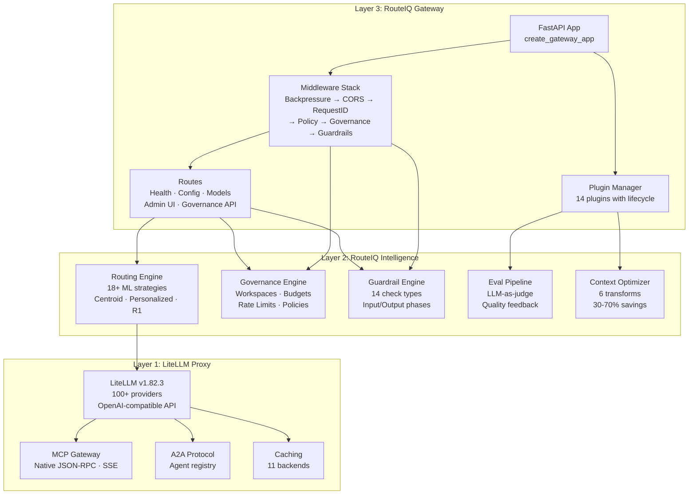
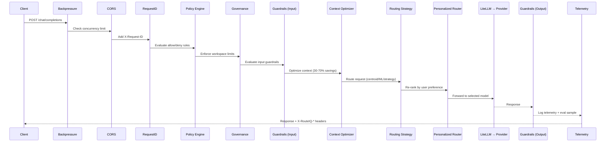
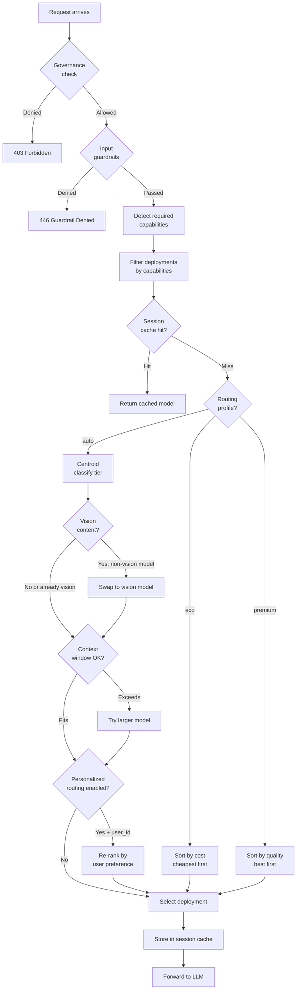
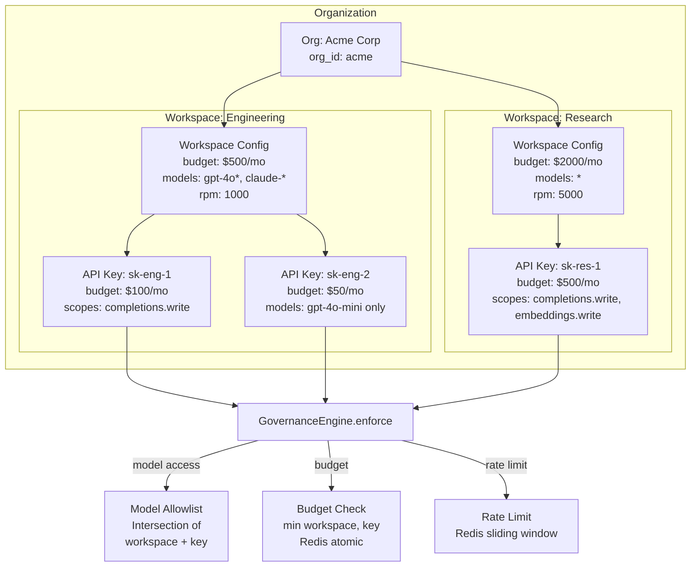
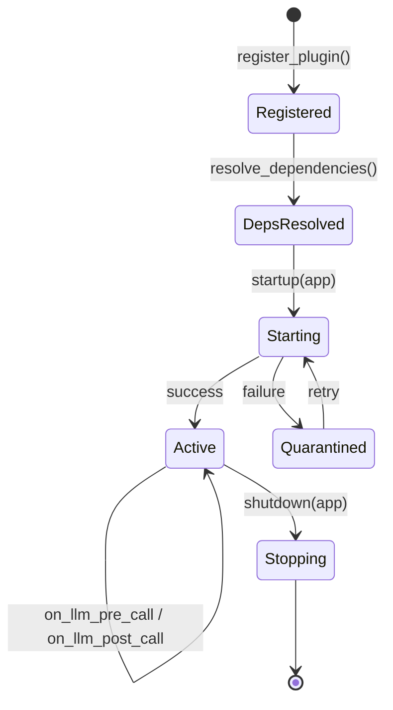
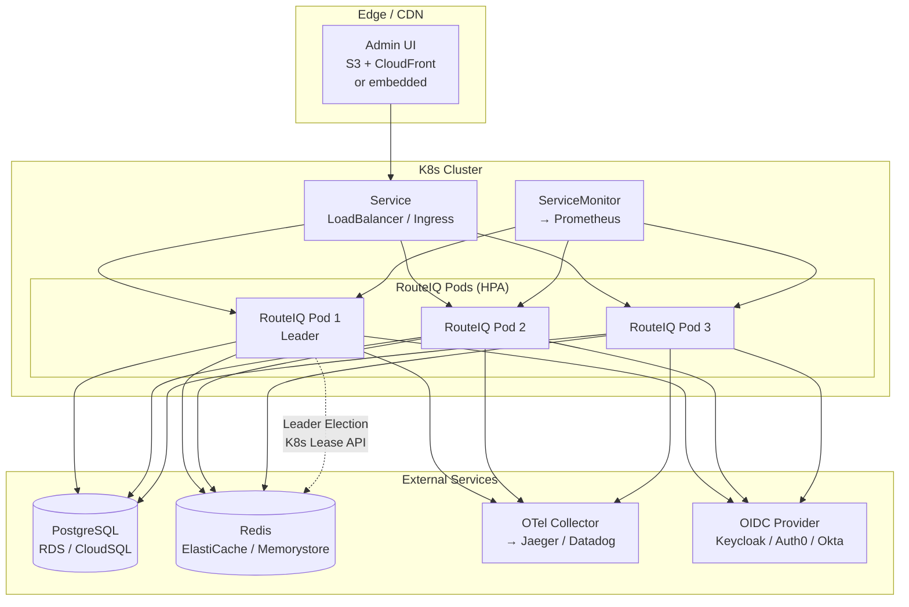

# Architecture Overview

RouteIQ Gateway is a high-performance, cloud-native AI Gateway built on
[LiteLLM](https://github.com/BerriAI/litellm) and [LLMRouter](https://github.com/ulab-uiuc/LLMRouter).

## Three-Layer Architecture

RouteIQ is composed of three distinct layers. Layer 1 (LiteLLM Proxy) provides
the OpenAI-compatible API surface and protocol support. Layer 2 (RouteIQ
Intelligence) adds ML-based routing, governance, guardrails, evaluation, and
context optimization. Layer 3 (RouteIQ Gateway) is the composition root —
FastAPI app factory, middleware stack, route registration, and plugin lifecycle.

## Request Flow

Every request traverses the full middleware stack before reaching the LLM
provider. The middleware order is critical — backpressure is innermost (registered
first), ensuring concurrency limits apply before any other processing.

## Routing Decision Flow

The routing engine handles capability detection, session affinity, profile-based
sorting, vision content swaps, context window validation, and personalized
re-ranking before selecting a deployment.

## Governance Architecture

Governance enforces organization → workspace → API key hierarchy. Each level
can set budgets, model allowlists, and rate limits. Enforcement computes the
intersection of workspace and key constraints.

## Plugin Lifecycle

Plugins are registered, dependency-resolved, started during app lifespan, and
shut down on termination. Failed plugins enter a quarantined state with retry.

## Deployment Topology

Production deployments use Kubernetes with HPA, backed by PostgreSQL, Redis,
an OTel Collector, and an OIDC provider. Leader election (via Redis or K8s
Lease API) ensures only one pod runs config sync.

## Key Components

### Data Plane

- **Unified API**: OpenAI-compatible proxy (inherited from LiteLLM)
- **Protocol Translation**: Bedrock, Vertex AI, Azure, etc.
- **Gateway Surfaces**: MCP, A2A, Skills endpoints
- **Plugin System**: 14 built-in plugins with lifecycle management

### Routing Intelligence Layer

- **Static Strategies**: round-robin, fallback (LiteLLM-native)
- **ML Strategies**: 18+ `llmrouter-*` strategies
- **Centroid Routing**: Zero-config ~2ms classification
- **A/B Testing**: Runtime strategy hot-swapping

### Control Plane

- **Configuration Management**: YAML-based, hot-reloadable
- **Artifact Registry**: S3/MinIO for trained routing models
- **Rollout Delivery**: Rolling deploys or sync sidecars

### Closed-Loop MLOps

- **Collect**: OTel traces/logs from data plane
- **Train**: Offline jobs produce routing artifacts
- **Deploy**: New artifacts rolled out, routing layer reloads

## Middleware Stack

Request processing order (innermost to outermost):

1. **Backpressure** - Concurrent request limiting
2. **CORS** - Cross-origin resource sharing
3. **RequestID** - Correlation ID assignment
4. **Policy Engine** - OPA-style allow/deny evaluation
5. **Governance** - Workspace and budget enforcement
6. **Guardrails** - Input/output content safety
7. **Management RBAC** - Admin endpoint protection
8. **Plugin Middleware** - Plugin-injected middleware
9. **Router Decision** - Telemetry span attributes
