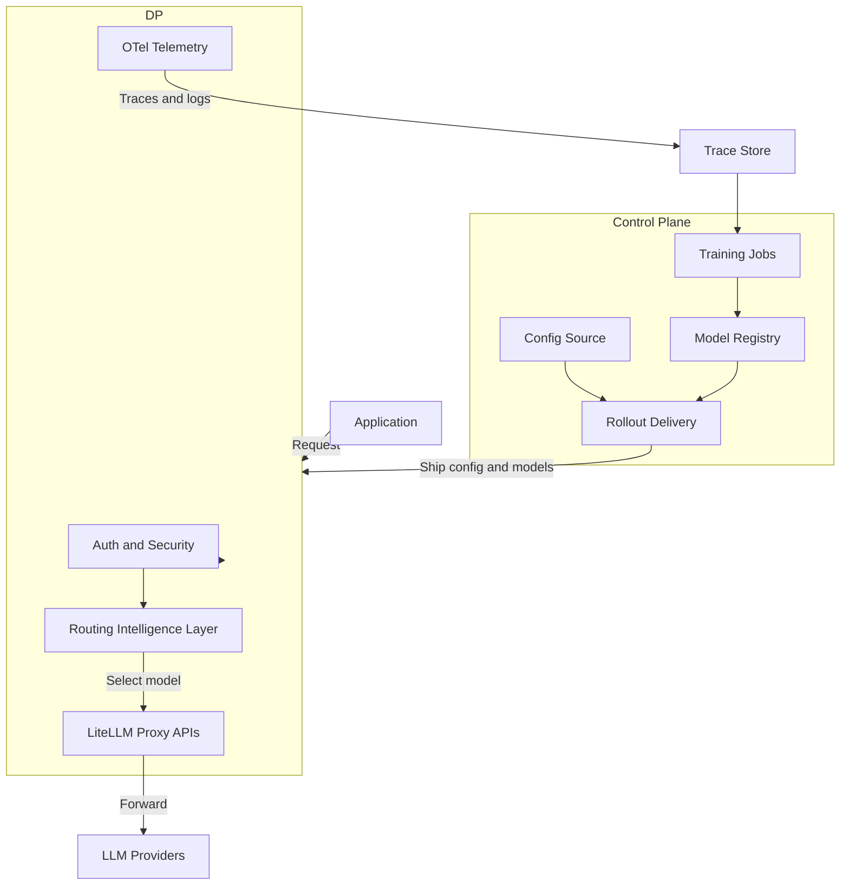

# Architecture Overview

RouteIQ Gateway is a high-performance, cloud-native AI Gateway built on
[LiteLLM](https://github.com/BerriAI/litellm) and [LLMRouter](https://github.com/ulab-uiuc/LLMRouter).

## Two-Plane Architecture

1. **Data Plane (Gateway Runtime)** - In-path serving component for API traffic
2. **Control Plane (Management + Delivery)** - Out-of-path config and model delivery

## Key Components

### Data Plane

- **Unified API**: OpenAI-compatible proxy (inherited from LiteLLM)
- **Protocol Translation**: Bedrock, Vertex AI, Azure, etc.
- **Gateway Surfaces**: MCP, A2A, Skills endpoints
- **Plugin System**: 13 built-in plugins with lifecycle management

### Routing Intelligence Layer

- **Static Strategies**: round-robin, fallback (LiteLLM-native)
- **ML Strategies**: 18+ `llmrouter-*` strategies
- **Centroid Routing**: Zero-config ~2ms classification
- **A/B Testing**: Runtime strategy hot-swapping

### Control Plane

- **Configuration Management**: YAML-based, hot-reloadable
- **Artifact Registry**: S3/MinIO for trained routing models
- **Rollout Delivery**: Rolling deploys or sync sidecars

### Closed-Loop MLOps

- **Collect**: OTel traces/logs from data plane
- **Train**: Offline jobs produce routing artifacts
- **Deploy**: New artifacts rolled out, routing layer reloads

## Middleware Stack

Request processing order (innermost to outermost):

1. **Backpressure** - Concurrent request limiting
2. **CORS** - Cross-origin resource sharing
3. **RequestID** - Correlation ID assignment
4. **Policy Engine** - OPA-style allow/deny evaluation
5. **Management RBAC** - Admin endpoint protection
6. **Plugin Middleware** - Plugin-injected middleware
7. **Router Decision** - Telemetry span attributes
