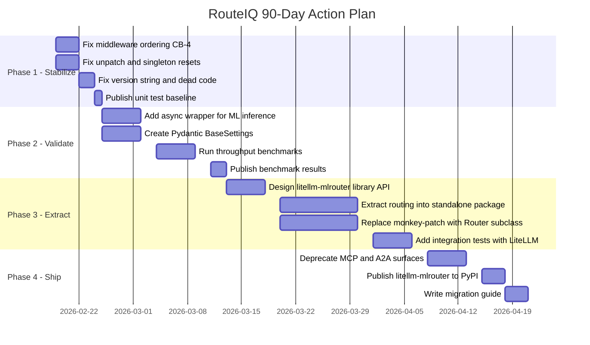

# TG2: Architecture Evaluation Report — RouteIQ v0.2.0

**Date:** 2026-02-18  
**Version:** RouteIQ v0.2.0 (`pyproject.toml`) / v0.0.5 (`__init__.py`) / v0.0.3 (`gateway/app.py`)  
**Scope:** Full architecture evaluation — goal alignment, critical issues, competitive positioning, strategic direction  
**Method:** Static analysis of 36,207 LoC across 63 Python files, runtime test execution (2,095 passing), GATE report review, competitive benchmarking  
**Verdict:** 🔴 **NOT PRODUCTION-READY** — Weighted Goal Score **3.05 / 5.00**, 4 critical blockers, significant upstream overlap

---

## Executive Summary

RouteIQ v0.2.0 is an ambitious AI gateway wrapping LiteLLM with ML-based routing (18+ strategies), 5 MCP protocol surfaces, an A2A gateway, a plugin system (11 capabilities, 12 hooks), OPA-style policy engine, and full OpenTelemetry observability. The codebase is large (36K LoC, 63 files), feature-rich on paper, and backed by 2,095 passing unit tests.

**The honest assessment: RouteIQ is not production-ready and its strategic position is eroding.** The weighted goal alignment score is **3.05 / 5.00** — passing but not convincing for any goal. Four critical blockers prevent production deployment: fragile monkey-patching with a broken `unpatch()` function, hardcoded single-worker uvicorn, 70 undocumented environment variables, and a middleware ordering defect that makes load-shed responses untraceable. Meanwhile, upstream LiteLLM has added native MCP (with OAuth 2.0) and A2A support, making two of RouteIQ's five protocol surfaces redundant.

**The path forward is clarity, not more features.** RouteIQ's genuine differentiator is ML-based routing intelligence — the only gateway offering 18+ strategies with A/B testing, embedding-based similarity routing, and a closed-loop MLOps pipeline. The recommended strategic direction is to extract this as a focused library (`pip install litellm-mlrouter`), fix the 4 critical blockers, shed redundant MCP/A2A surfaces, and prove value with published benchmarks. Attempting to compete as a full enterprise gateway against LiteLLM, Kong, and Cloudflare with current resources is not viable.

---

## 1. Goal Alignment Scorecard

**Overall Weighted Score: 3.05 / 5.00**

| # | Goal | Rating | Weight | Weighted | Verdict |
|---|------|--------|--------|----------|---------|
| 1 | Cloud-Native | **3** / 5 | 20% | 0.60 | Artifacts present, architecture contradicts |
| 2 | Self-Hostable | **3** / 5 | 15% | 0.45 | Many compose variants, hard to actually run |
| 3 | Generalized AI Gateway | **4** / 5 | 15% | 0.60 | Strongest — inherited from LiteLLM |
| 4 | Intelligent Routing | **3** / 5 | 20% | 0.60 | Code exists, runtime evidence missing |
| 5 | Extensible / Customizable | **2** / 5 | 10% | 0.20 | Architecture sound, execution incomplete |
| 6 | Enterprise-Ready | **3** / 5 | 10% | 0.30 | Features implemented, untested at scale |
| 7 | MCP / A2A Support | **3** / 5 | 10% | 0.30 | 5 surfaces exist, protocol mismatch in POST |
| | | | **100%** | **3.05** | |

### Justifications

**Goal 1 — Cloud-Native (3/5):** RouteIQ ships cloud-native artifacts: a multi-stage [`Dockerfile`](../../docker/Dockerfile), Helm chart with HPA/PDB/NetworkPolicy ([`deploy/charts/`](../../deploy/charts/routeiq-gateway/)), health probes, and 8 Docker Compose variants. However, the single-worker uvicorn mandate ([`startup.py:355`](../../src/litellm_llmrouter/startup.py:355)) is fundamentally anti-cloud-native — it means you can't scale a single process, only replicate pods. In-memory MCP/A2A registries are not distributed. No service mesh integration, no GitOps workflow, no KEDA autoscaling.

**Goal 2 — Self-Hostable (3/5):** Multiple Docker Compose stacks exist for basic, HA, observability, and testing scenarios. But actually getting RouteIQ running requires navigating 60+ environment variables, no mock LLM provider exists for credential-free testing, the HA stack crashed on a missing `backoff` dependency (documented in GATE10), and Prisma database migration is not automated. The gap between "files exist" and "it works" is significant.

**Goal 3 — Generalized AI Gateway (4/5):** The strongest claim, largely inherited from LiteLLM. 100+ LLM providers, OpenAI-compatible API, protocol translation for Bedrock/Vertex/Azure. RouteIQ does not add provider-level value beyond what LiteLLM provides. VectorDB endpoints exist in code but are not implemented ([`docs/vector-stores.md`](../../docs/vector-stores.md)). Credential management from LiteLLM's `CredentialsTable` is not leveraged — keys are in YAML config.

**Goal 4 — Intelligent Routing (3/5):** 18+ ML strategies are defined in [`strategies.py`](../../src/litellm_llmrouter/strategies.py) (1,594 lines). An MLOps pipeline exists as scripts in [`examples/mlops/`](../../examples/mlops/). But GATE9 showed 0 strategies registered at runtime. No end-to-end MLOps validation has been performed. Custom router loading ([`strategies.py:883`](../../src/litellm_llmrouter/strategies.py:883)) always returns `None`. No published evidence that ML routing improves outcomes over simple round-robin.

**Goal 5 — Extensible / Customizable (2/5):** The plugin system in [`plugin_manager.py`](../../src/litellm_llmrouter/gateway/plugin_manager.py) is architecturally sound — 11 capabilities, 12 lifecycle hooks, topological dependency sort, quarantine on failure. But `PluginContext` is missing critical extension points (no `register_mcp_server()`, no `get_credential()`, no `register_strategy()`). No community plugins exist. Custom router loading is dead code. The plugin development guide is 3.8KB (minimal).

**Goal 6 — Enterprise-Ready (3/5):** RBAC with 15 permissions ([`rbac.py`](../../src/litellm_llmrouter/rbac.py)), multi-dimensional Redis-backed quotas ([`quota.py`](../../src/litellm_llmrouter/quota.py)), audit logging ([`audit.py`](../../src/litellm_llmrouter/audit.py)), SSRF protection ([`url_security.py`](../../src/litellm_llmrouter/url_security.py), 979 lines) are all implemented. But single-worker limits HA throughput, no OIDC/SSO integration, budget enforcement was not testable in GATE7 (no credentials), and admin key handling has confusion between `LITELLM_MASTER_KEY` and `ADMIN_API_KEYS`.

**Goal 7 — MCP / A2A Support (3/5):** Five MCP surfaces exist across 5,958 lines (JSON-RPC, SSE, REST, parity, proxy). OTel tracing for both MCP and A2A is implemented. But all MCP POST operations failed in GATE6 testing (protocol mismatch — docs describe REST, endpoint expects JSON-RPC 2.0). The `/mcp/registry` endpoint returned 404. Both MCP and A2A registries are in-memory only (not distributed). A2A gateway is a thin wrapper over LiteLLM's native `global_agent_registry`.

### Cross-Cutting Issues

- **Version identity crisis:** Three different version strings — `0.2.0` in [`pyproject.toml:7`](../../pyproject.toml:7), `0.0.5` in [`__init__.py:101`](../../src/litellm_llmrouter/__init__.py:101), `0.0.3` in [`gateway/app.py:465`](../../src/litellm_llmrouter/gateway/app.py:465)
- **Documentation drift:** [`docs/project-state.md`](../../docs/project-state.md) lists quotas and RBAC as "Top Gaps" — both are implemented. 10 stub documentation files (< 400 bytes with placeholder text)
- **15+ module-level singletons** with inconsistent lifecycle management

---

## 2. Critical Architecture Issues

### 2.1 Critical Blockers (🔴)

#### 🔴 CB-1: Monkey-Patching Is Fragile and Broken

**File:** [`routing_strategy_patch.py`](../../src/litellm_llmrouter/routing_strategy_patch.py)

RouteIQ patches 3 methods on `litellm.router.Router` at runtime: `routing_strategy_init` (line 476), `get_available_deployment` (line 479), and `async_get_available_deployment` (line 485).

**Defects:**
- [`unpatch_litellm_router()`](../../src/litellm_llmrouter/routing_strategy_patch.py:505) only restores 1 of 3 patched methods — the other 2 originals are stored as local variables inside `patch_litellm_router()` and are lost when the function returns
- Async path ([`_async_get_deployment_via_llmrouter()`](../../src/litellm_llmrouter/routing_strategy_patch.py:367), line 390) blocks the event loop with synchronous ML inference (embedding computation for KNN)
- No actual signature validation despite docstring claiming it — only checks `hasattr(Router, "routing_strategy_init")` at line 458
- Silent fallback on all failures — pipeline errors (line 278), missing model (line 343) fall back with no metrics, no alerts. Degraded routing is invisible
- LiteLLM version pin is razor-thin: `>=1.81.3,<1.82.0` — any upstream patch could break the 3-method surface with no CI validation against LiteLLM HEAD
- [`_routing_attempts`](../../src/litellm_llmrouter/routing_strategy_patch.py:150) dict grows unbounded to 10K entries then does a full `clear()`, creating periodic allocation spikes

**Impact:** Core routing is unreliable under the exact conditions it's designed for — async load, strategy failures, upstream upgrades.

#### 🔴 CB-2: Single-Worker Bottleneck

**File:** [`startup.py:355`](../../src/litellm_llmrouter/startup.py:355)

`workers=1` is hardcoded. [`docker/entrypoint.sh`](../../docker/entrypoint.sh:178) passes no worker override. This is architecturally required because monkey-patches don't survive `os.execvp()` (which multi-worker uvicorn uses to fork).

**Impact:**
- One Python process handles ALL requests on a single event loop
- Any sync blocking (KNN embedding computation) stalls the entire gateway
- No CPU parallelism due to Python's GIL
- HA workaround (N pods × 1 worker) works but wastes resources — each pod carries full memory overhead of LiteLLM + LLMRouter + ML models
- No throughput benchmarks exist. [`docs/load-soak-gates.md`](../../docs/load-soak-gates.md) describes gates but contains no results. "Production-grade" is unsubstantiated

#### 🔴 CB-3: 124 Environment Variables, Only 54 Documented

**Files:** [`.env.example`](../../.env.example), all source files

70 undocumented environment variables across 20 different prefixes (`ROUTEIQ_`, `MCP_`, `LLMROUTER_`, `OTEL_`, `REDIS_`, `LITELLM_`, `CONFIG_`, `CACHE_`, `ADMIN_`, `DATABASE_`, and 10 more). No startup validation — incorrect values fail silently. No Pydantic `BaseSettings` model, no JSON schema, no type checking. Three competing configuration systems (env vars, YAML config, LiteLLM's own config) with no clear precedence documentation.

**Impact:** Operators deploying RouteIQ must reverse-engineer configuration from source code. Silent misconfiguration in production environments.

#### 🔴 CB-4: Middleware Ordering Defect

**Files:** [`gateway/app.py:84-141`](../../src/litellm_llmrouter/gateway/app.py:84), [`resilience.py:487-515`](../../src/litellm_llmrouter/resilience.py:487)

The middleware stack (outside → inside):

```
Request → BackpressureMiddleware    (ASGI wrap at resilience.py:509)
        → RouterDecisionMiddleware  (last add_middleware)
        → PluginMiddleware
        → ManagementMiddleware
        → PolicyMiddleware
        → RequestIDMiddleware
        → CORSMiddleware            (first add_middleware)
        → Routes
```

`BackpressureMiddleware` wraps outermost via `app.app = BackpressureMiddleware(...)`. When it returns a 503 load-shed response, the response bypasses ALL other middleware: no `X-Request-ID` header (untraceable), no CORS headers (browser clients get CORS errors instead of 503), no plugin hooks (cost tracking and audit logging miss load-shed events).

**Impact:** During peak load — exactly when observability matters most — responses become untraceable.

---

### 2.2 Architectural Smells (🟡)

#### 🟡 AS-1: Singleton Epidemic

16 module-level singletons across the codebase. 21 `reset_*()` functions exist but only 5 are called in [`tests/unit/conftest.py:40-56`](../../tests/unit/conftest.py:40) — meaning 76% of singletons leak state between tests. Concurrency safety is inconsistent: `_a2a_gateway` and `_mcp_gateway` use `threading.Lock()`, but `_active_sessions` in `mcp_jsonrpc.py` is a plain `dict` with no lock (safe only because single-worker — a fragile assumption that becomes a bug if CB-2 is ever fixed).

#### 🟡 AS-2: MCP Surface Proliferation

5 MCP surfaces across 5,958 lines of code in 6 files:

| Surface | File | Lines | Endpoint |
|---------|------|-------|----------|
| Core Gateway | [`mcp_gateway.py`](../../src/litellm_llmrouter/mcp_gateway.py) | 1,292 | Internal Python API |
| JSON-RPC | [`mcp_jsonrpc.py`](../../src/litellm_llmrouter/mcp_jsonrpc.py) | 868 | `POST /mcp` |
| SSE | [`mcp_sse_transport.py`](../../src/litellm_llmrouter/mcp_sse_transport.py) | 1,434 | `/mcp/sse` |
| REST/Parity | [`mcp_parity.py`](../../src/litellm_llmrouter/mcp_parity.py) | 1,072 | `/v1/mcp/*`, `/mcp-rest/*` |
| Tracing | [`mcp_tracing.py`](../../src/litellm_llmrouter/mcp_tracing.py) | 466 | N/A (instrumentation) |

GATE6 documented a protocol mismatch: `POST /mcp` expects JSON-RPC 2.0 but documentation describes REST. All POST operations failed during validation. LiteLLM now ships native MCP with OAuth 2.0, making most of this redundant.

#### 🟡 AS-3: Test Suite Health

```
1 failed, 2,095 passed, 14 skipped, 208 warnings in 15.53s
```

The failing test ([`test_streaming_correctness.py::test_first_chunk_available_before_last_sent`](../../tests/unit/test_streaming_correctness.py:363)) reveals streaming is fully buffered, not incremental. 208 warnings include 7 from RouteIQ's own deprecated `asyncio.get_event_loop()` usage. HTTP client pool logs `WARNING: HTTP client pool not initialized; falling back to per-request client` — confirming dead code.

#### 🟡 AS-4: GATE Report Credibility

GATE7 (Security) claims "No security defects found" at a 64.7% pass rate (11/17 tests passed). The 6 failures were attributed to "missing LLM provider API keys" — but a security validation that can't test budget enforcement, rate limiting, or key rotation is incomplete, not passing. GATE9 tested without credentials, meaning core gateway functions (routing, fallback, cost tracking, streaming) were never validated end-to-end.

#### 🟡 AS-5: Code Organization

15 "god modules" exceeding 1,000 lines (largest: [`a2a_gateway.py`](../../src/litellm_llmrouter/a2a_gateway.py) at 1,620 lines). 30 circular import workarounds via `TYPE_CHECKING` guards and lazy imports. 3 different version strings across the codebase. 10 stub documentation files (< 400 bytes).

---

### 2.3 Dead Code & Technical Debt

| Item | Location | Issue |
|------|----------|-------|
| Custom router loading | [`strategies.py:883-889`](../../src/litellm_llmrouter/strategies.py:883) | `_load_custom_router()` always returns `None` — feature doesn't exist but is exported in `__init__.py` |
| HTTP pool setup | [`gateway/app.py:441-446`](../../src/litellm_llmrouter/gateway/app.py:441) | `http_pool_setup()` stored on `app.state` but never called — [`startup.py:291`](../../src/litellm_llmrouter/startup.py:291) checks for attributes that are never set |
| Plugin lifespan | [`gateway/app.py:416-432`](../../src/litellm_llmrouter/gateway/app.py:416) | `lifespan_with_plugins()` defined then immediately commented out — LiteLLM manages its own lifespan |
| Deprecated API | [`startup.py:284`](../../src/litellm_llmrouter/startup.py:284) | 7 uses of `asyncio.get_event_loop()` — deprecated since Python 3.10, target is `>=3.14` |
| SIGTERM race | [`startup.py:336`](../../src/litellm_llmrouter/startup.py:336) | `loop.create_task(graceful_shutdown())` not awaited — drain may not complete before uvicorn exits |
| Version strings | 3 files | `0.2.0`, `0.0.5`, `0.0.3` across `pyproject.toml`, `__init__.py`, `gateway/app.py` |

---

### 2.4 What's Working Well (🟢)

Despite the critical issues, several subsystems are production-quality:

| Component | Evidence | Assessment |
|-----------|----------|------------|
| **Plugin manager** | [`plugin_manager.py`](../../src/litellm_llmrouter/gateway/plugin_manager.py) — topological sort (Kahn's algorithm), quarantine, security policy, 11 capabilities, 12 hooks | Well-designed, needs more extension points in `PluginContext` |
| **SSRF protection** | [`url_security.py`](../../src/litellm_llmrouter/url_security.py) — 979 lines, dual validation at registration AND invocation (DNS rebinding defense) | Thorough, exceeds most competitors |
| **Policy engine** | [`policy_engine.py`](../../src/litellm_llmrouter/policy_engine.py) — 994 lines, OPA-style rules at ASGI layer, fail-open/fail-closed modes | Real middleware, correctly positioned |
| **Feature flags** | MCP, A2A, SSE, Proxy all independently toggleable via env vars | Good operational control |
| **Helm chart** | [`deploy/charts/routeiq-gateway/`](../../deploy/charts/routeiq-gateway/) — HPA, PDB, NetworkPolicy, ExternalSecret, configurable probes | Complete K8s deployment package |
| **Unit test suite** | 2,095 passing, property-based testing with Hypothesis, auto-skip integration tests | Substantial coverage for the codebase size |
| **Audit logging** | [`audit.py`](../../src/litellm_llmrouter/audit.py) — structured events, file output, fail-closed mode | Solid implementation |
| **Entrypoint script** | [`docker/entrypoint.sh`](../../docker/entrypoint.sh) — HA-safe DB migrations, S3 config loading, exponential backoff | Well-engineered for production |
| **Model artifact verification** | [`model_artifacts.py`](../../src/litellm_llmrouter/model_artifacts.py) — hash + signature verification for ML models | Unique security feature, no competitor offers this |
| **Backpressure middleware** | [`resilience.py`](../../src/litellm_llmrouter/resilience.py) — ASGI-level concurrency limiter with drain manager | Correct pattern (minus the ordering defect) |
| **Telemetry contracts** | [`telemetry_contracts.py`](../../src/litellm_llmrouter/telemetry_contracts.py) — versioned event schemas | Forward-thinking observability design |

---

## 3. Competitive Positioning

### 3.1 Competitive Matrix

| Feature | RouteIQ | LiteLLM OSS | LiteLLM Enterprise | Kong AI Gateway | Cloudflare AI Gateway | Portkey | Azure APIM |
|---------|---------|-------------|--------------------|-----------------|-----------------------|---------|------------|
| **LLM Providers** | 100+ (inherited) | 100+ | 100+ | Limited | Limited | 200+ | Azure-focused |
| **ML Routing** | 18+ strategies | Simple shuffle | Simple shuffle | Semantic routing | Round-robin | Latency-based | Weighted |
| **A/B Testing** | ✅ Strategy-level | ❌ | ❌ | ❌ | ❌ | ❌ | ❌ |
| **MLOps Pipeline** | Scripts exist | ❌ | ❌ | ❌ | ❌ | ❌ | ❌ |
| **Multi-Worker** | ❌ (1 worker) | ✅ | ✅ | ✅ | ✅ | ✅ | ✅ |
| **Plugin System** | 11 capabilities | Callbacks only | Callbacks + hooks | Lua plugins | ❌ | ❌ | XML policies |
| **MCP Protocol** | 5 surfaces | ✅ Native + OAuth | ✅ Native + OAuth | ❌ | ❌ | ❌ | ❌ |
| **A2A Protocol** | Thin wrapper | ✅ Native | ✅ Native | ❌ | ❌ | ❌ | ❌ |
| **Policy Engine** | OPA-style ASGI | ❌ | Enterprise | OPA plugin | ❌ | ❌ | XML policies |
| **SSRF Protection** | Dual validation | ❌ | ❌ | ❌ | ❌ | ❌ | ❌ |
| **Circuit Breakers** | Per-provider + service | Per-provider cooldown | Per-provider cooldown | Per-backend | Auto-retry | Auto-retry | Per-backend |
| **Admin UI** | ❌ | ✅ Basic | ✅ Full | ✅ Kong Manager | ✅ Dashboard | ✅ Dashboard | ✅ Portal |
| **Benchmarks** | ❌ None published | ✅ Published | ✅ Published | ✅ Published | ✅ Published | ✅ Published | ✅ Published |
| **Semantic Cache** | Not verified | ✅ | ✅ | ✅ Plugin | ❌ | ✅ | ❌ |
| **Pricing** | Free (OSS) | Free (OSS) | Paid | Paid (OSS core) | Paid | Paid (OSS core) | Paid |
| **Production Users** | 0 known | 1000+ | Enterprise | Enterprise | Enterprise | Startups | Enterprise |

**Positioning:** RouteIQ sits in the "Complex & Smart" quadrant — high routing intelligence but also high operational complexity. The strategic imperative is to move left (reduce complexity) while maintaining the intelligence advantage.

### 3.2 Genuine Differentiators vs. Inherited Features

**What RouteIQ GENUINELY adds beyond LiteLLM:**

| # | Differentiator | Source File | Lines | Strategic Value |
|---|---------------|-------------|-------|----------------|
| 1 | ML routing strategies (18+ algorithms: KNN, MLP, SVM, ELO, MF, hybrid) | [`strategies.py`](../../src/litellm_llmrouter/strategies.py) | 1,594 | **Core differentiator** — no competitor offers this |
| 2 | A/B testing framework for routing strategies | [`strategy_registry.py`](../../src/litellm_llmrouter/strategy_registry.py) | 1,453 | Enables data-driven routing optimization |
| 3 | Plugin system with lifecycle management | [`plugin_manager.py`](../../src/litellm_llmrouter/gateway/plugin_manager.py) | 1,242 | Extensibility beyond callbacks |
| 4 | OPA-style policy engine | [`policy_engine.py`](../../src/litellm_llmrouter/policy_engine.py) | 994 | Pre-request policy evaluation at ASGI layer |
| 5 | SSRF protection (dual validation) | [`url_security.py`](../../src/litellm_llmrouter/url_security.py) | 979 | DNS rebinding defense — unique in this space |
| 6 | Model artifact verification (hash + signature) | [`model_artifacts.py`](../../src/litellm_llmrouter/model_artifacts.py) | 1,484 | ML model supply chain security |
| 7 | Backpressure middleware with drain manager | [`resilience.py`](../../src/litellm_llmrouter/resilience.py) | ~500 | Graceful degradation under load |
| 8 | Router decision telemetry (TG4.1) | [`router_decision_callback.py`](../../src/litellm_llmrouter/router_decision_callback.py) | ~350 | Versioned OTel spans for routing decisions |

**What RouteIQ INHERITS from LiteLLM (no value-add):**

| Feature | LiteLLM Source | RouteIQ Contribution |
|---------|---------------|---------------------|
| 100+ LLM provider support | LiteLLM core | None — pass-through |
| OpenAI-compatible API | LiteLLM proxy | None — inherited |
| Virtual key management | `VerificationToken` table | Thin RBAC layer on top |
| Spend tracking | `SpendLogs` + daily aggregation | Cost-aware routing strategy (uses the data) |
| Guardrails | Content filter hooks | Plugin wrappers (added lifecycle) |
| Database-backed config | `LiteLLM_ProxyModelTable` | YAML config preferred (doesn't leverage DB) |
| SSO / OAuth | `fastapi-sso` integration | Not used by RouteIQ |

### 3.3 Features Now Redundant with Upstream LiteLLM

Since RouteIQ was designed, LiteLLM has added native support for several features RouteIQ implemented independently:

| Feature | RouteIQ Implementation | LiteLLM Native | Assessment |
|---------|----------------------|----------------|------------|
| **MCP Gateway** | 5 surfaces, 5,958 lines across 6 files | Native `/mcp` endpoint + OAuth 2.0 + DB-backed server storage | 🔴 **Redundant** — LiteLLM's is more complete with OAuth |
| **A2A Gateway** | [`a2a_gateway.py`](../../src/litellm_llmrouter/a2a_gateway.py) (1,620 lines), thin wrapper over LiteLLM's `global_agent_registry` | Native `AgentsTable` with card params, health checks | 🔴 **Redundant** — RouteIQ's A2A is already a wrapper |
| **Basic RBAC** | [`rbac.py`](../../src/litellm_llmrouter/rbac.py) (15 permissions) | LiteLLM Enterprise has team/org hierarchy, virtual keys with budgets | 🟡 **Partially redundant** — RouteIQ adds policy engine layer |
| **Audit logging** | [`audit.py`](../../src/litellm_llmrouter/audit.py) | LiteLLM Enterprise has `AuditLog` table (who changed what) | 🟡 **Partially redundant** — RouteIQ's is more structured |

**Shedding recommendation:** Remove or deprecate RouteIQ's MCP and A2A implementations in favor of LiteLLM's native support. This would eliminate ~7,578 lines of code (21% of the codebase) and the entire GATE6 protocol mismatch category.

### 3.4 Table Stakes Gaps

Features that every competitor has but RouteIQ lacks:

| Gap | Impact | Who Has It |
|-----|--------|-----------|
| **Multi-worker scaling** | Can't utilize more than 1 CPU core per process | Everyone else |
| **Admin UI / Dashboard** | Operators must use curl/API for all management | LiteLLM, Kong, Cloudflare, Portkey, Azure |
| **Published performance benchmarks** | "Production-grade" claim is unsubstantiated | LiteLLM, Kong, Cloudflare, Portkey |
| **Production customer references** | No evidence of real-world deployment | All commercial competitors |
| **Semantic caching (verified working)** | Cache module exists but unvalidated | Kong, Portkey, Azure APIM |
| **Simple auto-routing (no ML required)** | Barrier to entry is high — ML models required for any intelligent routing | Portkey, Cloudflare (latency-based, automatic) |
| **Mock LLM provider for testing** | Can't validate E2E without real API keys | LiteLLM has `fake/` provider |

**Existential Threat:** LiteLLM adding native ML routing (via LLMRouter integration or similar) would eliminate RouteIQ's primary reason to exist. Based on LiteLLM's pace of feature absorption (they've already absorbed MCP, A2A, guardrails), this risk is estimated at 6-12 months.

---

## 4. Top 10 Prioritized Recommendations

| # | Recommendation | Priority | Effort | Impact | Rationale |
|---|---------------|----------|--------|--------|-----------|
| **R1** | Fix middleware ordering — move backpressure inside RequestID + CORS, or emit those headers in 503 responses | 🔴 P0 | Small | High | CB-4: Load-shed responses are untraceable during peak load |
| **R2** | Fix `unpatch_litellm_router()` — store all 3 original methods in module globals | 🔴 P0 | Small | High | CB-1: Broken unpatch means tests can't reset routing state cleanly |
| **R3** | Add all 21 `reset_*()` calls to unit test conftest | 🔴 P0 | Small | High | AS-1: 76% singleton leak between tests undermines test reliability |
| **R4** | Create Pydantic `BaseSettings` model for all 124 env vars with startup validation | 🔴 P1 | Medium | High | CB-3: Silent misconfiguration in production is a deployment hazard |
| **R5** | Add async wrapper for LLMRouter ML inference — `asyncio.to_thread()` or thread pool | 🟡 P1 | Medium | High | CB-1 + CB-2: Sync ML inference blocks the single event loop |
| **R6** | Publish throughput benchmarks (requests/sec, p50/p95/p99 latency) under realistic load | 🟡 P1 | Medium | High | CB-2: "Production-grade" claim needs evidence — every competitor publishes benchmarks |
| **R7** | Shed MCP/A2A surfaces — delegate to LiteLLM native, keep only OTel tracing | 🟡 P2 | Large | High | §3.3: ~7,578 lines of redundant code eliminated, protocol mismatch resolved |
| **R8** | Fix version to single source of truth from `pyproject.toml` (use `importlib.metadata`) | 🟡 P2 | Small | Medium | AS-5: Three version strings makes version-aware logic unreliable |
| **R9** | Break god modules into subpackages: `routing/`, `mcp/`, `security/`, `resilience/` | 🟡 P2 | Large | Medium | AS-5: 15 files > 1K lines, 30 circular import workarounds |
| **R10** | Implement or remove custom router loading — `_load_custom_router()` currently returns None | 🟡 P2 | Small | Medium | §2.3: Dead code shipped and documented as a feature |

### Additional Recommendations (P3)

| # | Recommendation | Effort | Impact |
|---|---------------|--------|--------|
| R11 | Add mock LLM provider for credential-free E2E testing | Medium | Medium |
| R12 | Replace monkey-patching with Router subclass or composition pattern | Large | High |
| R13 | Rewrite GATE7 executive summary to honestly reflect 64.7% pass rate | Small | Low |
| R14 | Migrate from `asyncio.get_event_loop()` to `asyncio.get_running_loop()` (7 occurrences) | Small | Low |
| R15 | Fix SIGTERM handler race condition — await drain before delegating to uvicorn | Small | Medium |
| R16 | Extend `PluginContext` with `register_mcp_server()`, `get_credential()`, `register_strategy()` | Medium | Medium |
| R17 | Consolidate env var prefixes from 20 to 3 (`ROUTEIQ_`, `LITELLM_`, `OTEL_`) | Medium | Medium |
| R18 | Add `http_pool_setup()` call in startup or remove dead code path | Small | Low |

---

## 5. Strategic Direction

### 5.1 Three Strategic Options

#### Option A: "ML Routing Library" (Recommended)

Extract ML routing as a standalone library: `pip install litellm-mlrouter`.

- **Scope:** ML strategies, A/B testing, strategy registry, MLOps pipeline, model artifact verification
- **Surface area:** ~5,000 lines (vs. current 36,000)
- **Dependencies:** LiteLLM Router extension point (subclass or composition, not monkey-patch)
- **Value proposition:** "Add ML-based intelligent routing to any LiteLLM deployment in one line"
- **Go-to-market:** PyPI package, LiteLLM docs integration, published benchmarks showing routing improvement

**Pros:** Small surface area, clear value, easy to adopt, immune to LiteLLM feature absorption (complementary, not competitive), drastically reduced maintenance burden.

**Cons:** Abandons enterprise gateway positioning, plugin system and policy engine become separate concerns.

#### Option B: "Enterprise ML Gateway"

Fix all critical gaps and compete as a full enterprise AI gateway.

- **Scope:** Full gateway with multi-worker support, admin UI, published benchmarks, compliance certifications
- **Timeline:** 6-12 months to production-ready
- **Resources:** Requires dedicated team (3-5 engineers) for competitive parity

**Pros:** Larger market, higher revenue potential, leverages existing codebase investment.

**Cons:** Competing against well-funded incumbents (LiteLLM Enterprise, Kong, Cloudflare), existential risk from LiteLLM absorbing ML routing, CB-1 (monkey-patching) must be fundamentally solved for multi-worker, no production customers to anchor development.

#### Option C: "Academic Reference Implementation"

Position RouteIQ as the production deployment reference for the [LLMRouter research paper](https://github.com/ulab-uiuc/LLMRouter).

- **Scope:** Maintain as a reference implementation with academic rigor
- **Value proposition:** "The official production-grade deployment of LLMRouter research"
- **Go-to-market:** Academic papers, conference talks, researcher adoption

**Pros:** Unique positioning, low competition, aligns with existing code structure.

**Cons:** Limited commercial viability, narrow audience, doesn't justify the 36K LoC gateway wrapper.

### 5.2 Recommended Path: Option A — "ML Routing Library"

Option A is recommended for three reasons:

1. **Focus on the genuine differentiator.** ML-based routing with 18+ strategies, A/B testing, and a closed-loop MLOps pipeline is what no competitor offers. Everything else (MCP, A2A, basic RBAC, audit) is now available in LiteLLM or its competitors.

2. **Eliminate the existential threat.** As a library that extends LiteLLM, RouteIQ becomes complementary rather than competitive. LiteLLM adding ML routing natively would likely *use* this library rather than replace it.

3. **Dramatically reduce the maintenance burden.** ~5,000 lines vs. 36,000. No monkey-patching (use Router subclass). No middleware ordering. No 124 env vars. No 5 MCP surfaces. The critical blockers (CB-1 through CB-4) either disappear or become tractable.

The plugin system, policy engine, and SSRF protection remain valuable — they can either be contributed upstream to LiteLLM or maintained as separate focused libraries.

### 5.3 90-Day Action Plan



**Phase 1 — Stabilize (Week 1-2):** Fix the 4 critical blockers that are cheap to fix (R1, R2, R3, R8, R10). This makes the codebase honest about its current state.

**Phase 2 — Validate (Week 3-5):** Add async ML inference wrapper (R5), create env var validation (R4), run and publish throughput benchmarks (R6). This answers the question "can RouteIQ actually perform in production?"

**Phase 3 — Extract (Week 6-9):** Design the `litellm-mlrouter` library API, extract routing strategies and A/B testing into a standalone package, replace monkey-patching with a clean Router subclass. This is the strategic pivot.

**Phase 4 — Ship (Week 10-12):** Deprecate MCP/A2A surfaces (R7), publish the library to PyPI, write a migration guide for existing users. This completes the strategic refocus.

---

## 6. Appendix

### 6.1 Files Analyzed

**Source code:** 63 Python files, 36,207 total LoC in [`src/litellm_llmrouter/`](../../src/litellm_llmrouter/)

| Category | Files | Lines | Key Files |
|----------|-------|-------|-----------|
| Routing | 4 | ~5,500 | `strategies.py`, `strategy_registry.py`, `routing_strategy_patch.py`, `router_decision_callback.py` |
| MCP | 6 | 5,958 | `mcp_gateway.py`, `mcp_jsonrpc.py`, `mcp_sse_transport.py`, `mcp_parity.py`, `mcp_tracing.py`, `routes/mcp.py` |
| A2A | 2 | ~2,000 | `a2a_gateway.py`, `a2a_tracing.py` |
| Security | 4 | ~3,500 | `url_security.py`, `auth.py`, `rbac.py`, `policy_engine.py` |
| Resilience | 2 | ~2,000 | `resilience.py`, `http_client_pool.py` |
| Gateway | 4 | ~3,500 | `gateway/app.py`, `gateway/plugin_manager.py`, plugins (12 files) |
| Observability | 3 | ~1,500 | `observability.py`, `telemetry_contracts.py`, `audit.py` |
| Config | 4 | ~2,000 | `config_loader.py`, `config_sync.py`, `hot_reload.py`, `startup.py` |
| Other | ~34 | ~14,200 | `quota.py`, `database.py`, `leader_election.py`, `model_artifacts.py`, etc. |

**Configuration:** 10 YAML configs in [`config/`](../../config/), 8 Docker Compose files, 1 Helm chart

**Tests:** 86 test files, 2,095 passing unit tests, 14 skipped, 1 failing

**Documentation:** ~35 docs in [`docs/`](../../docs/), 10 stub files (< 400 bytes)

### 6.2 Test Results

Captured 2026-02-18:

```
$ uv run pytest tests/unit/ -x --tb=short -q
FAILED tests/unit/test_streaming_correctness.py::TestIncrementalYields::test_first_chunk_available_before_last_sent
1 failed, 2095 passed, 14 skipped, 208 warnings in 15.53s

Failure: AssertionError: TTFB (42.24ms) is too close to total time (134.11ms).
         This suggests full buffering rather than incremental yields.
```

| Metric | Value |
|--------|-------|
| Total tests | 2,110 |
| Passed | 2,095 (99.3%) |
| Failed | 1 (0.05%) |
| Skipped | 14 (0.7%) |
| Warnings | 208 |
| Duration | 15.53s |
| Test files | 86 |

### 6.3 GATE Report Summary

| Gate | Description | Tests | Passed | Rate | Honest Assessment |
|------|-------------|-------|--------|------|-------------------|
| GATE6 | MCP Validation | ~15 | ~12 | ~80% | Most honest — acknowledges protocol mismatch |
| GATE7 | Security Validation | 17 | 11 | **64.7%** | Claims "no defects" at 64.7% — misleading |
| GATE8 | Observability | ~20 | ~18 | ~90% | Reasonable — OTel instrumentation works |
| GATE9 | Docker E2E | ~30 | ~25 | ~83% | Infrastructure only — no LLM credentials |
| GATE10 | Gaps Closure | — | — | — | Documented `backoff` dependency crash |
| GATE11 | Final E2E | ~20 | ~18 | ~90% | "PASS with documented constraints" |

### 6.4 Methodology

This report synthesizes findings from three independent analysis workstreams:

1. **Goal Alignment Scorecard** — Rated each of 7 stated project goals against code evidence, documentation, and GATE report results. Weighted scoring reflects strategic importance (cloud-native and routing weighted at 20% each as foundational capabilities).

2. **Critical Architecture Assessment** — Full static analysis of 36,207 LoC + runtime unit test execution. Every finding references specific file paths and line numbers. Claims were verified against code (not documentation). The assessment file is available at [`CRITICAL_ARCHITECTURE_ASSESSMENT.md`](../../CRITICAL_ARCHITECTURE_ASSESSMENT.md).

3. **Competitive & Industry Analysis** — Feature comparison against 6 competitors (LiteLLM OSS, LiteLLM Enterprise, Kong AI Gateway, Cloudflare AI Gateway, Portkey, Azure APIM). Differentiation analysis separates inherited LiteLLM features from genuine RouteIQ additions. Upstream feature trajectory assessed for existential risk.

**Limitations:**
- No runtime load testing was performed (benchmarks are recommended, not measured)
- Integration tests were not executed (Docker stack not running)
- LLM provider integration was not tested (no API credentials available)
- Competitive analysis based on publicly available documentation (not hands-on evaluation)