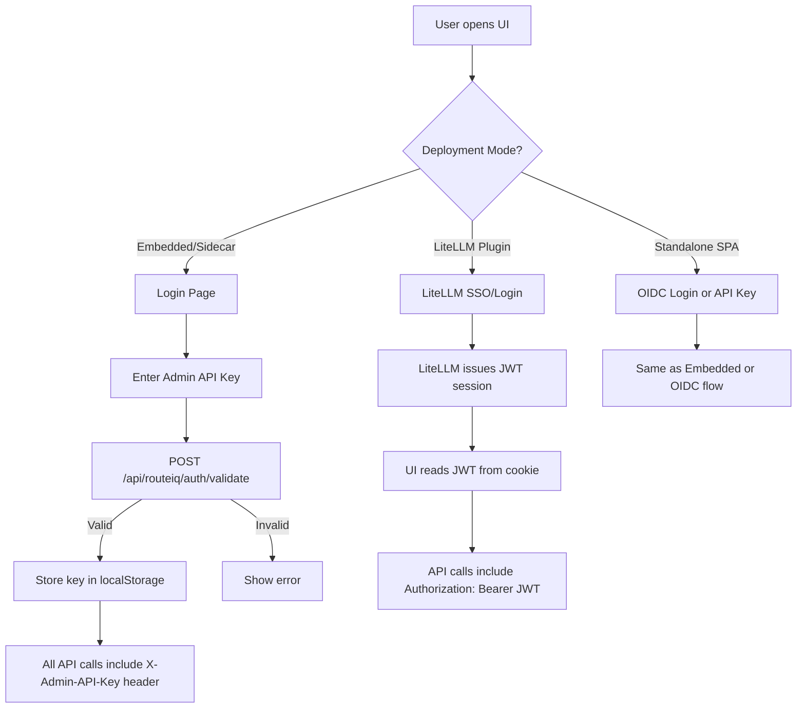

# TG3: Admin UI Architecture Design

> **Version**: 1.0  
> **Date**: 2026-02-18  
> **Status**: Proposal — awaiting review  
> **Scope**: Complete admin UI architecture for RouteIQ, covering both standalone and LiteLLM-plugin deployment modes  
> **Companion doc**: [TG3 Alternative Patterns](tg3-alternative-patterns.md)

---

## Executive Summary

RouteIQ currently has **no admin UI**. LiteLLM ships a comprehensive Next.js dashboard
covering model management, API keys, teams, usage, and cost tracking — but nothing for
RouteIQ's unique capabilities: ML routing strategy configuration, A/B testing, routing
decision visualization, MLOps pipeline management, plugin lifecycle, or policy editing.

This document designs a **React + TypeScript + Vite** single-page application that serves
as the RouteIQ admin console. The UI is purpose-built for RouteIQ's differentiating
features and is deployable in four modes: embedded in the gateway process, as a Docker
sidecar, as a standalone SPA, or as custom pages extending LiteLLM's existing dashboard.

The recommended architecture uses **TanStack Query** for server state management,
**WebSocket/SSE** for real-time routing metrics, and authenticates via the existing
`ADMIN_API_KEYS` mechanism with optional OIDC delegation when running as a LiteLLM plugin.

The UI is packaged as a Python wheel (`routeiq-ui`) containing pre-built static assets
served by FastAPI's `StaticFiles` mount, requiring zero Node.js runtime in production.

---

## Design Principles

1. **RouteIQ-only scope**: The UI covers only what LiteLLM's dashboard does NOT — routing
   strategies, A/B testing, MLOps, plugins, policies. It does not duplicate model
   management, key management, or spend tracking.

2. **Dual-mode awareness**: Every page works whether RouteIQ runs standalone or as a
   LiteLLM plugin. When running as a plugin, the UI links to LiteLLM's dashboard for
   overlapping concerns (models, keys, teams).

3. **API-first**: The UI consumes a well-defined REST API. No server-side rendering,
   no backend-for-frontend. The same API is usable by CLI tools, Terraform providers,
   and external integrations.

4. **Progressive disclosure**: The dashboard overview shows key metrics at a glance.
   Advanced features (policy editor, MLOps pipeline, config YAML editor) are accessible
   but not in the critical path.

5. **Zero runtime dependencies**: The production artifact is static HTML/CSS/JS served
   by FastAPI. No Node.js, no webpack-dev-server, no SSR process.

---

## Technology Decision

### Options Evaluated

| Option | Stack | Pros | Cons |
|--------|-------|------|------|
| **A: React + TypeScript + Vite** | React 18, TypeScript, Vite 6, TanStack Query, Tailwind CSS, Tremor charts | Fast builds (<2s HMR), excellent ecosystem, tree-shakeable, static output | No SSR (not needed for admin UI) |
| **B: Next.js** | Next.js 14, React 18, TypeScript | Matches LiteLLM dashboard — component sharing possible; SSR for SEO | SSR unnecessary for admin; `output: "export"` negates Next.js advantages; heavier dev toolchain; LiteLLM uses Next.js 14 with Ant Design which creates coupling |
| **C: Streamlit/Gradio** | Python-native UI framework | Zero JS; rapid MVP; Python devs can contribute | Limited customization; no WebSocket for real-time; poor UX for complex forms; not embeddable as static assets |
| **D: Extend LiteLLM Dashboard** | Fork/extend LiteLLM's Next.js app | Direct integration; shared auth; shared nav | Tight coupling to LiteLLM's UI release cadence; merge conflicts on upstream updates; forces Next.js/Ant Design; RouteIQ's plugin model means the UI should be independently deployable |

### Recommendation: **Option A — React + TypeScript + Vite**

**Justification:**

1. **Decoupled from LiteLLM's release cadence**: The TG3 architecture recommendation is
   to restructure RouteIQ as a `pip install routeiq-router` package. The UI should follow
   the same philosophy — independently versioned, independently deployable.

2. **Vite provides the best DX**: Sub-second HMR, native ESM, built-in TypeScript support.
   Build output is static assets (HTML + JS + CSS) deployable anywhere.

3. **Tremor + Tailwind for dashboards**: [Tremor](https://tremor.so) provides
   purpose-built React dashboard components (area charts, bar lists, metric cards,
   sparklines) on top of Tailwind CSS. This matches the data-heavy nature of RouteIQ's
   admin needs without the weight of Ant Design.

4. **TanStack Query for server state**: Handles caching, background refetching, optimistic
   updates, and pagination — exactly what an admin UI polling a gateway API needs.

5. **Static output is embeddable**: The built assets can be served by FastAPI
   (`StaticFiles`), embedded in a Docker image, or deployed to a CDN. LiteLLM uses the
   same pattern (`output: "export"` in their Next.js config at
   [`next.config.mjs`](../../reference/litellm/ui/litellm-dashboard/next.config.mjs:3)).

**Key libraries:**

| Concern | Library | Version |
|---------|---------|---------|
| Framework | React | ^18.3 |
| Language | TypeScript | ^5.5 |
| Bundler | Vite | ^6.x |
| Server state | @tanstack/react-query | ^5.x |
| Charts/metrics | @tremor/react | ^3.x |
| CSS | Tailwind CSS | ^3.4 |
| Forms | react-hook-form + zod | ^7.x / ^3.x |
| Code editor | @monaco-editor/react | ^4.x |
| Routing | react-router-dom | ^6.x |
| HTTP client | ky (fetch-based) | ^1.x |
| Real-time | native EventSource (SSE) | built-in |
| Testing | Vitest + Testing Library | ^2.x |

---

## Deployment Architecture

### Mode 1: Embedded in Gateway (Recommended Default)

The UI is served as static assets from the RouteIQ gateway process via FastAPI's
`StaticFiles` middleware. This is the simplest deployment — one container, one port.

```
    Browser
      |
      v
+---------------------------+
|    RouteIQ Gateway        |
|    (FastAPI, port 4000)   |
|                           |
|  /ui/*  --> StaticFiles   |   <-- Pre-built React SPA
|  /api/* --> FastAPI routes |   <-- Admin API
|  /v1/*  --> LiteLLM proxy |   <-- LLM proxy (if in-process)
+---------------------------+
```

**Implementation**: The `routeiq-ui` Python package bundles pre-built assets. On startup,
[`gateway/app.py`](../../src/litellm_llmrouter/gateway/app.py) mounts them:

```python
from fastapi.staticfiles import StaticFiles
import importlib.resources

ui_assets = importlib.resources.files("routeiq_ui") / "dist"
app.mount("/ui", StaticFiles(directory=str(ui_assets), html=True), name="routeiq-ui")
```

**Pros**: Single container, zero additional infrastructure, CORS-free (same origin).  
**Cons**: UI bundle increases gateway image size (~5MB gzipped).

### Mode 2: Docker Sidecar

The UI runs in a separate container (nginx or Caddy serving static files) alongside the
gateway. An nginx reverse proxy unifies both under one hostname.

```
+-------------------------------------------------------+
|  docker-compose                                       |
|                                                       |
|  +----------------+       +------------------------+  |
|  | routeiq-ui     |       | routeiq-gateway        |  |
|  | (nginx:alpine) |       | (FastAPI, port 4000)   |  |
|  | port 3000      |       |                        |  |
|  | /ui/* (static) |       | /api/* (admin API)     |  |
|  +--------+-------+       +-----------+------------+  |
|           |                           |               |
|  +--------v---------------------------v------------+  |
|  |              nginx reverse proxy                |  |
|  |              (port 80/443)                      |  |
|  |                                                 |  |
|  |  /ui/*   --> routeiq-ui:3000                    |  |
|  |  /api/*  --> routeiq-gateway:4000               |  |
|  +---------------------------------------------+  |  |
+-------------------------------------------------------+
```

**Pros**: UI updates independent of gateway; smaller gateway image.  
**Cons**: Extra container; nginx config complexity; CORS configuration needed if not proxied.

### Mode 3: Standalone SPA

The UI is deployed to a CDN (CloudFront, Vercel, Cloudflare Pages) and communicates with
the gateway API over HTTPS. Suitable for managed/hosted RouteIQ offerings.

```
    Browser
      |
      +---> CDN (ui.routeiq.example.com)
      |       |
      |       v
      |     React SPA (static assets)
      |
      +---> Gateway API (api.routeiq.example.com)
              |
              v
            FastAPI (CORS: allow ui.routeiq.example.com)
```

**Configuration**: The SPA reads the gateway URL from `VITE_ROUTEIQ_API_URL` at build
time (baked into the bundle) or from `/ui/config.json` at runtime (injected by deployment).

**Pros**: Globally distributed; scales independently; free hosting on Vercel/Pages.  
**Cons**: Requires CORS configuration; separate deployment pipeline; API must be publicly
reachable.

### Mode 4: LiteLLM Dashboard Extension

When RouteIQ operates as a LiteLLM plugin, the UI can be loaded as an iframe or
micro-frontend within LiteLLM's existing Next.js dashboard. LiteLLM's sidebar
navigation at [`leftnav.tsx`](../../reference/litellm/ui/litellm-dashboard/src/components/leftnav.tsx)
adds a "RouteIQ" section linking to either:

- **Iframe embed**: LiteLLM page renders `<iframe src="/ui/" />` pointing at the embedded
  RouteIQ UI
- **External link**: Sidebar links open the standalone RouteIQ UI in a new tab

This mode requires minimal changes — LiteLLM's dashboard already supports custom sidebar
items and external links.

```
+---------------------------------------------+
|  LiteLLM Dashboard (Next.js)                |
|                                             |
|  +----------+  +-------------------------+  |
|  | Sidebar  |  |  Content Area           |  |
|  |          |  |                         |  |
|  | Models   |  |  +-------------------+  |  |
|  | Keys     |  |  | RouteIQ UI        |  |  |
|  | Teams    |  |  | (iframe or link)  |  |  |
|  | Usage    |  |  |                   |  |  |
|  | -------- |  |  | Routing Config    |  |  |
|  | RouteIQ >|  |  | A/B Testing       |  |  |
|  |  Routing |  |  | MLOps Pipeline    |  |  |
|  |  A/B Test|  |  | Plugin Manager    |  |  |
|  |  MLOps   |  |  +-------------------+  |  |
|  |  Plugins |  |                         |  |
|  +----------+  +-------------------------+  |
+---------------------------------------------+
```

**Pros**: Seamless UX within existing dashboard; shared auth session.  
**Cons**: Iframe has CSS isolation challenges; micro-frontend adds complexity.

### Deployment Mode Selection

| Scenario | Recommended Mode |
|----------|-----------------|
| Self-hosted RouteIQ standalone | Mode 1 (Embedded) |
| Self-hosted with K8s / Helm | Mode 2 (Sidecar) |
| Managed / SaaS offering | Mode 3 (Standalone SPA) |
| RouteIQ as LiteLLM plugin | Mode 4 (Dashboard Extension) |
| Development / local testing | Mode 1 (Embedded) with Vite dev proxy |

---

## Feature Design

### 1. Dashboard (Overview)

The landing page provides at-a-glance operational metrics for the routing layer.

**User stories:**
- As an operator, I want to see requests/sec, latency, and cost at a glance
- As an operator, I want to see which routing strategy is active and its performance
- As an operator, I want to see model distribution to detect routing anomalies

**Layout:**

```
+------------------------------------------------------------------+
| RouteIQ Admin                            [user@company] [Logout] |
+--------+---------------------------------------------------------+
|        |  Dashboard                                    [Refresh] |
| NAV    |                                                         |
|        |  +------------+ +------------+ +------------+ +--------+|
|Dashboard|  | Requests/s | | p50 Lat ms | | p95 Lat ms | | Cost/h ||
|Routing  |  |    247     | |    42      | |    189     | | $12.50 ||
|Explorer |  +------------+ +------------+ +------------+ +--------+|
|MLOps    |                                                         |
|Plugins  |  +----------------------------+ +----------------------+|
|Policies |  | Requests by Model (Area)   | | Strategy Performance ||
|Config   |  |                            | |                      ||
|         |  | ~~~~~~___~~~~              | | A: knn    p50: 38ms  ||
|         |  | ~~~~/      \~~~           | | B: svm    p50: 45ms  ||
|         |  |                            | | Active: knn (90%)    ||
|         |  +----------------------------+ +----------------------+|
|         |                                                         |
|         |  +----------------------------+ +----------------------+|
|         |  | Model Distribution (Bar)   | | Recent Routing       ||
|         |  |                            | | Decisions            ||
|         |  | claude-3-opus  ████ 45%    | |                      ||
|         |  | gpt-4o         ███  32%    | | 17:23:01 gpt-4o      ||
|         |  | claude-3-sonnet██  23%     | | 17:23:00 claude-opus  ||
|         |  +----------------------------+ +----------------------+|
+---------+---------------------------------------------------------+
```

**Data requirements:**
- `GET /api/routeiq/metrics/realtime` — SSE stream of requests/sec, latency percentiles, cost
- `GET /api/routeiq/metrics/model-distribution?window=1h` — model selection counts
- `GET /api/routeiq/strategies/compare` — existing endpoint at [`/llmrouter/strategies/compare`](../../src/litellm_llmrouter/routes/config.py:230)
- `GET /api/routeiq/routing/recent?limit=20` — recent routing decisions (new endpoint)

**Real-time**: SSE for live metrics (requests/sec, latency). Polling (10s) for model distribution.

### 2. Routing Configuration

Configure which ML routing strategy is active, manage A/B test experiments, and set
model candidates.

**User stories:**
- As an ML engineer, I want to select a routing strategy and configure its parameters
- As an ML engineer, I want to create A/B tests between strategies with traffic splits
- As an ML engineer, I want to see which models are candidates for routing

**Layout:**

```
+------------------------------------------------------------------+
| Routing Configuration                                            |
|                                                                  |
| +--------------------------------------------------------------+|
| | Active Strategy                                    [Change]  ||
| |                                                              ||
| |  Strategy: llmrouter-knn          Version: v2.1.0           ||
| |  Status:   Active                 Since: 2026-02-18 09:00   ||
| |                                                              ||
| |  Parameters:                                                 ||
| |    embedding_model: all-MiniLM-L6-v2                         ||
| |    k_neighbors: 5                                            ||
| |    similarity_threshold: 0.7                                 ||
| +--------------------------------------------------------------+|
|                                                                  |
| +--------------------------------------------------------------+|
| | A/B Testing Experiment                    [Create Experiment] ||
| |                                                              ||
| |  Experiment: routing-v3-rollout-2026Q1    Status: Running    ||
| |                                                              ||
| |  Variant     | Strategy      | Weight | Requests | p50 Lat  ||
| |  ------------|---------------|--------|----------|----------||
| |  control     | llmrouter-knn |   90%  |   12,450 |   38ms   ||
| |  treatment   | llmrouter-svm |   10%  |    1,383 |   45ms   ||
| |                                                              ||
| |  [Stop Experiment]  [Promote Treatment]  [View Details]      ||
| +--------------------------------------------------------------+|
|                                                                  |
| +--------------------------------------------------------------+|
| | Model Candidates                                             ||
| |                                                              ||
| |  Model Name        | Provider   | Status  | Health          ||
| |  ------------------|------------|---------|----------------||
| |  claude-3-opus     | Anthropic  | Active  | [Healthy]       ||
| |  gpt-4o            | OpenAI     | Active  | [Healthy]       ||
| |  claude-3-sonnet   | Anthropic  | Active  | [Degraded]      ||
| |  mixtral-8x7b      | Together   | Staged  | [Not deployed]  ||
| +--------------------------------------------------------------+|
+------------------------------------------------------------------+
```

**Data requirements:**
- `GET /api/routeiq/strategy` — current active strategy + parameters
- `GET /api/routeiq/strategies` — list all available strategies
- `PUT /api/routeiq/strategy` — change active strategy
- `GET /api/routeiq/experiment` — current A/B experiment config
- `POST /api/routeiq/experiment` — create/update experiment
- `DELETE /api/routeiq/experiment` — stop experiment
- `POST /api/routeiq/experiment/promote` — promote variant to 100%
- `GET /_health/models` — existing endpoint for model health

**Real-time**: Polling (30s) for experiment metrics. Static for strategy config.

### 3. Routing Explorer

Search, filter, and inspect individual routing decisions. Answers "why was model X
chosen for request Y?"

**User stories:**
- As a developer, I want to search routing decisions by request ID or model
- As an ML engineer, I want to understand why a specific model was chosen
- As an operator, I want to see fallback events and their causes

**Layout:**

```
+------------------------------------------------------------------+
| Routing Explorer                                                 |
|                                                                  |
| +--------------------------------------------------------------+|
| | Search: [request_id, model, strategy______] [Filter] [Clear] ||
| |                                                              ||
| | Time Range: [Last 1 hour v]  Strategy: [All v]  Outcome: [v]||
| +--------------------------------------------------------------+|
|                                                                  |
| +--------------------------------------------------------------+|
| | Timestamp   | ReqID    | Strategy  | Model      | Latency   ||
| |-------------|----------|-----------|------------|----------||
| | 17:23:01.45 | req-abc  | knn       | gpt-4o     | 12ms     ||
| | 17:23:00.89 | req-def  | knn       | claude-opus| 15ms     ||
| | 17:22:59.12 | req-ghi  | svm (A/B) | gpt-4o     | 8ms  [!] ||
| +--------------------------------------------------------------+|
|                                                                  |
| +--------------------------------------------------------------+|
| | Decision Detail: req-abc                                     ||
| |                                                              ||
| |  Strategy: llmrouter-knn v2.1.0                              ||
| |  Query embedding similarity scores:                          ||
| |    claude-3-opus:   0.89  ████████████████░░                 ||
| |    gpt-4o:          0.92  █████████████████░░  <-- selected  ||
| |    claude-3-sonnet:  0.71  ████████████░░░░░░                ||
| |                                                              ||
| |  A/B Assignment: control (knn, weight=90, bucket=34)         ||
| |  Trace ID: abc123def456                                      ||
| |  Latency breakdown: embedding=8ms, scoring=3ms, total=12ms  ||
| +--------------------------------------------------------------+|
+------------------------------------------------------------------+
```

**Data requirements:**
- `GET /api/routeiq/routing/decisions?limit=50&offset=0&strategy=knn&model=gpt-4o` — paginated routing decisions (new)
- `GET /api/routeiq/routing/decisions/{request_id}` — single decision detail with scoring breakdown (new)
- Backed by OpenTelemetry span data via Jaeger/Tempo query API, or a local ring buffer

**Real-time**: Polling (5s) for newest decisions in list view.

### 4. MLOps Pipeline

View training job status, model performance metrics, and deployment history for ML
routing models.

**User stories:**
- As an ML engineer, I want to see the status of training runs
- As an ML engineer, I want to compare model versions before deploying
- As an operator, I want to see which model version is currently deployed

**Layout:**

```
+------------------------------------------------------------------+
| MLOps Pipeline                                                   |
|                                                                  |
| +--------------------------------------------------------------+|
| | Current Model                                                ||
| |                                                              ||
| |  Strategy: knn   Model: router-knn-v2.1.0                   ||
| |  Trained: 2026-02-15   Deployed: 2026-02-16                 ||
| |  SHA256: a3f2b1...     Signature: Verified                  ||
| |  Performance: accuracy=0.87  latency_p50=12ms               ||
| +--------------------------------------------------------------+|
|                                                                  |
| +--------------------------------------------------------------+|
| | Training Jobs                               [Trigger Train]  ||
| |                                                              ||
| |  Job ID    | Strategy | Status    | Started     | Duration  ||
| |  ----------|----------|-----------|-------------|----------||
| |  job-001   | knn      | Completed | Feb 15 09:00| 45min    ||
| |  job-002   | svm      | Running   | Feb 18 14:00| 12min... ||
| |  job-003   | mlp      | Failed    | Feb 17 11:00| 3min     ||
| +--------------------------------------------------------------+|
|                                                                  |
| +--------------------------------------------------------------+|
| | Model Artifacts                              [Upload Model]  ||
| |                                                              ||
| |  Model             | Version | SHA256   | Signed | Deployed ||
| |  -------------------|---------|----------|--------|----------||
| |  router-knn-v2.1.0 | 2.1.0   | a3f2b1.. | Yes    | Active   ||
| |  router-knn-v2.0.0 | 2.0.0   | b4c3d2.. | Yes    | Previous ||
| |  router-svm-v1.0.0 | 1.0.0   | c5d4e3.. | No     | Staged   ||
| +--------------------------------------------------------------+|
+------------------------------------------------------------------+
```

**Data requirements:**
- `GET /api/routeiq/mlops/models` — deployed model info (new)
- `GET /api/routeiq/mlops/jobs` — training job list (new)
- `POST /api/routeiq/mlops/jobs` — trigger training run (new)
- `GET /api/routeiq/mlops/artifacts` — model artifact list (partially covered by model_artifacts.py)
- `POST /api/routeiq/mlops/artifacts/upload` — upload model artifact (new)
- `POST /api/routeiq/mlops/artifacts/{id}/deploy` — deploy a staged model (new)

**Real-time**: Polling (30s) for running jobs.

### 5. Plugin Manager

List loaded plugins, toggle enable/disable, view health status, and edit per-plugin
configuration.

**User stories:**
- As an operator, I want to see which plugins are loaded and healthy
- As an operator, I want to enable/disable a plugin without restarting
- As a developer, I want to configure plugin-specific settings

**Layout:**

```
+------------------------------------------------------------------+
| Plugin Manager                                                   |
|                                                                  |
| +--------------------------------------------------------------+|
| | Loaded Plugins                               [ Load Plugin ] ||
| |                                                              ||
| |  Plugin          | Capability     | Status   | Priority     ||
| |  ----------------|----------------|----------|-------------- ||
| |  evaluator       | evaluation     | Healthy  | 100  [Toggle]||
| |  content_filter  | guardrail      | Healthy  | 200  [Toggle]||
| |  cost_tracker    | cost_tracking  | Healthy  | 300  [Toggle]||
| |  pii_guard       | guardrail      | Degraded | 150  [Toggle]||
| |  cache_plugin    | caching        | Healthy  | 50   [Toggle]||
| +--------------------------------------------------------------+|
|                                                                  |
| +--------------------------------------------------------------+|
| | Plugin Detail: pii_guard                          [Configure] ||
| |                                                              ||
| |  Status: Degraded                                            ||
| |  Capabilities: guardrail, evaluation                         ||
| |  Dependencies: none                                          ||
| |  Failure Mode: quarantine                                    ||
| |                                                              ||
| |  Health Check:                                               ||
| |    status: degraded                                          ||
| |    reason: NER model loading slow (>5s)                      ||
| |    last_check: 2026-02-18T17:20:00Z                         ||
| |                                                              ||
| |  Configuration:                                              ||
| |    ROUTEIQ_PLUGIN_PII_GUARD_MODEL=en_core_web_lg            ||
| |    ROUTEIQ_PLUGIN_PII_GUARD_THRESHOLD=0.85                  ||
| +--------------------------------------------------------------+|
+------------------------------------------------------------------+
```

**Data requirements:**
- `GET /api/routeiq/plugins` — list plugins with status (new)
- `GET /api/routeiq/plugins/{name}` — plugin detail (new)
- `POST /api/routeiq/plugins/{name}/toggle` — enable/disable (new)
- `GET /api/routeiq/plugins/{name}/health` — health check result (new)
- `PUT /api/routeiq/plugins/{name}/config` — update config (new)

**Real-time**: Polling (60s) for health checks.

### 6. Policy Editor

Create, edit, and test OPA-style policies that control access to the gateway.

**User stories:**
- As a security engineer, I want to create policies that restrict model access by team
- As a security engineer, I want to test a policy against a sample request before applying
- As an operator, I want to see which policies are active and their evaluation results

**Layout:**

```
+------------------------------------------------------------------+
| Policy Editor                                                    |
|                                                                  |
| +-----------------------------+ +-------------------------------+|
| | Policies                    | | Editor                        ||
| |                             | |                               ||
| | [+ New Policy]              | | Name: [deny-expensive-models] ||
| |                             | |                               ||
| | > deny-expensive-models [A] | | +---------------------------+ ||
| |   allow-team-alpha      [A] | | | rules:                    | ||
| |   rate-limit-staging    [D] | | |   - name: deny-opus       | ||
| |                             | | |     match:                | ||
| |                             | | |       route: /v1/chat/*   | ||
| | [A] = Active                | | |       model: claude-*-opus| ||
| | [D] = Disabled              | | |     action: deny          | ||
| |                             | | |     reason: Cost control  | ||
| |                             | | +---------------------------+ ||
| +-----------------------------+ |                               ||
|                                 | [Validate] [Save] [Test]      ||
| +--------------------------------------------------------------+|
| | Policy Tester                                                ||
| |                                                              ||
| |  Sample Request:                                             ||
| |  { "model": "claude-3-opus", "user": "alice",               ||
| |    "team": "alpha", "route": "/v1/chat/completions" }       ||
| |                                                              ||
| |  Result: [DENIED] - Rule: deny-opus - Reason: Cost control  ||
| +--------------------------------------------------------------+|
+------------------------------------------------------------------+
```

**Data requirements:**
- `GET /api/routeiq/policies` — list policies (new)
- `GET /api/routeiq/policies/{id}` — get policy YAML (new)
- `PUT /api/routeiq/policies/{id}` — update policy (new)
- `POST /api/routeiq/policies` — create policy (new)
- `DELETE /api/routeiq/policies/{id}` — delete policy (new)
- `POST /api/routeiq/policies/test` — evaluate policy against sample request (new)
- `GET /api/routeiq/policies/stats` — policy evaluation statistics (new)

**Real-time**: Static (policies change infrequently).

### 7. Config Editor

Full YAML configuration editor with validation, diff view, and hot-reload trigger.

**User stories:**
- As an operator, I want to edit the gateway config in a web editor
- As an operator, I want to see a diff before applying changes
- As an operator, I want to trigger hot-reload after making changes

**Layout:**

```
+------------------------------------------------------------------+
| Config Editor                                                    |
|                                                                  |
| +--------------------------------------------------------------+|
| | Config Source: [config.yaml v]        Last Reload: 17:20:01  ||
| | Sync Status: [In Sync with S3]       Hot Reload: [Enabled]  ||
| +--------------------------------------------------------------+|
|                                                                  |
| +--------------------------------------------------------------+|
| |  +-------------------------+  +----------------------------+ ||
| |  | Current Config          |  | Editor                     | ||
| |  |                         |  |                            | ||
| |  | model_list:             |  | model_list:                | ||
| |  |   - model_name: gpt-4o |  |   - model_name: gpt-4o    | ||
| |  |     litellm_params:     |  |     litellm_params:        | ||
| |  |       model: gpt-4o    |  |       model: gpt-4o       | ||
| |  |                         |  |   - model_name: claude-4   | ||
| |  |                         |  |     litellm_params:        | ||
| |  |                         |  |       model: claude-4      | ||
| |  +-------------------------+  +----------------------------+ ||
| |                                                              ||
| |  Changes: +2 lines added, 0 removed                         ||
| |                                                              ||
| |  [Validate]  [Show Diff]  [Apply & Hot-Reload]  [Discard]   ||
| +--------------------------------------------------------------+|
+------------------------------------------------------------------+
```

**Data requirements:**
- `GET /api/routeiq/config` — current config YAML (partially via existing [`/llmrouter/config`](../../src/litellm_llmrouter/routes/config.py))
- `PUT /api/routeiq/config` — update config (new)
- `POST /api/routeiq/config/validate` — validate YAML without applying (new)
- `POST /api/routeiq/config/reload` — trigger hot-reload (existing: [`POST /config/reload`](../../src/litellm_llmrouter/routes/config.py:100))
- `GET /api/routeiq/config/sync/status` — S3 sync status (existing: [`GET /config/sync/status`](../../src/litellm_llmrouter/routes/config.py:211))

**Real-time**: Polling (30s) for sync status.

---

## Backend API Contract

All endpoints are prefixed with `/api/routeiq/` for the UI. In the gateway, these map
to the existing route structure or new routes added to the admin router.

### Existing Endpoints (Already Implemented)

| Endpoint | Method | Auth | UI Page | Module |
|----------|--------|------|---------|--------|
| `/_health/live` | GET | None | Dashboard | [`routes/health.py:36`](../../src/litellm_llmrouter/routes/health.py:36) |
| `/_health/ready` | GET | None | Dashboard | [`routes/health.py:50`](../../src/litellm_llmrouter/routes/health.py:50) |
| `/_health/models` | GET | None | Routing Config | [`routes/health.py:256`](../../src/litellm_llmrouter/routes/health.py:256) |
| `/llmrouter/strategies/compare` | GET | User | Routing Config | [`routes/config.py:230`](../../src/litellm_llmrouter/routes/config.py:230) |
| `/router/info` | GET | User | Dashboard | [`routes/config.py:222`](../../src/litellm_llmrouter/routes/config.py:222) |
| `/config/sync/status` | GET | User | Config Editor | [`routes/config.py:211`](../../src/litellm_llmrouter/routes/config.py:211) |
| `/config/status` | GET | None | Config Editor | [`routes/config.py:247`](../../src/litellm_llmrouter/routes/config.py:247) |
| `/llmrouter/reload` | POST | Admin+RBAC | Config Editor | [`routes/config.py:65`](../../src/litellm_llmrouter/routes/config.py:65) |
| `/config/reload` | POST | Admin+RBAC | Config Editor | [`routes/config.py:100`](../../src/litellm_llmrouter/routes/config.py:100) |
| `/llmrouter/spend/report` | GET | Admin | Dashboard | [`routes/config.py:259`](../../src/litellm_llmrouter/routes/config.py:259) |
| `/admin/cache/stats` | GET | Admin | Dashboard | [`routes/config.py:139`](../../src/litellm_llmrouter/routes/config.py:139) |

### New Endpoints — MVP (P0)

These are required for the initial UI launch.

#### Routing Strategy API

```
GET  /api/routeiq/strategies
  Response: { strategies: [{ name, family, version, state, parameters }] }
  Auth: User API key
  Maps to: strategy_registry.get_status()

GET  /api/routeiq/strategy
  Response: { name, family, version, state, parameters, registered_at }
  Auth: User API key
  Maps to: strategy_registry.get_active() + get_entry()

PUT  /api/routeiq/strategy
  Request: { strategy: "llmrouter-knn", parameters: { k: 5 } }
  Response: { success: true, previous: "llmrouter-svm" }
  Auth: Admin API key
  Maps to: strategy_registry.set_active()
```

#### A/B Experiment API

```
GET  /api/routeiq/experiment
  Response: { experiment_id, variants: { control: { strategy, weight }, ... }, status }
  Auth: User API key
  Maps to: strategy_registry.get_experiment()

POST /api/routeiq/experiment
  Request: { experiment_id, variants: [{ name, strategy, weight }], description }
  Response: { experiment_id, status: "running" }
  Auth: Admin API key
  Maps to: strategy_registry.set_experiment()

DELETE /api/routeiq/experiment
  Response: { status: "stopped", final_metrics: { ... } }
  Auth: Admin API key
  Maps to: strategy_registry.clear_weights()

POST /api/routeiq/experiment/promote
  Request: { variant: "treatment" }
  Response: { promoted_strategy: "llmrouter-svm", previous: "llmrouter-knn" }
  Auth: Admin API key
  Maps to: strategy_registry.set_active(variant_strategy)
```

#### Routing Decisions API

```
GET  /api/routeiq/routing/decisions
  Query: ?limit=50&offset=0&strategy=knn&model=gpt-4o&since=2026-02-18T00:00:00Z
  Response: { decisions: [{ request_id, timestamp, strategy, model, latency_ms, outcome }], total }
  Auth: Admin API key
  Source: OpenTelemetry span query or in-memory ring buffer

GET  /api/routeiq/routing/decisions/{request_id}
  Response: { request_id, strategy, version, model, candidates: [{ model, score }],
              ab_assignment: { experiment_id, variant, bucket }, latency_breakdown, trace_id }
  Auth: Admin API key
  Source: OpenTelemetry span query
```

#### Real-time Metrics API

```
GET  /api/routeiq/metrics/stream (SSE)
  Event stream: { type: "metrics", data: { requests_per_sec, p50_ms, p95_ms, cost_per_hour } }
  Auth: Admin API key (query param ?token=xxx for SSE)
  Interval: 1s

GET  /api/routeiq/metrics/model-distribution
  Query: ?window=1h
  Response: { models: [{ name, count, percentage }] }
  Auth: User API key
```

#### Plugin Management API

```
GET  /api/routeiq/plugins
  Response: { plugins: [{ name, capabilities, status, priority, failure_mode }] }
  Auth: Admin API key
  Maps to: PluginManager.plugins + health_checks()

GET  /api/routeiq/plugins/{name}
  Response: { name, capabilities, status, priority, dependencies, config, health }
  Auth: Admin API key

POST /api/routeiq/plugins/{name}/toggle
  Request: { enabled: false }
  Response: { name, status: "disabled" }
  Auth: Admin API key

PUT  /api/routeiq/plugins/{name}/config
  Request: { settings: { "threshold": 0.85 } }
  Response: { name, config: { ... }, requires_restart: false }
  Auth: Admin API key
```

### New Endpoints — Post-MVP (P1)

#### Policy Management API

```
GET    /api/routeiq/policies
POST   /api/routeiq/policies
GET    /api/routeiq/policies/{id}
PUT    /api/routeiq/policies/{id}
DELETE /api/routeiq/policies/{id}
POST   /api/routeiq/policies/test
GET    /api/routeiq/policies/stats
```

#### MLOps Pipeline API

```
GET  /api/routeiq/mlops/models
GET  /api/routeiq/mlops/jobs
POST /api/routeiq/mlops/jobs
GET  /api/routeiq/mlops/artifacts
POST /api/routeiq/mlops/artifacts/upload
POST /api/routeiq/mlops/artifacts/{id}/deploy
```

#### Config Management API

```
GET  /api/routeiq/config/full
PUT  /api/routeiq/config/full
POST /api/routeiq/config/validate
POST /api/routeiq/config/diff
```

### New Endpoints — Nice-to-Have (P2)

```
GET  /api/routeiq/audit/log          -- Query audit log entries
GET  /api/routeiq/resilience/status   -- Circuit breaker states, backpressure stats
POST /api/routeiq/resilience/reset    -- Reset a circuit breaker
GET  /api/routeiq/routing/explain     -- Natural language explanation of a routing decision
WS   /api/routeiq/ws/metrics          -- WebSocket alternative to SSE for metrics
```

### API Design: REST vs GraphQL

**Decision: REST**

RouteIQ's admin API has well-defined, bounded resources (strategies, experiments, plugins,
policies). The query patterns are predictable — the UI knows exactly what data each page
needs. GraphQL's flexibility is unnecessary and adds complexity (schema definition,
resolver implementation, client codegen).

REST is also consistent with the existing gateway API style (FastAPI routers with
Pydantic models) and with LiteLLM's API surface.

---

## State Management & Real-time Data

### Client-Side State Architecture

```
+------------------------------------------------------------------+
|                        React Application                         |
|                                                                  |
|  +-------------------+  +--------------------+  +--------------+ |
|  | TanStack Query    |  | React State        |  | URL State    | |
|  | (Server State)    |  | (UI State)         |  | (Navigation) | |
|  |                   |  |                    |  |              | |
|  | - Strategy config |  | - Sidebar open     |  | - Active page| |
|  | - Plugin list     |  | - Modal visibility |  | - Filters    | |
|  | - Policy list     |  | - Form dirty state |  | - Sort order | |
|  | - Metrics data    |  | - Selected items   |  | - Pagination | |
|  | - Routing history |  | - Editor content   |  |              | |
|  +-------------------+  +--------------------+  +--------------+ |
|                                                                  |
|  +-------------------+  +--------------------+                   |
|  | localStorage      |  | SSE Connection     |                   |
|  | (Persistence)     |  | (Real-time)        |                   |
|  |                   |  |                    |                   |
|  | - Auth token      |  | - Metrics stream   |                   |
|  | - UI preferences  |  | - Event updates    |                   |
|  | - Last page       |  |                    |                   |
|  +-------------------+  +--------------------+                   |
+------------------------------------------------------------------+
```

### Data Fetching Strategy

| Data Type | Method | Stale Time | Refetch |
|-----------|--------|------------|---------|
| Strategy config | TanStack Query | 30s | On focus + on mutation |
| Experiment status | TanStack Query | 10s | Polling 10s |
| Plugin list | TanStack Query | 60s | On focus |
| Policy list | TanStack Query | 5min | On mutation |
| Routing decisions | TanStack Query | 5s | Polling 5s (list), on-demand (detail) |
| Live metrics | SSE (EventSource) | N/A (real-time) | Auto-reconnect |
| Config YAML | TanStack Query | 30s | On focus |
| Model health | TanStack Query | 15s | Polling 15s |

### Real-time Data: SSE vs WebSocket vs Polling

**Decision: SSE for metrics, polling for everything else.**

- **SSE** (`EventSource` API) provides server-push with automatic reconnection. The
  gateway's existing [`mcp_sse_transport.py`](../../src/litellm_llmrouter/mcp_sse_transport.py)
  demonstrates SSE is already a proven pattern in this codebase.
- **WebSocket** adds bidirectional communication unnecessary for a dashboard (the UI
  mostly reads data). WebSocket also requires more complex connection lifecycle management.
- **Polling** (via TanStack Query `refetchInterval`) is sufficient for data that changes
  on human timescales (config, plugins, policies).

SSE is used only for the dashboard metrics stream (`/api/routeiq/metrics/stream`), which
pushes metrics at 1-second intervals. All other data uses optimistic-mutation polling.

### Optimistic Updates

For config changes (strategy switch, experiment creation, plugin toggle), the UI
applies optimistic updates via TanStack Query's `onMutate` — immediately updating the
UI state while the request is in-flight. On failure, the mutation is rolled back.

```typescript
const togglePlugin = useMutation({
  mutationFn: (args: { name: string; enabled: boolean }) =>
    api.post(`/plugins/${args.name}/toggle`, { enabled: args.enabled }),
  onMutate: async ({ name, enabled }) => {
    await queryClient.cancelQueries({ queryKey: ["plugins"] });
    const previous = queryClient.getQueryData(["plugins"]);
    queryClient.setQueryData(["plugins"], (old: Plugin[]) =>
      old.map(p => p.name === name ? { ...p, status: enabled ? "healthy" : "disabled" } : p)
    );
    return { previous };
  },
  onError: (_err, _vars, context) => {
    queryClient.setQueryData(["plugins"], context?.previous);
  },
  onSettled: () => {
    queryClient.invalidateQueries({ queryKey: ["plugins"] });
  },
});
```

---

## Authentication & Authorization

### Auth Flow by Deployment Mode



### Standalone / Embedded Mode

1. User navigates to `/ui/`
2. UI checks for stored admin key in `localStorage`
3. If no key, shows login page with API key input
4. Key is validated against `POST /api/routeiq/auth/validate` (new endpoint)
5. On success, key is stored in `localStorage` (encrypted with Web Crypto API)
6. All subsequent API calls include `X-Admin-API-Key: <key>` header
7. This leverages the existing [`admin_api_key_auth`](../../src/litellm_llmrouter/auth.py:285) dependency

### LiteLLM Plugin Mode

When RouteIQ runs as a LiteLLM plugin, auth delegates to LiteLLM's session:

1. User authenticates via LiteLLM's login (SSO/OIDC or API key)
2. LiteLLM issues a JWT (stored in cookie `token`)
3. RouteIQ UI reads the JWT from the cookie
4. API calls use `Authorization: Bearer <jwt>` header
5. RouteIQ's [`requires_permission()`](../../src/litellm_llmrouter/rbac.py:263) validates JWT via LiteLLM's `user_api_key_auth`

### RBAC Integration

The UI respects RouteIQ's existing RBAC permission model defined in
[`rbac.py`](../../src/litellm_llmrouter/rbac.py):

| UI Feature | Required Permission | Admin Bypass |
|------------|-------------------|--------------|
| Dashboard (read metrics) | `spend.read` or admin key | Yes |
| View routing config | Any valid API key | Yes |
| Change routing strategy | `system.config.reload` or admin key | Yes |
| Manage experiments | `system.config.reload` or admin key | Yes |
| View routing decisions | Admin key required | Yes |
| Plugin management | Admin key required | Yes |
| Policy editor | Admin key required | Yes |
| Config editor | `system.config.reload` or admin key | Yes |
| Hot-reload trigger | `system.config.reload` | Yes |

The UI queries `GET /api/routeiq/auth/permissions` at login to determine what features
to show. Tabs for unauthorized features are hidden (not just disabled).

### New Auth Endpoints (P0)

```
POST /api/routeiq/auth/validate
  Request: { key: "sk-riq-xxx" }
  Response: { valid: true, permissions: ["*"], is_admin: true }
  Auth: The key being validated

GET  /api/routeiq/auth/permissions
  Response: { permissions: ["system.config.reload", "spend.read"], is_admin: false }
  Auth: Current session key/JWT
```

---

## Build, Packaging & Distribution

### Repository Structure

```
routeiq-ui/
├── package.json              # React/Vite project
├── vite.config.ts            # Vite config with API proxy
├── tsconfig.json             # TypeScript config
├── tailwind.config.ts        # Tailwind CSS config
├── src/
│   ├── main.tsx              # Entry point
│   ├── App.tsx               # Root component with router
│   ├── api/                  # API client (ky + TanStack Query)
│   │   ├── client.ts         # ky instance with auth interceptor
│   │   ├── queries.ts        # TanStack Query hooks
│   │   └── types.ts          # API response types
│   ├── pages/                # Page components
│   │   ├── Dashboard.tsx
│   │   ├── RoutingConfig.tsx
│   │   ├── RoutingExplorer.tsx
│   │   ├── MLOpsPipeline.tsx
│   │   ├── PluginManager.tsx
│   │   ├── PolicyEditor.tsx
│   │   └── ConfigEditor.tsx
│   ├── components/           # Shared components
│   │   ├── Layout.tsx        # Shell with sidebar nav
│   │   ├── MetricCard.tsx
│   │   ├── DataTable.tsx
│   │   ├── YamlEditor.tsx
│   │   └── ...
│   ├── hooks/                # Custom React hooks
│   │   ├── useSSEMetrics.ts
│   │   ├── useAuth.ts
│   │   └── ...
│   └── utils/                # Helpers
├── tests/                    # Vitest tests
├── dist/                     # Build output (gitignored)
└── pyproject.toml            # Python package for embedding
```

### Build Pipeline

```
npm run build
  --> vite build
  --> dist/ (static HTML + JS + CSS, ~2MB gzipped)
  --> python -m build (packages dist/ into routeiq_ui wheel)
  --> routeiq_ui-1.0.0-py3-none-any.whl (~5MB)
```

### Distribution Channels

| Channel | Artifact | Use Case |
|---------|----------|----------|
| PyPI | `routeiq-ui` wheel | `pip install routeiq-ui` — embedded mode |
| Docker Hub | `routeiq/ui:latest` | Docker sidecar mode |
| npm | `@routeiq/admin-ui` | Developers extending the UI |
| CDN | dist/ folder | Standalone SPA deployment |
| Gateway image | Baked into `routeiq-gateway` Docker image | Default for self-hosters |

### Development Workflow

```bash
# Start gateway in dev mode
cd routeiq-gateway
uv run python -m litellm_llmrouter.startup --config config/config.yaml --port 4000

# Start UI in dev mode (separate terminal)
cd routeiq-ui
npm run dev
# --> Vite dev server on http://localhost:5173
# --> API proxy: /api/routeiq/* --> http://localhost:4000/*
```

**Vite proxy config** (`vite.config.ts`):

```typescript
export default defineConfig({
  server: {
    proxy: {
      "/api/routeiq": {
        target: "http://localhost:4000",
        rewrite: (path) => path.replace(/^\/api\/routeiq/, ""),
      },
    },
  },
});
```

### CI/CD

```
on push to routeiq-ui/:
  1. npm ci && npm run lint && npm run test
  2. npm run build
  3. python -m build (create wheel)
  4. Upload wheel to PyPI (on tag)
  5. docker build -t routeiq/ui:$VERSION (on tag)
```

---

## Implementation Roadmap

### Phase 1: MVP — Foundations + Routing Config

**Scope**: Login, dashboard overview, routing strategy configuration, A/B testing UI.

**Deliverables:**
- React+Vite project scaffolding with Tailwind + Tremor
- Auth flow (admin API key validation, localStorage persistence)
- Sidebar navigation shell
- Dashboard page with metric cards (requests/sec, latency, cost)
- Routing Configuration page (strategy selector, A/B experiment manager)
- Backend: 8 new API endpoints (strategy CRUD, experiment CRUD, auth, metrics)
- Embedded deployment mode (FastAPI StaticFiles mount)
- Docker sidecar deployment mode (nginx container)

**Effort**: 3 person-weeks

### Phase 2: Core Features — Explorer + Plugins + Config

**Scope**: Routing decision explorer, plugin manager, config editor.

**Deliverables:**
- Routing Explorer page (search, filter, decision detail with scoring breakdown)
- Plugin Manager page (list, toggle, health, config editor)
- Config Editor page (Monaco YAML editor, diff view, hot-reload trigger)
- Backend: Routing decisions ring buffer or OTel query integration
- Backend: Plugin management API (5 endpoints)
- Backend: Config management API (4 endpoints)
- SSE metrics stream implementation

**Effort**: 3 person-weeks

### Phase 3: Advanced — Policies + MLOps + Polish

**Scope**: Policy editor, MLOps pipeline, LiteLLM dashboard integration, polish.

**Deliverables:**
- Policy Editor page (YAML editor, visual rule builder, policy tester)
- MLOps Pipeline page (training jobs, model artifacts, deployment)
- LiteLLM Dashboard Extension mode (iframe integration, sidebar entries)
- Standalone SPA mode (CORS, runtime config, OIDC auth flow)
- E2E tests (Playwright)
- Documentation and deployment guides
- PyPI package (`routeiq-ui`)

**Effort**: 4 person-weeks

### Summary Timeline

```
Phase 1 (MVP):       ██████████████████  3 pw
Phase 2 (Core):      ██████████████████  3 pw
Phase 3 (Advanced):  ████████████████████████  4 pw
                     |--- Total: 10 person-weeks ---|
```

---

## Appendix A: Wireframe Descriptions

### A.1 Sidebar Navigation

The sidebar is persistent across all pages. It contains:

```
+------------------+
| [RouteIQ Logo]   |
| Admin Console    |
+------------------+
| > Dashboard      |   <-- Overview metrics
| > Routing        |   <-- Strategy + A/B testing
| > Explorer       |   <-- Decision search
| > MLOps          |   <-- Training + artifacts
| > Plugins        |   <-- Plugin lifecycle
| > Policies       |   <-- Policy editor
| > Config         |   <-- YAML editor
+------------------+
| [LiteLLM UI >]   |   <-- External link (if plugin mode)
+------------------+
| v0.1.0           |
| Gateway: healthy |
+------------------+
```

### A.2 Metric Card Component

Each metric card on the dashboard follows this pattern:

```
+----------------------+
| Requests/sec         |   <-- Label
| 247                  |   <-- Current value (large)
| +12% vs 1h ago       |   <-- Trend indicator
| ▁▂▃▅▆█▇▅▃▂         |   <-- Sparkline (last 60 data points)
+----------------------+
```

### A.3 Strategy Selector Modal

When a user clicks "Change" on the active strategy:

```
+--------------------------------------+
| Select Routing Strategy              |
|                                      |
| Search: [_____________]              |
|                                      |
| ( ) llmrouter-knn       [Active]    |
|     KNN-based similarity routing     |
|                                      |
| ( ) llmrouter-svm                    |
|     SVM classification routing       |
|                                      |
| ( ) llmrouter-mlp                    |
|     Neural network routing           |
|                                      |
| ( ) llmrouter-elo                    |
|     ELO-based tournament routing     |
|                                      |
| ( ) llmrouter-mf                     |
|     Matrix factorization routing     |
|                                      |
| ( ) llmrouter-hybrid                 |
|     Ensemble of multiple strategies  |
|                                      |
|     [Cancel]  [Apply]                |
+--------------------------------------+
```

### A.4 A/B Experiment Creation Form

```
+----------------------------------------------+
| Create A/B Experiment                        |
|                                              |
| Experiment ID: [routing-v3-rollout-2026Q1__] |
| Description:   [Compare KNN v2 vs SVM v1___] |
|                                              |
| Variants:                                    |
|                                              |
|  Control:                                    |
|    Strategy: [llmrouter-knn v]               |
|    Weight:   [90___]%                        |
|                                              |
|  Treatment:                                  |
|    Strategy: [llmrouter-svm v]               |
|    Weight:   [10___]%                        |
|                                              |
| [ + Add Variant ]                            |
|                                              |
| Hash Key: ( ) User ID (sticky)               |
|           ( ) Request ID (random)            |
|           ( ) Tenant + User (sticky)          |
|                                              |
|     [Cancel]  [Start Experiment]             |
+----------------------------------------------+
```

---

## Appendix B: API Route Mapping

This table maps UI API paths to gateway route registration, showing where the proxy
rewrite lands.

| UI calls | Gateway route | Router | Auth |
|----------|--------------|--------|------|
| `GET /api/routeiq/strategies` | `GET /llmrouter/strategies` | `llmrouter_router` | User |
| `GET /api/routeiq/strategy` | `GET /llmrouter/strategy` | `llmrouter_router` | User |
| `PUT /api/routeiq/strategy` | `PUT /llmrouter/strategy` | `admin_router` | Admin |
| `GET /api/routeiq/experiment` | `GET /llmrouter/experiment` | `llmrouter_router` | User |
| `POST /api/routeiq/experiment` | `POST /llmrouter/experiment` | `admin_router` | Admin |
| `DELETE /api/routeiq/experiment` | `DELETE /llmrouter/experiment` | `admin_router` | Admin |
| `GET /api/routeiq/plugins` | `GET /llmrouter/plugins` | `admin_router` | Admin |
| `POST /api/routeiq/plugins/{n}/toggle` | `POST /llmrouter/plugins/{n}/toggle` | `admin_router` | Admin |
| `GET /api/routeiq/policies` | `GET /llmrouter/policies` | `admin_router` | Admin |
| `POST /api/routeiq/policies/test` | `POST /llmrouter/policies/test` | `admin_router` | Admin |
| `GET /api/routeiq/metrics/stream` | `GET /llmrouter/metrics/stream` | `admin_router` | Admin |
| `POST /api/routeiq/auth/validate` | `POST /llmrouter/auth/validate` | `health_router` | None (self-validating) |

---

## Appendix C: LiteLLM Dashboard Feature Overlap

This table clarifies the boundary between LiteLLM's dashboard and RouteIQ's admin UI.

| Feature | LiteLLM Dashboard | RouteIQ Admin UI |
|---------|:-----------------:|:----------------:|
| Model management (add/remove) | ✅ | -- (link to LiteLLM) |
| API key management | ✅ | -- (link to LiteLLM) |
| Team management | ✅ | -- (link to LiteLLM) |
| Usage analytics / cost tracking | ✅ | Summary card only |
| Request logs | ✅ | Routing decisions only |
| Budget management | ✅ | -- (link to LiteLLM) |
| User management / SSO | ✅ | -- (link to LiteLLM) |
| Guardrails configuration | ✅ | -- (link to LiteLLM) |
| ML routing strategy config | -- | ✅ |
| A/B testing management | -- | ✅ |
| Routing decision visualization | -- | ✅ |
| MLOps pipeline management | -- | ✅ |
| Plugin lifecycle management | -- | ✅ |
| OPA-style policy editor | -- | ✅ |
| Config YAML editor + hot-reload | -- | ✅ |
| Model artifact management | -- | ✅ |
| Real-time routing metrics | -- | ✅ |
