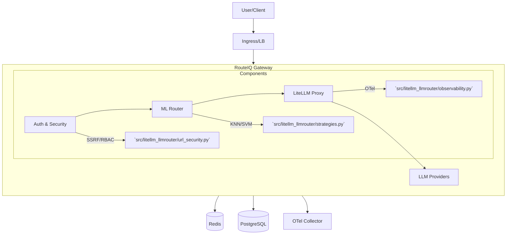

# Project State & Gaps

**Last Updated:** 2026-02-19

> **Attribution**:
> RouteIQ is built on top of upstream [LiteLLM](https://github.com/BerriAI/litellm) for proxy/API compatibility and [LLMRouter](https://github.com/ulab-uiuc/LLMRouter) for ML routing.

This document provides a consolidated view of RouteIQ Gateway's current architecture, value add, known gaps, and immediate roadmap.

## 1. Architecture Map

RouteIQ is structured as a wrapper around LiteLLM, injecting intelligence and enterprise features at key extension points.

### Key File Locations

| Component | Description | Key Files |
|-----------|-------------|-----------|
| **Entrypoint** | Server startup & config loading | [`src/litellm_llmrouter/startup.py`](../src/litellm_llmrouter/startup.py) |
| **Routing** | ML-based routing logic | [`src/litellm_llmrouter/strategies.py`](../src/litellm_llmrouter/strategies.py) |
| **Centroid Routing** | Zero-config centroid-based routing (~2ms) | [`src/litellm_llmrouter/centroid_routing.py`](../src/litellm_llmrouter/centroid_routing.py) |
| **Custom Strategy Adapter** | LiteLLM CustomRoutingStrategyBase adapter | [`src/litellm_llmrouter/custom_routing_strategy.py`](../src/litellm_llmrouter/custom_routing_strategy.py) |
| **Security** | SSRF & URL validation | [`src/litellm_llmrouter/url_security.py`](../src/litellm_llmrouter/url_security.py) |
| **MCP** | Model Context Protocol integration | [`src/litellm_llmrouter/mcp_gateway.py`](../src/litellm_llmrouter/mcp_gateway.py) |
| **A2A** | Agent-to-Agent protocol | [`src/litellm_llmrouter/a2a_gateway.py`](../src/litellm_llmrouter/a2a_gateway.py) |
| **HA / Leader Election** | Coordination & leader election | [`src/litellm_llmrouter/leader_election.py`](../src/litellm_llmrouter/leader_election.py) |
| **Plugin System** | Gateway plugin management | [`src/litellm_llmrouter/gateway/plugin_manager.py`](../src/litellm_llmrouter/gateway/plugin_manager.py) |
| **Plugin Callback Bridge** | Plugin-to-LiteLLM callback bridge | [`src/litellm_llmrouter/gateway/plugin_callback_bridge.py`](../src/litellm_llmrouter/gateway/plugin_callback_bridge.py) |
| **Plugin Middleware** | Plugin middleware integration | [`src/litellm_llmrouter/gateway/plugin_middleware.py`](../src/litellm_llmrouter/gateway/plugin_middleware.py) |
| **Routes** | API routes (health, a2a, mcp, config, models, admin_ui) | [`src/litellm_llmrouter/routes/`](../src/litellm_llmrouter/routes/) |
| **Telemetry** | Telemetry contracts & schemas | [`src/litellm_llmrouter/telemetry_contracts.py`](../src/litellm_llmrouter/telemetry_contracts.py) |

## 2. RouteIQ vs. Upstream LiteLLM

RouteIQ is a **superset** of LiteLLM. We aim to maintain 100% compatibility while adding "Moat Mode" features.

| Feature | LiteLLM (Upstream) | RouteIQ (This Project) |
|---------|--------------------|------------------------|
| **Proxy Core** | OpenAI-compatible API, 100+ Providers | ✅ **Inherited** (Direct wrapper) |
| **Routing** | Simple Shuffle, Least Busy, Latency | ✅ **Enhanced** (KNN, SVM, MLP strategies) |
| **Security** | Basic Auth | ✅ **Hardened** (SSRF Protection, Pickle Safety, Strict Defaults) |
| **Protocols** | Chat/Completions | ✅ **Expanded** (MCP, A2A, Skills) |
| **MLOps** | None | ✅ **Tooling** (Scripts for training & deploying routers) |
| **Observability**| Standard Logging | ✅ **Deep** (Routing decision telemetry, OTel contracts) |

## 3. Top Gaps & Known Issues

These are the highest priority technical debt and missing features as of the latest audit.

1.  ~~**Quotas & Limits**: No granular quota management (e.g., "Team A gets $50/day").~~ ✅ **Resolved** — Implemented in [`quota.py`](../src/litellm_llmrouter/quota.py) with per-team/per-key rate limiting and budget enforcement.
2.  ~~**RBAC**: Admin UI/API lacks fine-grained Role-Based Access Control.~~ ✅ **Resolved** — Implemented in [`rbac.py`](../src/litellm_llmrouter/rbac.py) with per-role permission sets.
3.  ~~**Audit Logs**: Audit logs are ephemeral or local.~~ ✅ **Resolved** — Implemented in [`audit.py`](../src/litellm_llmrouter/audit.py) with PostgreSQL-backed durable logging.
4.  ~~**Backpressure**: No mechanism to reject traffic when overloaded.~~ ✅ **Resolved** — Implemented in [`resilience.py`](../src/litellm_llmrouter/resilience.py) with configurable max concurrent requests and 503 rejection.
5.  ~~**Failover**: Database/Redis failover is handled by infrastructure, but app-level circuit breakers are basic.~~ ✅ **Improved** — [`resilience.py`](../src/litellm_llmrouter/resilience.py) now includes per-provider circuit breakers with configurable thresholds.
6.  **CI Load Tests**: No automated load testing in CI pipeline to catch performance regressions.
7.  **MCP Tool Invocation**: Tool execution is currently flag-gated and lacks full OAuth delegation.

> **Also implemented since last audit:**
> - **Policy Engine**: OPA-style pre-request policy evaluation in [`policy_engine.py`](../src/litellm_llmrouter/policy_engine.py)
> - **Env Validation**: Startup environment variable validation in [`env_validation.py`](../src/litellm_llmrouter/env_validation.py)
> - **Plugin System**: Full plugin lifecycle management with 13 built-in plugins in [`gateway/plugins/`](../src/litellm_llmrouter/gateway/plugins/)

## 3a. TG-IMPL Delivered Features

The TG-IMPL architecture overhaul delivered the following major features:

### Centroid Routing (Zero-Config)

Zero-config ~2ms intelligent routing via [`centroid_routing.py`](../src/litellm_llmrouter/centroid_routing.py). Uses pre-computed centroid vectors to classify prompts and route to the optimal model without any ML model training.

- **Routing Profiles**: `auto` (balanced), `eco` (cost-optimized), `premium` (quality-first), `free` (free models only), `reasoning` (reasoning-capable models)
- **Agentic Detection**: Automatically detects tool-use / agentic patterns and routes to capable models
- **Reasoning Detection**: Detects complex reasoning prompts and routes to reasoning-optimized models
- **Session Persistence**: Maintains routing affinity within conversation sessions
- Enabled by default (`ROUTEIQ_CENTROID_ROUTING=true`), profile set via `ROUTEIQ_ROUTING_PROFILE=auto`

### Plugin Strategy

`ROUTEIQ_USE_PLUGIN_STRATEGY=true` (default). Uses [`custom_routing_strategy.py`](../src/litellm_llmrouter/custom_routing_strategy.py) with `RouteIQRoutingStrategy` class — a `CustomRoutingStrategyBase` adapter instead of monkey-patching LiteLLM's Router. This is the runtime glue between centroid + ML routing and LiteLLM's routing system.

### Multi-Worker Support

`ROUTEIQ_WORKERS` env var controls the number of uvicorn workers. Requires the plugin strategy (default). Legacy monkey-patch mode is restricted to 1 worker because `os.execvp()` would lose patches, while `os.fork()` preserves the plugin-based app state.

### Admin UI

`ROUTEIQ_ADMIN_UI_ENABLED=true` mounts a built-in admin interface at `/ui/`. Provides gateway status, configuration management, and operational controls.

### Routes Package Refactor

Refactored from a single `routes.py` to a [`routes/`](../src/litellm_llmrouter/routes/) package with dedicated modules:
- `health.py` — Health/readiness probes
- `a2a.py` — A2A agent routes
- `mcp.py` — MCP gateway routes (all surfaces)
- `config.py` — Config/admin routes
- `models.py` — Model management routes
- `admin_ui.py` — Admin UI mount

### Docker Examples Reorganization

Deployment examples reorganized into [`examples/docker/`](../examples/docker/) with self-contained scenarios:
- **basic** — Minimal gateway setup
- **ha** — High availability with Redis, PostgreSQL, Nginx
- **observability** — OTel Collector + Jaeger
- **full-stack** — HA + Observability + all features
- **local-dev** — Local development with hot-reload

Each scenario includes its own `docker-compose.yml`, `.env.example`, and `README.md`.

## 4. Phased Roadmap

### Now (Current Focus)
*   **Stability**: Fixing edge cases in ML routing and config syncing.
*   **Documentation**: Consolidating docs to match actual code state (TG-IMPL-B).
*   **Validation**: Manual verification of HA and Security gates.

### Next (Q2 2026)
*   **Enterprise Hardening**: ~~Implementing Backpressure and Load Shedding.~~ ✅ Done. Focusing on quota management and secret rotation.
*   **Durable Auditing**: ~~Shipping audit logs to S3.~~ ✅ Done (PostgreSQL-backed). S3 export is a future enhancement.
*   **Automated MLOps**: Moving from scripts to a fully automated pipeline.

### Later (Q3 2026+)
*   **Advanced Scale**: Autoscaling based on custom metrics (KEDA).
*   **Multi-Region**: Global state synchronization.
*   ~~**Management UI**: A dedicated React frontend for gateway administration.~~ ✅ **Delivered** — Built-in admin UI at `/ui/` via `ROUTEIQ_ADMIN_UI_ENABLED=true`.
