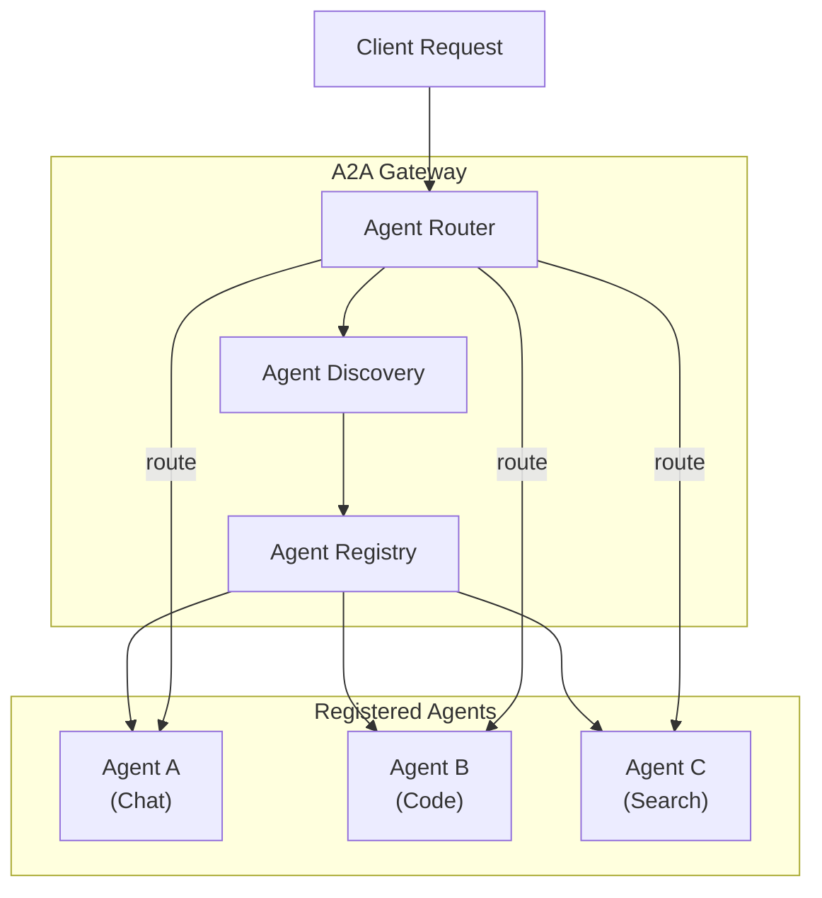

# A2A Protocol

RouteIQ implements Google's [A2A (Agent-to-Agent)](https://google.github.io/A2A/)
protocol for standardized communication between AI agents.

## Overview

The A2A Gateway enables:

- Registering AI agents with their capabilities
- Discovering agents based on capabilities
- Routing requests to appropriate agents
- Building multi-agent systems with orchestration

## Enabling A2A Gateway

```bash
A2A_GATEWAY_ENABLED=true
```

## API Endpoints

### Invoke an Agent (Canonical)

The primary endpoint for invoking an A2A agent using JSON-RPC:

```bash
curl -X POST http://localhost:4000/a2a/my-agent \
  -H "Authorization: Bearer $MASTER_KEY" \
  -H "Content-Type: application/json" \
  -d '{
    "jsonrpc": "2.0",
    "method": "message/send",
    "id": "1",
    "params": {
      "message": {
        "role": "user",
        "content": "Hello, agent!"
      }
    }
  }'
```

Supports synchronous responses and SSE streaming based on `Accept` header.

### Streaming

Explicit streaming alias:

```bash
curl -X POST http://localhost:4000/a2a/my-agent/message/stream \
  -H "Authorization: Bearer $MASTER_KEY" \
  -H "Content-Type: application/json" \
  -H "Accept: text/event-stream" \
  -d '{
    "jsonrpc": "2.0",
    "method": "message/send",
    "id": "1",
    "params": {
      "message": {
        "role": "user",
        "content": "Stream a response"
      }
    }
  }'
```

### Get Agent Card

```bash
GET /a2a/{agent_id}/.well-known/agent-card.json
```

### Register an Agent

```bash
curl -X POST http://localhost:4000/a2a/agents \
  -H "X-Admin-API-Key: $ADMIN_KEY" \
  -H "Content-Type: application/json" \
  -d '{
    "agent_id": "my-agent",
    "name": "My AI Agent",
    "description": "An agent that handles customer support",
    "url": "http://agent-service:8000/a2a",
    "capabilities": ["chat", "support", "ticket-creation"],
    "metadata": {
      "version": "1.0.0",
      "owner": "support-team"
    }
  }'
```

### List Agents

```bash
curl http://localhost:4000/a2a/agents \
  -H "Authorization: Bearer $API_KEY"
```

### Discover by Capability

```bash
GET /a2a/agents?capability=chat
```

### Unregister an Agent

```bash
DELETE /a2a/agents/{agent_id}
```

## Python SDK Usage

```python
from litellm_llmrouter.a2a_gateway import A2AGateway, A2AAgent

gateway = A2AGateway()

agent = A2AAgent(
    agent_id="code-agent",
    name="Code Assistant",
    description="Helps with code review and generation",
    url="http://localhost:9000/a2a",
    capabilities=["code", "review", "generation"]
)
gateway.register_agent(agent)

# Discover agents by capability
snapshot = gateway.get_agents_snapshot()
code_agents = [a for a in snapshot.values() if "code" in a.capabilities]

# Get agent card
card = gateway.get_agent_card("code-agent")
```

## Multi-Agent Architecture



## Observability

A2A operations are instrumented with OpenTelemetry spans via `a2a_tracing.py`,
providing visibility into agent invocations, latency, and errors.

## Configuration

| Variable | Default | Description |
|----------|---------|-------------|
| `A2A_GATEWAY_ENABLED` | `false` | Enable A2A gateway |
| `STORE_MODEL_IN_DB` | `false` | Persist agents in database |
