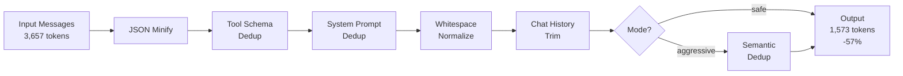

# Context Optimization

RouteIQ provides context optimization capabilities to reduce token usage
while preserving the semantic content of LLM requests.

## Overview

Context optimization applies lossless transforms to reduce the number of tokens
sent to LLM providers, resulting in:

- Lower costs per request
- Faster response times (fewer tokens to process)
- Ability to fit more context within model limits

## Transform Pipeline

Context optimization applies a series of transforms in sequence. Each
transform is lossless (preserves semantic content). In `aggressive` mode,
an additional semantic deduplication pass runs at the end.



## Optimization Strategies

### JSON Minification

Strips unnecessary whitespace and formatting from JSON payloads embedded
in messages (tool calls, function results, structured data).

### Tool Schema Deduplication

Removes duplicate tool definitions when the same schema is repeated across
multiple messages in a conversation.

### System Prompt Deduplication

Detects identical or near-identical system prompts repeated in conversation
history and collapses them to a single instance.

### Whitespace Normalization

Compresses unnecessary whitespace and formatting that consumes tokens
without adding semantic value.

### Chat History Trimming

Intelligently truncates and summarizes conversation history when approaching
model context limits, preserving the most relevant information.

### Semantic Deduplication (aggressive mode)

Uses embedding similarity to detect semantically duplicate content across
messages, even when the wording differs. Only runs in `aggressive` mode.

## Configuration

Context optimization is configured via the gateway settings:

```yaml
general_settings:
  context_optimization:
    enabled: true
    strategies:
      - deduplication
      - whitespace_normalization
```

## Metrics

Token savings are tracked via OpenTelemetry metrics:

- `routeiq.context.tokens_saved` - Total tokens saved per request
- `routeiq.context.compression_ratio` - Compression ratio achieved
