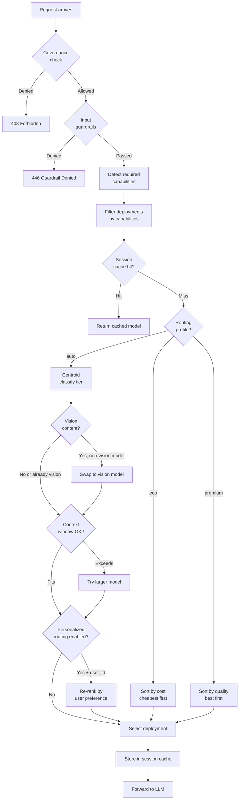

# Intelligent Routing

RouteIQ provides 18+ routing strategies for intelligently directing LLM requests
to the optimal model based on query characteristics, cost, latency, and quality.

## Zero-Config Centroid Routing

RouteIQ ships with **centroid-based routing** that works out of the box with no model
training required. It classifies queries in ~2ms using pre-computed centroid vectors.

```bash
# Set routing profile via environment variable
export ROUTEIQ_ROUTING_PROFILE=auto  # auto | eco | premium | free | reasoning
```

| Profile | Behavior |
|---------|----------|
| `auto` | Balanced quality/cost (default) |
| `eco` | Minimize cost, use cheaper models |
| `premium` | Maximize quality, prefer frontier models |
| `free` | Use only free-tier models |
| `reasoning` | Prefer models with strong reasoning |

## LiteLLM Built-in Strategies

| Strategy | Description |
|----------|-------------|
| `simple-shuffle` | Random load balancing (default) |
| `least-busy` | Route to deployment with fewest active requests |
| `latency-based-routing` | Route based on historical response latency |
| `cost-based-routing` | Route to minimize token costs |
| `usage-based-routing` | Route based on token usage |

## LLMRouter ML Strategies

ML-based strategies from [LLMRouter](https://github.com/ulab-uiuc/LLMRouter):

### Single-Round Routers

| Strategy | Algorithm | Best For |
|----------|-----------|----------|
| `llmrouter-knn` | K-Nearest Neighbors | Quick deployment, interpretable |
| `llmrouter-svm` | Support Vector Machine | Binary decisions, generalization |
| `llmrouter-mlp` | Multi-Layer Perceptron | Complex patterns, high accuracy |
| `llmrouter-mf` | Matrix Factorization | Collaborative filtering |
| `llmrouter-elo` | Elo Rating | Simple preference-based |
| `llmrouter-hybrid` | Probabilistic Hybrid | Ensemble approach |
| `llmrouter-routerdc` | Dual Contrastive (BERT) | Semantic understanding |
| `llmrouter-causallm` | Transformer (GPT-2) | Sequence modeling |
| `llmrouter-graph` | Graph Neural Network | Relationship modeling |
| `llmrouter-automix` | Automatic Mixing | Self-tuning ensemble |

### Multi-Round Routers

| Strategy | Description |
|----------|-------------|
| `llmrouter-r1` | Pre-trained multi-turn router |
| `llmrouter-knn-multiround` | KNN agentic router |
| `llmrouter-llm-multiround` | LLM agentic router |

### Router-R1 cost/latency gating + eval-loop feedback (RouteIQ-81bc)

`router_r1.py` implements the native Router-R1 iterative reasoning router. An
iterative router trades **cost and latency for quality** — it issues several LLM
rounds per query — so RouteIQ lets an operator cap that tradeoff and feeds the
run's observed quality back into the routing loop.

**Cost/latency gates.** Two optional budgets stop the iterative loop *before* it
issues another round when the cumulative cost/latency would exceed the cap:

| Env var | Default | Purpose |
|---------|---------|---------|
| `ROUTEIQ_ROUTER_R1_MAX_TOTAL_TOKENS` | `0` (off) | Token cap (cost proxy). When cumulative tokens reach this, the loop stops. |
| `ROUTEIQ_ROUTER_R1_MAX_TOTAL_LATENCY_MS` | `0` (off) | Wall-clock latency cap. When elapsed time reaches this, the loop stops. |

`0` disables the respective gate, so the default behaviour is byte-stable. Every
run records why it stopped on `R1Result.stop_reason` — one of `answer`,
`max_iterations`, `token_budget`, `latency_budget`, `size_limit`, `timeout`, or
`error` — so an operator can see when a budget cut a run short.

**Eval-loop feedback.** When the evaluation pipeline is enabled, each completed
Router-R1 run is handed to it (the COLLECT arm) as an `EvalSample` carrying the
final answer plus the observed cost (`total_tokens`) and `latency_ms`. The
LLM-as-judge then grades it and the score feeds the
COLLECT→EVALUATE→AGGREGATE→FEEDBACK loop (see [evaluation](../observability.md)).
The emit is best-effort: a disabled or erroring eval pipeline is a silent no-op
so a feedback hiccup never breaks routing.

The stress harness exposes the cost/latency tradeoff for any iterative router via
its `latency-cost` verdict family (informational p50/p95 latency + total tokens).

## Routing Decision Flow

The following diagram shows how a request is routed from arrival through
governance, guardrails, capability detection, profile selection, and
personalized re-ranking to the final LLM deployment.



## Configuration

```yaml
router_settings:
  routing_strategy: llmrouter-knn
  routing_strategy_args:
    model_path: /app/models/knn_router.pt
    llm_data_path: /app/config/llm_candidates.json
    hot_reload: true
    reload_interval: 300
```

## A/B Testing

RouteIQ supports runtime A/B testing between routing strategies:

```python
from litellm_llmrouter import get_routing_registry

registry = get_routing_registry()
registry.set_weights({"baseline": 90, "candidate": 10})
```

## Training Custom Models

The MLOps pipeline supports training custom routing models:

```bash
# Extract telemetry data
python examples/mlops/scripts/extract_traces.py

# Train a KNN model
python examples/mlops/scripts/train.py --config examples/mlops/configs/knn.yaml

# Deploy the model
python examples/mlops/scripts/deploy.py --model-path models/knn_router.pt
```

See [MLOps Training](../operations/observability.md) for the full training pipeline.
