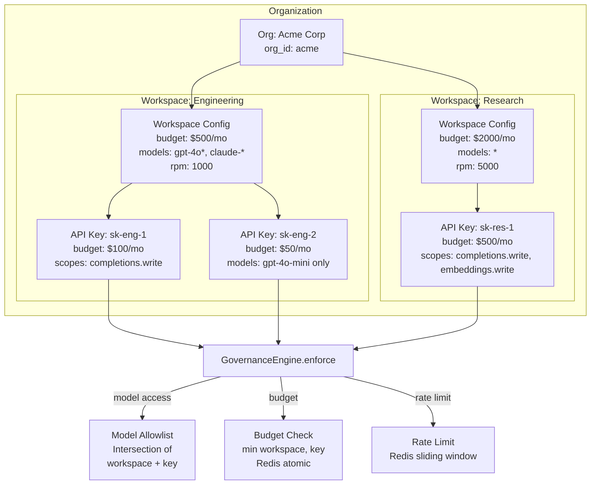

# Governance Overview

RouteIQ provides enterprise governance features for managing AI usage across
teams, enforcing policies, and maintaining compliance.

## Key Capabilities

- **Workspaces** — Isolated environments with per-team budgets and model access
- **Usage Policies** — Rate limits, quotas, and spend caps per team/key
- **Guardrails** — Content filtering, PII detection, prompt injection defense
- **Identity** — OIDC/SSO integration for enterprise authentication
- **Audit Logging** — Structured audit trail for all operations
- **Policy Engine** — OPA-style pre-request policy evaluation

## Architecture

Governance operates at the ASGI middleware layer, evaluating policies before
requests reach the routing layer. The hierarchy flows from organization to
workspace to API key, with enforcement computing the intersection of
constraints at each level.

## Getting Started

- [Workspaces](workspaces.md) — Set up isolated team environments
- [Usage Policies](usage-policies.md) — Configure rate limits and budgets
- [Guardrails](guardrails.md) — Enable content safety plugins
- [Identity](identity.md) — Configure OIDC/SSO
