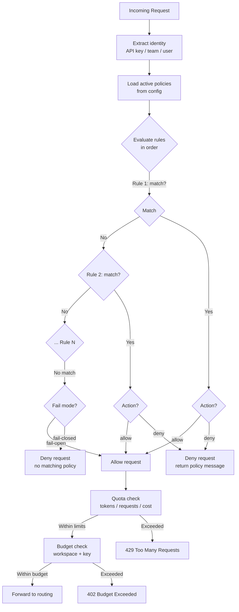

# Usage Policies

Usage policies control how teams and API keys interact with the gateway.

## Rate Limits

Configure per-key or per-team rate limits:

```yaml
general_settings:
  max_parallel_requests: 100
  global_max_parallel_requests: 1000
```

## Quotas

Per-team and per-key quota enforcement:

```bash
QUOTA_ENABLED=true
```

Quotas track:

- Token usage (input + output)
- Request count
- Cost (based on model pricing)

## Budget Controls

Set maximum budgets per key or team:

```bash
curl -X POST http://localhost:4000/key/generate \
  -H "Authorization: Bearer $MASTER_KEY" \
  -d '{
    "max_budget": 50.00,
    "budget_duration": "daily"
  }'
```

## Policy Evaluation Flow

Every request passes through the policy engine before reaching the routing
layer. Policies are evaluated in order; the first matching rule determines
the outcome. If no rule matches, the default action applies (allow in
fail-open mode, deny in fail-closed mode).



## Policy Engine

The OPA-style policy engine evaluates rules before each request:

```bash
POLICY_ENGINE_ENABLED=true
POLICY_CONFIG_PATH=config/policy.yaml
```

Example policy:

```yaml
policies:
  - name: block-expensive-models
    match:
      model: ["gpt-4-turbo", "claude-3-opus"]
      team: ["interns"]
    action: deny
    message: "Access to premium models requires manager approval"
```
