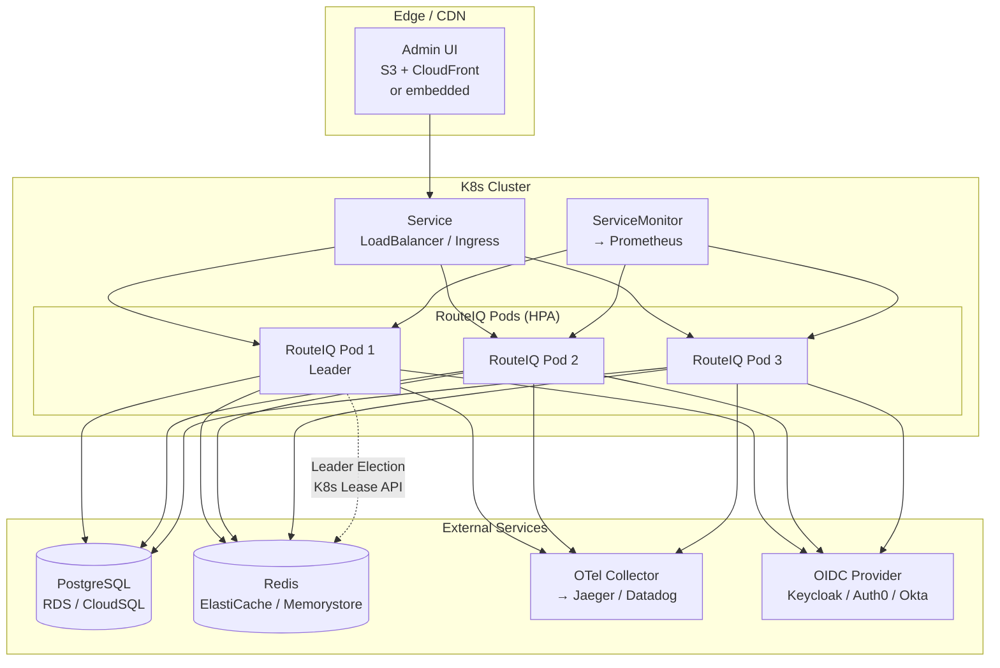

# Helm Chart

RouteIQ provides Helm charts for Kubernetes deployment.

## Installation

```bash
helm install routeiq deploy/charts/routeiq \
  --namespace routeiq \
  --create-namespace \
  --set config.masterKey=sk-your-key \
  --set config.openaiApiKey=sk-...
```

## Configuration

Key values:

```yaml
# values.yaml
replicaCount: 3

image:
  repository: routeiq
  tag: latest

config:
  masterKey: ""  # Required
  configPath: /app/config/config.yaml

resources:
  requests:
    memory: 512Mi
    cpu: 250m
  limits:
    memory: 1Gi
    cpu: 1000m

redis:
  enabled: true

postgresql:
  enabled: false

ingress:
  enabled: true
  className: nginx
  hosts:
    - host: routeiq.example.com
      paths:
        - path: /
          pathType: Prefix
```

## Health Probes

```yaml
livenessProbe:
  httpGet:
    path: /_health/live
    port: 4000

readinessProbe:
  httpGet:
    path: /_health/ready
    port: 4000
```

## Scaling

```yaml
autoscaling:
  enabled: true
  minReplicas: 2
  maxReplicas: 10
  targetCPUUtilizationPercentage: 70
```

## Deployment Topology

The following diagram shows a production Kubernetes deployment with HPA,
backed by PostgreSQL, Redis, an OTel Collector, and an OIDC provider.
Leader election ensures only one pod runs config sync and migrations.


