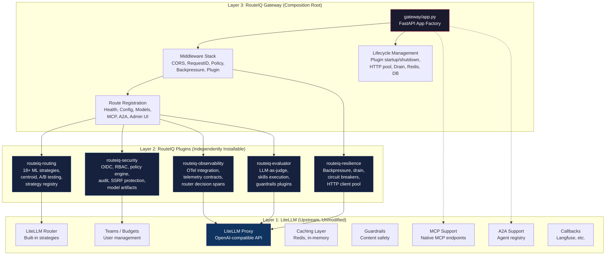
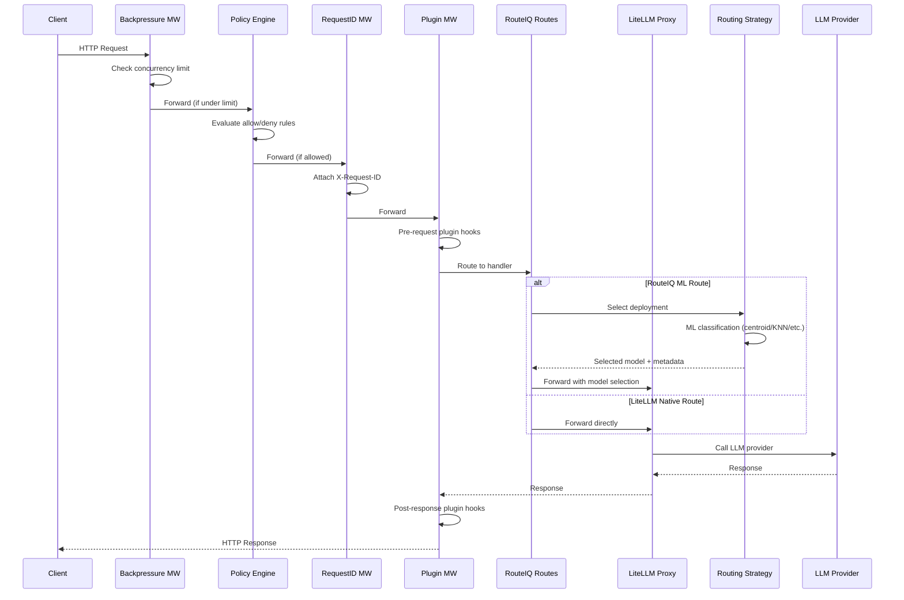
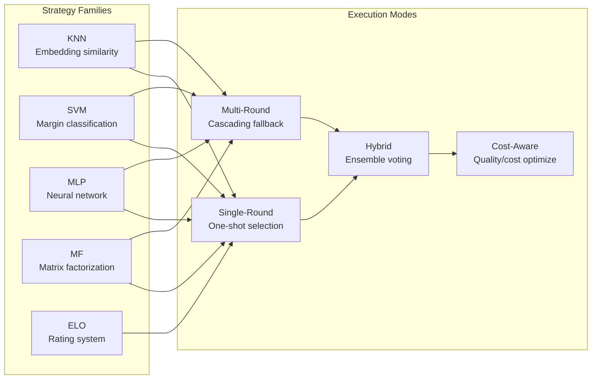
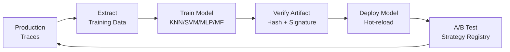
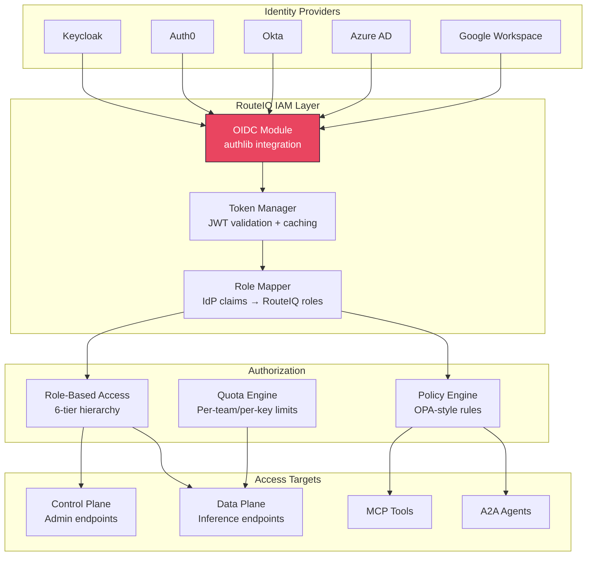
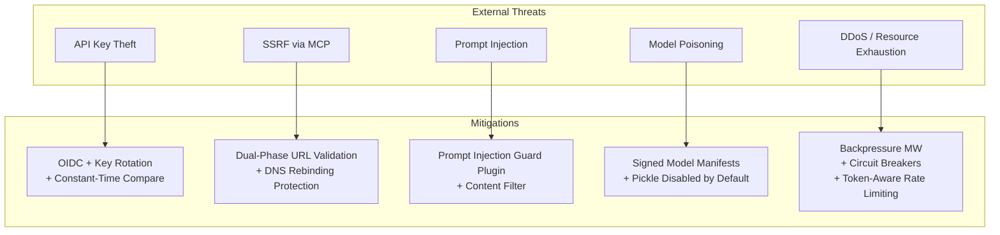
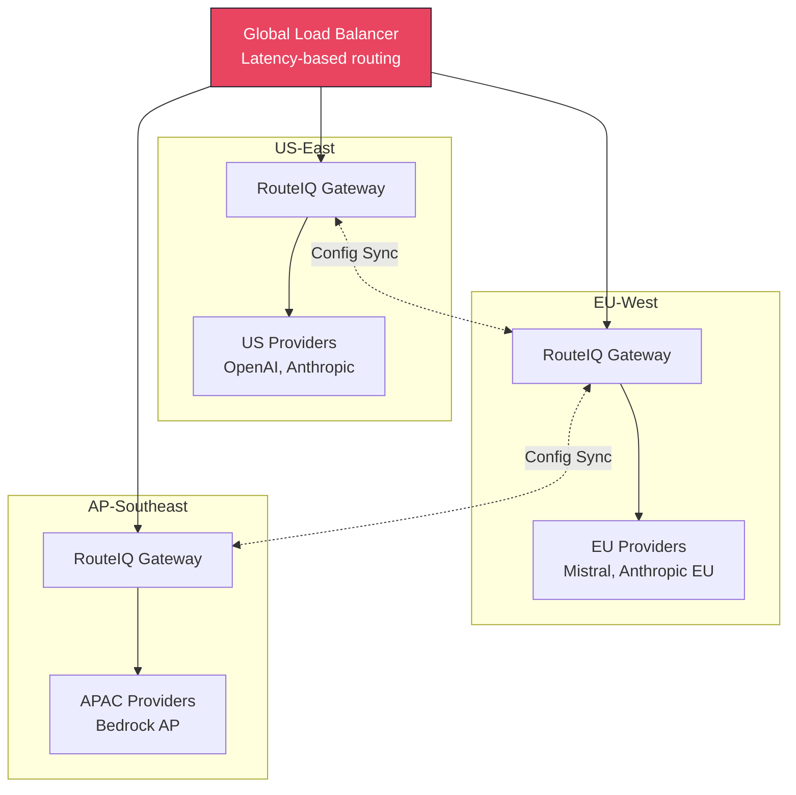

# RouteIQ v1.0 Cloud-Native AI Gateway — Rearchitecture Plan

**Status**: Active | **Version**: 1.0-draft | **Last Updated**: 2026-04-02
**Authors**: RouteIQ Engineering

---

## Table of Contents

1. [Vision](#1-vision)
2. [Current State Assessment](#2-current-state-assessment)
3. [Target Architecture (Three-Layer Design)](#3-target-architecture-three-layer-design)
4. [What We Already Implemented (This PR)](#4-what-we-already-implemented-this-pr)
5. [Competitive Analysis](#5-competitive-analysis)
6. [RouteIQ Unique Differentiators](#6-routeiq-unique-differentiators)
7. [Identity & Access Management Design](#7-identity--access-management-design)
8. [Security Assessment & Improvements](#8-security-assessment--improvements)
9. [Implementation Roadmap](#9-implementation-roadmap)
10. [LiteLLM Upstream Capabilities to Leverage](#10-litellm-upstream-capabilities-to-leverage)
11. [Metrics & Success Criteria](#11-metrics--success-criteria)

---

## 1. Vision

**RouteIQ is the best open-source OpenRouter alternative**: a cloud-native, scalable AI gateway for model inference, MCP tools, A2A agents, skills execution, with intelligent ML routing, enterprise identity, and extensibility.

### Design Principles

1. **Upstream-first**: Consume LiteLLM unmodified. Don't reimplement what upstream provides.
2. **Plugin-over-patch**: All RouteIQ capabilities delivered as independently installable plugins.
3. **Zero-config intelligence**: Centroid routing provides smart routing out of the box — no ML training required.
4. **Enterprise-ready**: OIDC, RBAC, audit logging, OPA-style policies, multi-tenancy from day one.
5. **Cloud-native**: Stateless gateway, externalized state, horizontal scaling, Kubernetes-native.
6. **Observable by default**: OpenTelemetry traces, metrics, and structured logs on every request path.

### What RouteIQ Is NOT

- **Not a fork of LiteLLM** — RouteIQ is a composition layer that adds ML routing, plugins, policy, and enterprise features on top of unmodified upstream LiteLLM.
- **Not a managed service** — RouteIQ is self-hosted, open-source infrastructure you deploy in your own cloud.
- **Not a prompt engineering tool** — prompt management is a Phase 4 convenience feature, not the core value prop.

---

## 2. Current State Assessment

### Codebase Metrics

| Metric | Current | Target (v1.0) |
|--------|---------|---------------|
| Total lines (src/) | ~36,117 | ~22,000 (gateway) + ~8,000 (plugins) |
| Production readiness | 3.05 / 5 | 4.5+ / 5 |
| Python source files | 63 | ~40 (gateway) + ~15 (plugin packages) |
| Environment variables | 124 | ~35 (typed, validated via Pydantic Settings) |
| Workers | 1 (legacy monkey-patch) | N (multi-worker, plugin strategy default) |
| Docker image size | 2-4 GB | 500 MB (slim) / 2 GB (full) |
| Time to first route | Days (train ML model) | 0 (centroid zero-config) |

### Key Coupling Points with LiteLLM

| Coupling | Description | Severity |
|----------|-------------|----------|
| **App borrowing** | `create_app()` imports LiteLLM's FastAPI app and mutates it | High |
| **Router monkey-patching** | `routing_strategy_patch.py` patches `Router.async_get_available_deployment` at runtime | High (deprecated) |
| **Plugin hooks on `app.state`** | Plugin startup/shutdown stored as lambdas on `app.state` because LiteLLM owns lifespan | Medium |
| **Config model_list format** | `config.yaml` uses LiteLLM's `model_list` / `router_settings` schema | Low (intended) |
| **`litellm.*` env vars** | 50+ `LITELLM_*` env vars that must not be renamed | Low (intended) |

### Technical Debt Inventory

1. **~3,400 lines of redundant MCP code** — `mcp_parity.py`, `mcp_jsonrpc.py`, `mcp_sse_transport.py` duplicated upstream capabilities. **DELETED in this PR.**
2. **Legacy monkey-patching** — `routing_strategy_patch.py` (592 lines) monkey-patches LiteLLM's Router class, restricting to 1 worker. **DEPRECATED** — plugin strategy is now default.
3. **No connection pooling** — DB and Redis connections created per-request. **FIXED** — asyncpg pool + Redis singleton with circuit breaker.
4. **Timing-unsafe auth** — API key comparison used `==` instead of `hmac.compare_digest()`. **FIXED.**
5. **124 untyped env vars** — No validation, no defaults documentation, scattered `os.environ.get()` calls.
6. **No OIDC/SSO** — Only static API keys and LiteLLM's built-in team auth. No federated identity.
7. **Single-process architecture** — Legacy monkey-patch mode forces `workers=1`.

### Module Size Breakdown (lines of code)

```
Routing subsystem:        5,527  (strategies, centroid, registry, patch, custom)
Gateway + plugins:        7,427  (app factory, plugin system, 13 built-in plugins)
Observability:            922    (OTel traces, metrics, logs)
Resilience:              1,138   (backpressure, drain, circuit breakers)
Policy engine:            993    (OPA-style rules)
Security:                ~1,800  (auth, rbac, url_security, model_artifacts, audit)
MCP gateway:             ~1,200  (mcp_gateway, mcp_tracing, routes/mcp)
A2A gateway:              ~600   (a2a_gateway, a2a_tracing, routes/a2a)
Config & infra:          ~2,500  (config_loader, hot_reload, database, redis, etc.)
Routes:                  ~1,500  (health, config, models, admin_ui)
Everything else:         ~12,500 (startup, migrations, env_validation, etc.)
```

---

## 3. Target Architecture (Three-Layer Design)

### Architecture Diagram



### Layer Responsibilities

#### Layer 1: LiteLLM (Upstream, Unmodified)

- OpenAI-compatible proxy API (`/v1/chat/completions`, `/v1/embeddings`, etc.)
- Built-in routing strategies (simple-shuffle, least-busy, latency-based, cost-based)
- Team/user/budget management (virtual keys, spend tracking)
- Caching (Redis, in-memory)
- Guardrails integration
- MCP native endpoints (`/mcp`, `/v1/mcp/*`)
- A2A agent registry
- Callback system (Langfuse, custom callbacks)
- SSO via `fastapi-sso`

**Rule**: Never modify, monkey-patch, or wrap upstream LiteLLM code. Use its extension points (callbacks, `CustomRoutingStrategyBase`, configuration) only.

#### Layer 2: RouteIQ Plugins (Independently Installable)

Each plugin is a separate Python package (`pip install routeiq-routing`, etc.) that can be used standalone or composed into the full gateway.

| Plugin Package | Contents | Lines (est.) |
|----------------|----------|-------------|
| `routeiq-routing` | 18+ ML strategies, centroid routing, strategy registry, A/B testing, conversation affinity | ~5,500 |
| `routeiq-security` | OIDC module, RBAC, policy engine, audit logging, SSRF protection, model artifact verification | ~3,500 |
| `routeiq-observability` | OTel integration, telemetry contracts, router decision callback, MCP/A2A tracing | ~2,000 |
| `routeiq-evaluator` | LLM-as-judge, skills discovery (bash/computer/editor), guardrails plugins (PII, content filter, prompt injection, LlamaGuard, Bedrock) | ~3,500 |
| `routeiq-resilience` | Backpressure middleware, drain manager, circuit breakers, HTTP client pool, Redis pool | ~2,500 |

#### Layer 3: RouteIQ Gateway (Composition Root)

The thin composition layer that wires everything together:

- `gateway/app.py` — FastAPI app factory, middleware stack, route registration
- `startup.py` — Entry point, uvicorn configuration
- `config_loader.py` — YAML loading, S3/GCS download
- Configuration validation and typed settings

**Target**: ~3,000 lines for the composition root.

### Request Flow



---

## 4. What We Already Implemented (This PR)

### 4.1 Redundant MCP Code Deletion (-3,379 lines)

| File | Lines | Reason |
|------|-------|--------|
| `mcp_parity.py` | ~580 | Upstream LiteLLM now provides `/v1/mcp/*` natively |
| `mcp_jsonrpc.py` | ~750 | Upstream MCP JSON-RPC support makes this redundant |
| `mcp_sse_transport.py` | ~600 | LiteLLM's native SSE transport replaces this |
| Related route code | ~1,449 | SSE/JSON-RPC route handlers in `routes/mcp.py` |

**Impact**: Eliminated the largest source of maintenance burden and upstream divergence. RouteIQ's MCP gateway (`mcp_gateway.py`, ~800 lines) remains as it provides the server registry, tool discovery, and tracing layer that upstream doesn't have.

### 4.2 Legacy Monkey-Patch Deprecation

- `routing_strategy_patch.py` marked as deprecated with runtime warnings
- `ROUTEIQ_USE_PLUGIN_STRATEGY=true` is now the default
- Plugin strategy uses LiteLLM's `CustomRoutingStrategyBase` extension point (no patching)
- Multi-worker support enabled via `ROUTEIQ_WORKERS` when using plugin strategy

### 4.3 Connection Pooling

**asyncpg Connection Pool** (`database.py`):
- Shared `asyncpg.Pool` with configurable min/max connections
- All database operations use the shared pool
- Graceful shutdown with `close_db_pool()`
- Connection health checks

**Redis Singleton with Circuit Breaker** (`redis_pool.py`):
- Single `redis.asyncio.Redis` instance shared across the gateway
- Circuit breaker integration: auto-trips on repeated failures, half-open recovery
- Graceful shutdown via `close_async_redis_client()`

### 4.4 Security Hardening

| Fix | File | Description |
|-----|------|-------------|
| Constant-time key comparison | `auth.py` | Replaced `==` with `hmac.compare_digest()` for API key validation |
| Request ID validation | `auth.py` | Validates `X-Request-ID` format (UUID or `[a-zA-Z0-9-_]{1,128}`) to prevent header injection |
| Policy info leak fix | `policy_engine.py` | Deny responses no longer leak internal policy rule names |
| Secure pickle defaults | `model_artifacts.py` | `LLMROUTER_ALLOW_PICKLE_MODELS=false` by default; `LLMROUTER_ENFORCE_SIGNED_MODELS=true` for manifest verification |
| Dev-only admin bypass | `auth.py` | Admin auth bypass (`ROUTEIQ_DEV_ADMIN_BYPASS`) only activates when `LITELLM_MASTER_KEY` is not set |

### 4.5 Dependency Cleanup

```toml
# Before: everything in core dependencies
dependencies = ["boto3", "a2a-sdk", "watchdog", ...]

# After: optional extras for modularity
[project.optional-dependencies]
cloud = ["boto3>=1.42.32", "google-cloud-aiplatform>=1.134.0", "azure-identity>=1.15.0"]
a2a = ["a2a-sdk>=0.2.0"]
hotreload = ["watchdog>=3.0.0"]
oidc = ["authlib>=1.5.0"]     # NEW
knn = ["sentence-transformers>=5.2.0", "scikit-learn>=1.3.0"]
prod = ["routeiq[db,otel,cloud,callbacks,knn,a2a,hotreload,oidc]"]
```

---

## 5. Competitive Analysis

### AI Gateway Landscape

| Feature | RouteIQ | OpenRouter | Portkey | Helicone | Kong AI | Cloudflare AI | Martian | Not Diamond | Unify AI |
|---------|---------|------------|---------|----------|---------|---------------|---------|-------------|----------|
| **Open Source** | Yes (MIT) | No | Partial | Yes | Partial | No | No | No | No |
| **Self-Hosted** | Yes | No | Yes | Yes | Yes | No | No | No | No |
| **ML Routing (18+ algos)** | Yes | No | No | No | No | No | Yes (1) | Yes (1) | Yes (1) |
| **Zero-Config Routing** | Yes (centroid) | No | No | No | No | No | No | No | No |
| **MCP Gateway** | Yes | No | No | No | No | No | No | No | No |
| **A2A Protocol** | Yes | No | No | No | No | No | No | No | No |
| **Skills Execution** | Yes | No | No | No | No | No | No | No | No |
| **OPA-Style Policy** | Yes | No | No | No | Yes | No | No | No | No |
| **Plugin System** | Yes | No | Yes | No | Yes | No | No | No | No |
| **MLOps Pipeline** | Yes | No | No | No | No | No | No | No | No |
| **Full OTel** | Yes | No | No | No | Yes | No | No | No | No |
| **Analytics Dashboard** | Planned | Yes | Yes | Yes | Yes | Yes | No | Yes | Yes |
| **Playground UI** | Planned | Yes | Yes | Yes | No | Yes | No | No | No |
| **Prompt Management** | Planned | No | Yes | Yes | No | No | No | No | No |
| **Python SDK** | Planned | Yes | Yes | Yes | No | No | Yes | Yes | Yes |
| **Token-Aware Rate Limiting** | Planned | Yes | Yes | No | Yes | Yes | No | No | No |

### Key Gaps (Addressed in Roadmap)

1. **Analytics Dashboard** — No web UI for usage visualization, cost breakdown, latency percentiles. Every commercial competitor has this. *Phase 4.*
2. **Playground / Chat UI** — No interactive testing interface. OpenRouter, Portkey, Helicone all offer this. *Phase 4.*
3. **Python SDK** — No `routeiq` Python client. Users must use `openai` SDK or raw HTTP. *Phase 4.*
4. **Prompt Management** — No prompt versioning, A/B testing of prompts, template library. *Phase 4.*
5. **Token-Aware Rate Limiting** — Current quota system is request-based, not token-based. *Phase 4.*
6. **Webhook Events** — No push notifications for spend alerts, errors, model failures. *Phase 4.*

### Where RouteIQ Already Wins

1. **ML Routing Depth** — 18+ strategies vs. 0-1 for every competitor. No OSS project matches this.
2. **Zero-Config Intelligence** — Centroid routing at ~2ms with no training data needed. Unique.
3. **Protocol Coverage** — MCP + A2A + Skills in one gateway. No competitor offers all three.
4. **Policy Engine** — OPA-style pre-request rules. Only Kong has something comparable (but not OSS).
5. **Plugin Architecture** — Capability-based security, dependency resolution, failure modes. Production-grade.

---

## 6. RouteIQ Unique Differentiators

### 6.1 ML Routing (18+ Strategies)

No open-source competitor implements ML-based model routing. RouteIQ integrates the entire LLMRouter research project:

**Single-Round Routers**: KNN, SVM, MLP, MF (matrix factorization), ELO
**Multi-Round Routers**: Cascading variants of each single-round strategy
**Hybrid Routers**: Ensemble methods combining multiple classifiers
**Cost-Aware Routers**: Strategies that optimize for quality-per-dollar
**Custom Strategies**: `CustomRoutingStrategyBase` adapter for user-defined logic



### 6.2 Centroid Zero-Config Routing (~2ms)

The centroid classifier provides intelligent routing without any ML training:

- **Pre-computed centroid vectors** (384-dim sentence-transformer embeddings) for simple/complex prompt archetypes
- **Cosine similarity classification** — ~2ms per request
- **Agentic detection** — Cumulative scoring for tool use, multi-step, agentic keywords
- **Reasoning detection** — Regex-based markers for step-by-step, chain-of-thought, proofs
- **Routing profiles**: `auto`, `eco`, `premium`, `free`, `reasoning`
- **Session affinity** — In-memory LRU cache with TTL for conversation-consistent routing

### 6.3 MLOps Training Pipeline

Complete closed-loop from production telemetry to trained routing models:



### 6.4 MCP + A2A + Skills Gateway

Three protocol surfaces in one gateway — no competitor offers this combination:

| Protocol | Capability |
|----------|------------|
| **MCP (Model Context Protocol)** | Server registry, tool discovery, REST/JSON-RPC/SSE surfaces, OTel tracing |
| **A2A (Agent-to-Agent)** | Agent registry, capability discovery, inter-agent communication |
| **Skills** | Anthropic Computer Use, Bash execution, Text Editor — sandboxed skill execution |

### 6.5 Policy Engine (OPA-Style)

Pre-request policy evaluation at the ASGI middleware layer:

- **Subject-based rules**: Allow/deny by team, user, API key
- **Route-based rules**: Restrict access to specific endpoints
- **Model-based rules**: Control which models each team can access
- **Metadata rules**: Filter by headers, source IP
- **Fail modes**: Configurable fail-open (default) or fail-closed
- **Auditable decisions**: Every policy evaluation logged with reason

### 6.6 Plugin System with Capability-Based Security

```python
class PluginMetadata:
    name: str
    version: str
    capabilities: set[PluginCapability]   # ROUTES, ROUTING_STRATEGY, MIDDLEWARE, etc.
    depends_on: list[str]                 # Dependency resolution
    priority: int                         # Load ordering
    failure_mode: FailureMode             # CONTINUE, ABORT, QUARANTINE
```

13 built-in plugins covering evaluation, skills, guardrails, caching, cost tracking, content filtering, PII detection, and prompt injection guard.

---

## 7. Identity & Access Management Design

### Current State

- Static API keys via `LITELLM_MASTER_KEY` and `ADMIN_API_KEYS`
- LiteLLM's built-in team/user/budget management (virtual keys)
- No federated identity (OIDC/SSO)
- No service accounts for M2M
- No multi-tenancy beyond LiteLLM teams

### Target State: OIDC + Multi-Tenancy



### Role Hierarchy

```
proxy_admin          Full system access, configuration, secrets management
  └── org_admin      Organization-level: manage teams, budgets, policies
       └── team_admin    Team-level: manage members, keys, model access
            └── internal_user    Standard user: inference, MCP tools, A2A
                 └── viewer      Read-only: dashboards, logs, metrics
                      └── customer    External: scoped inference only, no admin
```

### OIDC Integration Design

```python
# New module: src/litellm_llmrouter/oidc.py (authlib-based)

class OIDCConfig(BaseSettings):
    """Typed OIDC configuration via Pydantic Settings."""
    oidc_issuer_url: str                    # https://auth.example.com/realms/routeiq
    oidc_client_id: str                     # routeiq-gateway
    oidc_client_secret: SecretStr           # Client secret
    oidc_audience: str = "routeiq"          # Expected audience
    oidc_scopes: list[str] = ["openid", "profile", "email"]
    oidc_role_claim: str = "realm_access.roles"   # JWT claim for roles
    oidc_team_claim: str = "routeiq_team"          # JWT claim for team
    oidc_cache_ttl: int = 300                       # JWKS cache TTL (seconds)

class OIDCMiddleware:
    """ASGI middleware for JWT validation and role extraction."""
    async def __call__(self, scope, receive, send):
        # 1. Extract Bearer token from Authorization header
        # 2. Validate JWT signature against cached JWKS
        # 3. Check issuer, audience, expiry
        # 4. Extract roles from configured claim path
        # 5. Map IdP roles to RouteIQ role hierarchy
        # 6. Attach identity to request state
        ...
```

### API Key Management

| Key Type | Scope | Use Case |
|----------|-------|----------|
| **Master Key** | Full admin | Bootstrap, emergency access |
| **Admin Key** | Control plane | Configuration, team management |
| **Team Key** | Team's models + budgets | Application-level access |
| **User Key** | Individual quota | Per-user tracking |
| **Service Account** | M2M, scoped | CI/CD, automated pipelines |

### Multi-Tenancy Model

```
Organization (Acme Corp)
├── Team: Platform Engineering
│   ├── Budget: $5,000/month
│   ├── Models: claude-3-opus, gpt-4o, llama-3.1-70b
│   ├── Policy: Allow all routes
│   └── Members: alice (admin), bob (user), ci-bot (service)
├── Team: Product
│   ├── Budget: $2,000/month
│   ├── Models: claude-3-sonnet, gpt-4o-mini
│   ├── Policy: Deny /admin/*, /mcp-proxy/*
│   └── Members: carol (admin), dave (user)
└── Team: External Partners
    ├── Budget: $500/month
    ├── Models: claude-3-haiku only
    ├── Policy: Deny all except /v1/chat/completions
    └── Members: partner-api (service)
```

---

## 8. Security Assessment & Improvements

### Current Score: 4.2 / 5

#### Excellent (No Changes Needed)

| Area | Implementation | Score |
|------|---------------|-------|
| **SSRF Prevention** | `url_security.py` — dual-phase validation (registration + invocation), DNS rebinding protection | 5/5 |
| **Container Security** | Non-root user, pinned base images (sha256 digest), read-only filesystem | 5/5 |
| **Audit Logging** | Structured audit events, file + event-based, secret scrubbing | 4.5/5 |
| **Model Artifact Verification** | Hash + signature verification, manifest-based, pickle disabled by default | 5/5 |
| **Input Validation** | Pydantic models for all API endpoints, request ID format validation | 4/5 |

#### Fixed in This PR

| Issue | Severity | Fix |
|-------|----------|-----|
| Timing-unsafe API key comparison | High | `hmac.compare_digest()` in `auth.py` |
| Request ID header injection | Medium | UUID/alphanumeric format validation |
| Policy engine info leak | Medium | Deny responses stripped of internal rule names |
| Pickle model loading enabled by default | High | `LLMROUTER_ALLOW_PICKLE_MODELS=false` default |
| Dev admin bypass in production | High | Only activates when `LITELLM_MASTER_KEY` is unset |

#### Remaining Work (Phase 1-3)

| Issue | Severity | Planned Phase |
|-------|----------|---------------|
| **ReDoS protection** | Medium | Phase 1 — Audit all regex patterns, add timeout wrappers |
| **Auth rate limiting** | Medium | Phase 1 — Add per-IP rate limiting on auth endpoints |
| **Trusted proxy config** | Low | Phase 1 — Configurable trusted proxy list for X-Forwarded-For |
| **CSP headers** | Low | Phase 3 — Content-Security-Policy for admin UI |
| **Dependency vulnerability scanning** | Medium | Phase 1 — Integrate `pip-audit` or `safety` in CI |
| **Secret rotation** | Medium | Phase 3 — Pattern for rotating keys without downtime |

### Threat Model Summary



---

## 9. Implementation Roadmap

### Phase 0: Surgical Cleanup (DONE)

**Status**: Complete | **Duration**: 1 week

- [x] Delete 3,379 lines of redundant MCP code
- [x] Deprecate legacy monkey-patching (`routing_strategy_patch.py`)
- [x] Implement asyncpg connection pooling
- [x] Implement Redis singleton with circuit breaker
- [x] Security hardening (5 fixes)
- [x] Dependency cleanup (optional extras)
- [x] Add `authlib` dependency for OIDC

### Phase 1: Dependency Decoupling (Weeks 1-4)

**Goal**: Own the FastAPI app. Remove `app.state` hacks. Typed configuration.

#### 1.1 Own the FastAPI App

```python
# BEFORE (current): Borrow LiteLLM's app and mutate it
from litellm.proxy.proxy_server import app as litellm_app

def create_app():
    app = litellm_app  # We don't own this
    app.add_middleware(...)  # Mutating someone else's app
    return app

# AFTER (target): Create our own app, mount LiteLLM as sub-app
def create_app():
    app = FastAPI(title="RouteIQ Gateway", version="1.0.0")
    litellm_app = create_litellm_proxy_app()
    app.mount("/v1", litellm_app)           # LiteLLM handles /v1/*
    app.mount("/mcp", litellm_mcp_app)      # LiteLLM handles /mcp/*
    # RouteIQ owns everything else
    configure_middleware(app)
    register_routes(app)
    setup_lifecycle(app)
    return app
```

**Impact**: Clean lifespan management, no `app.state` hacks, proper signal handling, multi-worker safe.

#### 1.2 Pydantic Settings for Typed Configuration

```python
# New module: src/litellm_llmrouter/settings.py

class RouteIQSettings(BaseSettings):
    """All RouteIQ configuration in one typed, validated place."""
    model_config = SettingsConfigDict(env_prefix="ROUTEIQ_")

    # Core
    workers: int = 1
    host: str = "0.0.0.0"
    port: int = 4000

    # Routing
    routing_profile: Literal["auto", "eco", "premium", "free", "reasoning"] = "auto"
    centroid_routing: bool = True
    centroid_warmup: bool = False
    use_plugin_strategy: bool = True

    # Security
    cors_origins: list[str] = ["*"]
    admin_api_keys: list[SecretStr] = []
    dev_admin_bypass: bool = False

    # Features
    mcp_gateway_enabled: bool = False
    a2a_gateway_enabled: bool = False
    admin_ui_enabled: bool = False
    evaluator_enabled: bool = False
    policy_engine_enabled: bool = False

    # Resilience
    max_concurrent_requests: int = 0  # 0 = disabled
    drain_timeout_seconds: int = 30

    # Database
    database_url: Optional[SecretStr] = None
    db_pool_min: int = 2
    db_pool_max: int = 10

    # Redis
    redis_host: Optional[str] = None
    redis_port: int = 6379

    # Observability
    otel_enabled: bool = True
    otel_service_name: str = "routeiq-gateway"
```

**Impact**: Reduces 124 scattered `os.environ.get()` calls to ~35 typed fields with validation, defaults, and documentation.

#### 1.3 OIDC Integration Module

- Implement `oidc.py` using `authlib` (already added as dependency)
- JWT validation with JWKS caching
- Role claim extraction and mapping
- Integration with existing RBAC module
- Feature-flagged via `ROUTEIQ_OIDC_ENABLED`

#### 1.4 Remove Legacy Monkey-Patch Code Path

- Remove `routing_strategy_patch.py` entirely (currently deprecated)
- Remove `_use_plugin_strategy()` conditional in `gateway/app.py`
- Plugin strategy becomes the only code path
- Multi-worker support is unconditional

### Phase 2: Plugin Extraction (Weeks 4-6)

**Goal**: Extract RouteIQ capabilities into independently installable plugin packages.

#### Package Structure

```
routeiq/                          # Monorepo root
├── packages/
│   ├── routeiq-routing/          # pip install routeiq-routing
│   │   ├── pyproject.toml
│   │   └── src/routeiq_routing/
│   │       ├── strategies.py
│   │       ├── centroid.py
│   │       ├── registry.py
│   │       ├── custom_strategy.py
│   │       └── affinity.py
│   ├── routeiq-security/         # pip install routeiq-security
│   │   ├── pyproject.toml
│   │   └── src/routeiq_security/
│   │       ├── oidc.py
│   │       ├── rbac.py
│   │       ├── policy_engine.py
│   │       ├── audit.py
│   │       ├── url_security.py
│   │       └── model_artifacts.py
│   ├── routeiq-observability/    # pip install routeiq-observability
│   │   ├── pyproject.toml
│   │   └── src/routeiq_observability/
│   │       ├── otel.py
│   │       ├── telemetry_contracts.py
│   │       ├── router_callback.py
│   │       └── tracing.py
│   ├── routeiq-evaluator/        # pip install routeiq-evaluator
│   │   ├── pyproject.toml
│   │   └── src/routeiq_evaluator/
│   │       ├── evaluator.py
│   │       ├── skills.py
│   │       ├── guardrails/
│   │       └── plugins/
│   └── routeiq-resilience/       # pip install routeiq-resilience
│       ├── pyproject.toml
│       └── src/routeiq_resilience/
│           ├── backpressure.py
│           ├── drain.py
│           ├── circuit_breaker.py
│           ├── http_pool.py
│           └── redis_pool.py
├── src/litellm_llmrouter/       # Gateway composition root (thin)
├── pyproject.toml               # Meta-package: depends on all routeiq-* packages
└── docker/
```

#### Migration Strategy

1. **Copy-extract**: Copy modules into new package, add re-exports from original location
2. **Deprecation period**: Original imports work but emit `DeprecationWarning`
3. **Clean break**: Remove original modules, update all imports

#### Plugin Discovery

```python
# Plugins auto-discovered via entry_points
[project.entry-points."routeiq.plugins"]
routing = "routeiq_routing:RoutingPlugin"
security = "routeiq_security:SecurityPlugin"
observability = "routeiq_observability:ObservabilityPlugin"
```

### Phase 3: Cloud-Native Hardening (Weeks 6-8)

**Goal**: Production-ready Kubernetes deployment, externalized state, autoscaling.

#### 3.1 Kubernetes-Native Leader Election

```python
# Replace Redis-based leader election with K8s Lease API
# (Redis stays for caching, not coordination)

class K8sLeaderElector:
    """Leader election using kubernetes.client.CoordinationV1Api."""

    def __init__(self, lease_name: str, namespace: str):
        self.lease_name = lease_name
        self.namespace = namespace
        self._is_leader = False

    async def run(self):
        """Continuously attempt to acquire/renew lease."""
        ...
```

#### 3.2 State Externalization

| State | Current Location | Target |
|-------|-----------------|--------|
| Session affinity cache | In-memory dict | Redis (with local L1 cache) |
| Circuit breaker state | In-memory per-process | Redis (shared across replicas) |
| Config cache | In-memory | Redis + filesystem |
| JWKS cache | In-memory | Redis with TTL |
| Centroid vectors | Local filesystem | ConfigMap / S3 + local cache |

#### 3.3 Multi-Tier Docker Images

```dockerfile
# Slim image (~500MB): Gateway + LiteLLM core only
FROM python:3.14-slim AS slim
# No ML models, no sentence-transformers, no scikit-learn
# Uses centroid routing only (pre-computed vectors bundled)

# Full image (~2GB): Everything including ML inference
FROM python:3.14-slim AS full
# Includes sentence-transformers, scikit-learn, torch
# Supports all 18+ ML routing strategies
```

#### 3.4 KEDA Autoscaling

```yaml
apiVersion: keda.sh/v1alpha1
kind: ScaledObject
metadata:
  name: routeiq-gateway
spec:
  scaleTargetRef:
    name: routeiq-gateway
  minReplicaCount: 2
  maxReplicaCount: 20
  triggers:
    - type: prometheus
      metadata:
        serverAddress: http://prometheus:9090
        query: |
          sum(rate(routeiq_requests_total[1m]))
        threshold: "100"      # Scale at 100 req/s per replica
    - type: prometheus
      metadata:
        query: |
          avg(routeiq_concurrent_requests)
        threshold: "50"       # Scale at 50 concurrent per replica
```

#### 3.5 Helm Chart Improvements

```yaml
# deploy/charts/routeiq/values.yaml additions
routeiq:
  image:
    variant: slim              # slim or full
  routing:
    profile: auto
    centroid: true
  security:
    oidc:
      enabled: false
      issuerUrl: ""
      clientId: ""
  observability:
    serviceMonitor: true       # Prometheus ServiceMonitor
    grafanaDashboard: true     # Auto-provision Grafana dashboard
  autoscaling:
    enabled: true
    minReplicas: 2
    maxReplicas: 20
```

### Phase 4: Developer Experience (Weeks 8-12)

**Goal**: Close competitive gaps — analytics, playground, SDK, prompt management.

#### 4.1 Analytics Dashboard

- **Tech stack**: React + Vite, served from `/ui/` (already have `admin_ui.py` route)
- **Data source**: PostgreSQL (LiteLLM spend logs) + Prometheus (gateway metrics)
- **Views**:
  - Real-time request throughput, latency P50/P95/P99
  - Cost breakdown by model, team, user
  - Routing strategy distribution (which models are selected)
  - Error rates by provider, model, endpoint
  - Token usage over time

#### 4.2 Playground / Chat UI

- Interactive chat interface at `/ui/playground`
- Model selector, system prompt editor, parameter tuning
- Side-by-side model comparison
- Streaming response display
- Export conversations as curl/Python/TypeScript

#### 4.3 Python SDK

```python
# pip install routeiq

from routeiq import RouteIQ

client = RouteIQ(
    base_url="https://gateway.example.com",
    api_key="riq-...",
)

# OpenAI-compatible
response = client.chat.completions.create(
    model="auto",  # Let RouteIQ route
    messages=[{"role": "user", "content": "Hello"}],
)

# RouteIQ-specific
strategies = client.routing.list_strategies()
client.routing.set_profile("eco")
metrics = client.analytics.get_usage(period="7d")
```

#### 4.4 Prompt Management

- Prompt versioning with semantic versioning
- A/B testing of prompt variants
- Template variables and composition
- Usage analytics per prompt version
- API: `POST /v1/prompts`, `GET /v1/prompts/{id}/versions`

#### 4.5 Token-Aware Rate Limiting

```python
class TokenRateLimiter:
    """Sliding window rate limiting based on token consumption."""

    async def check_limit(self, key: str, estimated_tokens: int) -> bool:
        """
        Check if request would exceed token budget.
        Uses prompt token estimation before request,
        actual token count after response for accounting.
        """
        ...
```

#### 4.6 Webhook Events

```python
# Event types
WEBHOOK_EVENTS = [
    "request.completed",
    "request.failed",
    "budget.threshold",       # 80%, 90%, 100% of budget
    "budget.exceeded",
    "model.unavailable",
    "circuit_breaker.opened",
    "policy.denied",
    "routing.fallback",       # ML model failed, fell back to centroid
]
```

### Phase 5: Advanced Features (Weeks 12+)

**Goal**: Differentiation features that no competitor offers.

#### 5.1 Per-User Personalized Routing

- Track per-user satisfaction signals (regeneration rate, thumbs up/down)
- Build per-user routing profiles
- Optimize model selection based on individual usage patterns
- Privacy-preserving: aggregate signals, no prompt storage

#### 5.2 Cost Optimization Recommendations

- Analyze historical usage patterns
- Suggest model downgrades where quality is equivalent
- Identify underutilized premium models
- Weekly cost optimization reports via webhook

#### 5.3 Visual Routing Builder

- Drag-and-drop routing pipeline editor in admin UI
- Visual A/B test configuration
- Routing rule composition (if prompt_length > 1000 → use opus)
- Export as YAML config

#### 5.4 Multi-Region Routing



- Region-aware model selection (data residency compliance)
- Cross-region fallback on provider failure
- Shared configuration via S3/GCS with ETag-based sync (already implemented)
- Per-region cost optimization

---

## 10. LiteLLM Upstream Capabilities to Leverage

### Use Upstream (Don't Reimplement)

| Capability | LiteLLM Feature | RouteIQ Action |
|-----------|-----------------|----------------|
| **OpenAI API compatibility** | Full proxy API | Use as-is via sub-app mount |
| **MCP endpoints** | `/mcp`, `/v1/mcp/*` | Delegate entirely (deleted our 3,379 lines) |
| **A2A agent registry** | `global_agent_registry` | Use via thin wrapper |
| **Team/user management** | Virtual keys, spend tracking | Use as-is, extend with OIDC |
| **Budget management** | Per-team/per-key budgets | Use as-is |
| **Caching** | Redis, in-memory, s3 | Use as-is (we add semantic cache layer) |
| **Callbacks** | Langfuse, custom hooks | Use as-is (we add OTel bridge) |
| **Guardrails** | Content moderation hooks | Use as-is (we add plugin guardrails) |
| **SSO** | `fastapi-sso` integration | Use as-is, supplement with OIDC module |
| **Built-in routing** | simple-shuffle, least-busy, latency, cost | Use as-is (we add ML routing) |
| **Model fallbacks** | Automatic fallback chains | Use as-is |
| **Load balancing** | RPM/TPM-aware distribution | Use as-is |

### Keep (RouteIQ Value-Add)

| Capability | RouteIQ Module | Reason |
|-----------|---------------|--------|
| **ML Routing (18+ strategies)** | `strategies.py`, `centroid_routing.py` | Core differentiator, not in upstream |
| **Strategy Registry + A/B Testing** | `strategy_registry.py` | Unique to RouteIQ |
| **Centroid Zero-Config Routing** | `centroid_routing.py` | Unique to RouteIQ |
| **Plugin System** | `gateway/plugin_manager.py` | Capability-based security, dependency resolution |
| **Policy Engine** | `policy_engine.py` | OPA-style rules, not in upstream |
| **OTel Integration** | `observability.py` | Deeper than upstream's callbacks |
| **Telemetry Contracts** | `telemetry_contracts.py` | Versioned event schemas |
| **Router Decision Callback** | `router_decision_callback.py` | Routing-specific span attributes |
| **SSRF Protection** | `url_security.py` | Dual-phase validation, DNS rebinding |
| **Model Artifact Verification** | `model_artifacts.py` | Hash/signature/manifest verification |
| **Backpressure + Circuit Breakers** | `resilience.py` | Gateway-level resilience |
| **MCP Gateway** | `mcp_gateway.py` | Server registry, tool discovery layer |
| **MCP/A2A Tracing** | `mcp_tracing.py`, `a2a_tracing.py` | OTel instrumentation |
| **Audit Logging** | `audit.py` | Structured, scrubbed audit events |
| **Conversation Affinity** | `conversation_affinity.py` | Session-consistent routing |
| **Config Hot-Reload** | `hot_reload.py` | Filesystem-watching reload |
| **Config Sync** | `config_sync.py` | S3/GCS ETag-based sync |

### Deprecate/Remove

| Module | Lines | Reason | Timeline |
|--------|-------|--------|----------|
| `routing_strategy_patch.py` | 592 | Legacy monkey-patch, plugin strategy is default | Phase 1 |
| `management_classifier.py` | ~300 | Classification logic can be simplified with sub-app mounting | Phase 1 |
| `management_middleware.py` | ~400 | Merged into RBAC + policy engine | Phase 1 |

---

## 11. Metrics & Success Criteria

### Quantitative Targets

| Metric | Current (v0.2) | Target (v1.0) | Measurement |
|--------|----------------|---------------|-------------|
| **Production Readiness Score** | 3.05 / 5 | 4.5+ / 5 | Weighted assessment (security, reliability, observability, DX) |
| **Lines of Code (gateway)** | ~36,117 | ~22,000 | `wc -l src/litellm_llmrouter/**/*.py` |
| **Lines of Code (plugins)** | 0 (monolith) | ~8,000 | `wc -l packages/routeiq-*/**/*.py` |
| **Total LOC (RouteIQ-owned)** | ~36,117 | ~30,000 | Gateway + plugins (net reduction from dead code removal) |
| **Workers** | 1 (legacy mode) | N (configurable) | `ROUTEIQ_WORKERS` env var |
| **Docker Image (slim)** | 2-4 GB | ~500 MB | `docker images routeiq:slim` |
| **Docker Image (full)** | 2-4 GB | ~2 GB | `docker images routeiq:full` |
| **Environment Variables** | 124 (untyped) | ~35 (typed) | Pydantic Settings fields |
| **Time to First Route** | Days (train model) | 0 (centroid) | Centroid routing enabled by default |
| **Startup Time** | ~8s | ~3s (slim) / ~6s (full) | Time to `/_health/ready` returning 200 |
| **P99 Routing Latency** | ~5ms (centroid) | ~2ms (centroid), ~15ms (KNN) | OTel histogram |
| **Unit Test Coverage** | ~70% | ~85% | `pytest --cov` |
| **Integration Test Count** | ~12 | ~30 | `pytest tests/integration/ --collect-only` |

### Qualitative Gates

#### v1.0-alpha (End of Phase 2)

- [ ] RouteIQ owns its FastAPI app (LiteLLM mounted as sub-app)
- [ ] All configuration via Pydantic Settings with validation
- [ ] OIDC module functional with at least Keycloak + Auth0
- [ ] Plugin packages extractable (at least `routeiq-routing`)
- [ ] Legacy monkey-patch code removed
- [ ] All unit tests pass, no regressions

#### v1.0-beta (End of Phase 3)

- [ ] Multi-worker deployment validated in production-like environment
- [ ] Kubernetes Helm chart with ServiceMonitor + Grafana dashboard
- [ ] Slim Docker image under 600 MB
- [ ] KEDA autoscaling tested with load generator
- [ ] State externalized to Redis (no in-process singletons for shared state)
- [ ] Leader election via K8s Lease API

#### v1.0-rc (End of Phase 4)

- [ ] Analytics dashboard functional at `/ui/`
- [ ] Playground chat UI functional at `/ui/playground`
- [ ] Python SDK published to PyPI
- [ ] Token-aware rate limiting operational
- [ ] Webhook events for all critical lifecycle events
- [ ] Full documentation updated

#### v1.0-ga (Release)

- [ ] Production readiness score >= 4.5/5
- [ ] Zero critical or high security findings
- [ ] Performance benchmarks published
- [ ] Migration guide from v0.2 to v1.0
- [ ] Changelog and release notes

### Production Readiness Scoring Rubric

| Dimension | Weight | v0.2 Score | v1.0 Target | Criteria for 5/5 |
|-----------|--------|------------|-------------|-------------------|
| **Security** | 25% | 4.2 | 4.8 | OIDC, rate limiting, ReDoS protection, dep scanning, secret rotation |
| **Reliability** | 25% | 3.0 | 4.5 | Multi-worker, circuit breakers, graceful degradation, no single points of failure |
| **Observability** | 20% | 3.5 | 4.5 | Full OTel (traces + metrics + logs), dashboards, alerting, audit trail |
| **Developer Experience** | 15% | 2.0 | 4.0 | SDK, playground, analytics, typed config, good error messages |
| **Operability** | 15% | 2.5 | 4.5 | Helm chart, KEDA, slim images, config hot-reload, zero-downtime deploy |
| **Weighted Total** | 100% | **3.05** | **4.5** | |

---

## Appendix A: Environment Variable Migration

### Removed (Replaced by Pydantic Settings)

```
ROUTEIQ_MAX_CONCURRENT_REQUESTS  →  settings.max_concurrent_requests
ROUTEIQ_DRAIN_TIMEOUT_SECONDS    →  settings.drain_timeout_seconds
ROUTEIQ_CORS_ORIGINS             →  settings.cors_origins
ROUTEIQ_SKIP_ENV_VALIDATION      →  (removed — Pydantic handles validation)
ROUTEIQ_USE_PLUGIN_STRATEGY      →  (removed — plugin strategy is the only mode)
ROUTEIQ_WORKERS                  →  settings.workers
ROUTEIQ_CENTROID_ROUTING         →  settings.centroid_routing
ROUTEIQ_ROUTING_PROFILE          →  settings.routing_profile
ROUTEIQ_CENTROID_WARMUP          →  settings.centroid_warmup
ROUTEIQ_ADMIN_UI_ENABLED         →  settings.admin_ui_enabled
ROUTEIQ_EVALUATOR_ENABLED        →  settings.evaluator_enabled
ROUTEIQ_DEV_ADMIN_BYPASS         →  settings.dev_admin_bypass
```

### Kept (LiteLLM Compatibility)

```
LITELLM_MASTER_KEY               →  Kept (upstream requirement)
LITELLM_CONFIG_PATH              →  Kept (upstream requirement)
DATABASE_URL                     →  Kept (upstream requirement)
REDIS_HOST / REDIS_PORT          →  Kept (upstream requirement)
OTEL_*                           →  Kept (OpenTelemetry standard)
```

### New (Phase 1+)

```
ROUTEIQ_OIDC_ENABLED             →  settings.oidc.enabled
ROUTEIQ_OIDC_ISSUER_URL          →  settings.oidc.issuer_url
ROUTEIQ_OIDC_CLIENT_ID           →  settings.oidc.client_id
ROUTEIQ_OIDC_CLIENT_SECRET       →  settings.oidc.client_secret (secret)
ROUTEIQ_OIDC_AUDIENCE            →  settings.oidc.audience
ROUTEIQ_OIDC_ROLE_CLAIM          →  settings.oidc.role_claim
ROUTEIQ_OIDC_TEAM_CLAIM          →  settings.oidc.team_claim
```

---

## Appendix B: Migration Guide (v0.2 → v1.0)

### Breaking Changes

1. **`ROUTEIQ_USE_PLUGIN_STRATEGY`** — Removed. Plugin strategy is the only mode. If you were using `=false` (legacy monkey-patch), you must migrate.

2. **MCP custom endpoints** — Removed. Use LiteLLM's native `/mcp` and `/v1/mcp/*` endpoints instead of the deleted `mcp_parity.py`, `mcp_jsonrpc.py`, `mcp_sse_transport.py` code paths.

3. **Import paths** — Modules extracted into plugin packages:
   ```python
   # Before
   from litellm_llmrouter.strategies import LLMRouterKNNStrategy

   # After
   from routeiq_routing.strategies import LLMRouterKNNStrategy
   # Or (compatibility shim, deprecated):
   from litellm_llmrouter.strategies import LLMRouterKNNStrategy
   ```

4. **Docker image variants** — Choose `routeiq:slim` (centroid only, ~500MB) or `routeiq:full` (all ML strategies, ~2GB).

5. **Configuration** — Environment variables still work but Pydantic Settings is preferred. Config file format unchanged.

### Non-Breaking Changes

- OIDC support (opt-in via `ROUTEIQ_OIDC_ENABLED`)
- Analytics dashboard (opt-in via `ROUTEIQ_ADMIN_UI_ENABLED`)
- Python SDK (separate `pip install routeiq` package)
- Webhook events (opt-in configuration)
- Multi-worker support (set `ROUTEIQ_WORKERS` > 1)

---

## Appendix C: Decision Log

| Decision | Options Considered | Choice | Rationale |
|----------|-------------------|--------|-----------|
| App ownership | (A) Keep borrowing LiteLLM's app (B) Own app, mount LiteLLM | **B** | Clean lifecycle, multi-worker, no `app.state` hacks |
| Plugin packaging | (A) Monorepo with workspace (B) Separate repos | **A** | Shared CI, atomic version bumps, easier cross-package changes |
| Leader election | (A) Redis-based (current) (B) K8s Lease API (C) etcd | **B** | Kubernetes-native, no extra dependency, standard pattern |
| OIDC library | (A) python-jose + requests (B) authlib (C) PyJWT | **B** | Full OIDC stack, JWKS caching, maintained, async-compatible |
| State store | (A) In-memory only (B) Redis (C) PostgreSQL | **B** | Fast, shared across replicas, already a dependency |
| Image strategy | (A) Single large image (B) Multi-stage slim/full | **B** | 500MB slim for most users, full only for ML strategies |
| Config approach | (A) Keep env vars (B) Pydantic Settings (C) YAML only | **B** | Type safety, validation, defaults, env var AND file support |
| MCP code | (A) Keep our implementation (B) Delete, use upstream | **B** | -3,379 lines, upstream is maintained, we were diverging |
| Monkey-patching | (A) Keep as option (B) Remove entirely | **B** | Plugin strategy works, monkey-patch restricts to 1 worker |

---

*This document is the single source of truth for RouteIQ v1.0 rearchitecture planning. All implementation work should reference this plan. Update this document as decisions are made and phases are completed.*
